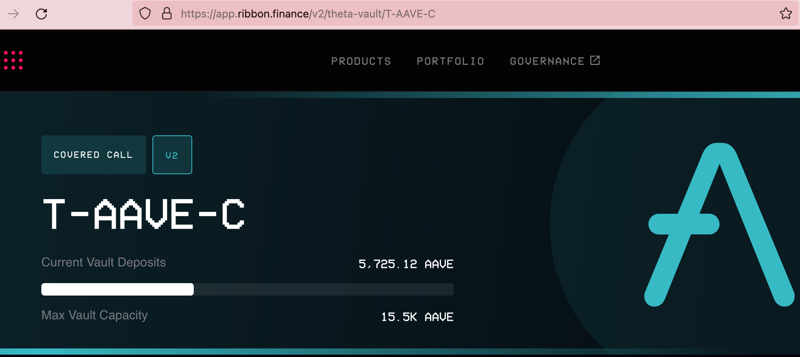
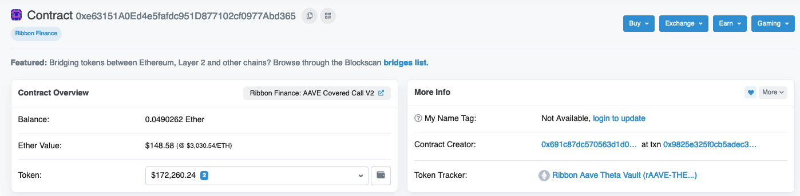
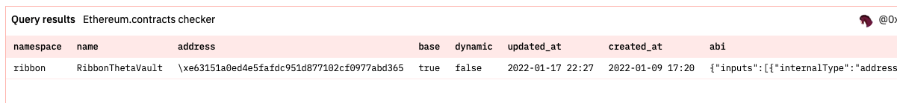
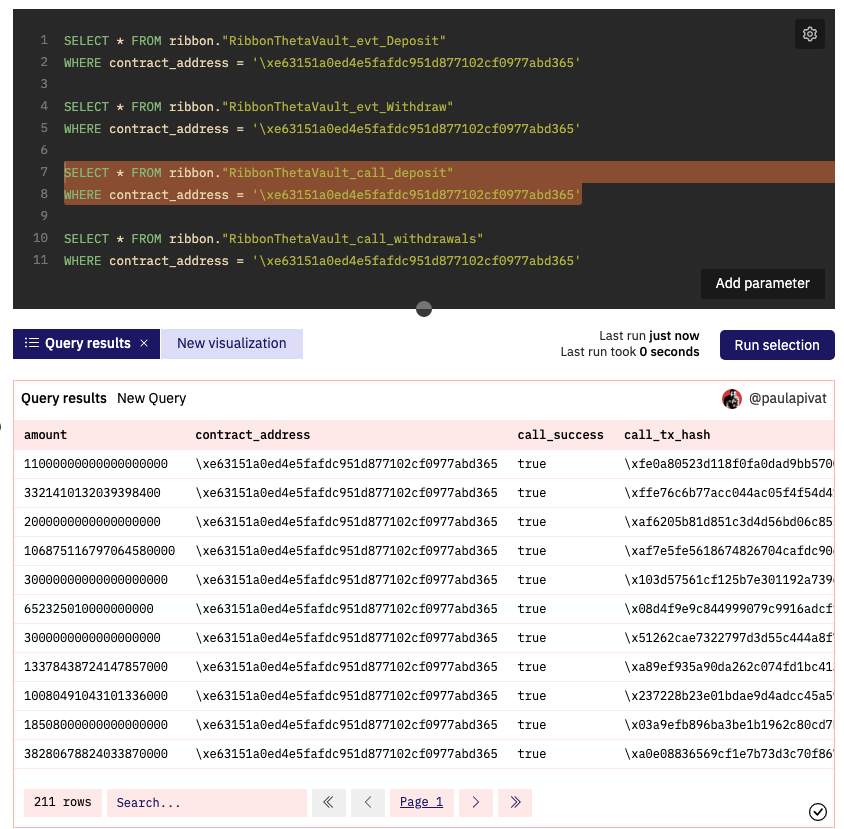
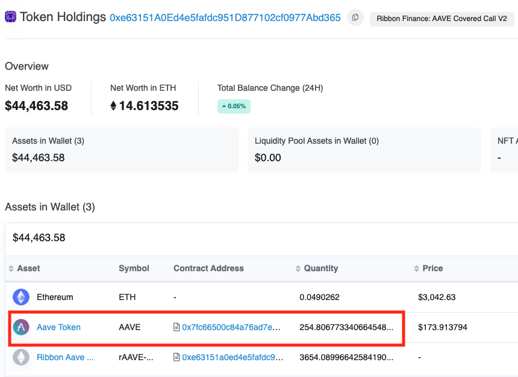
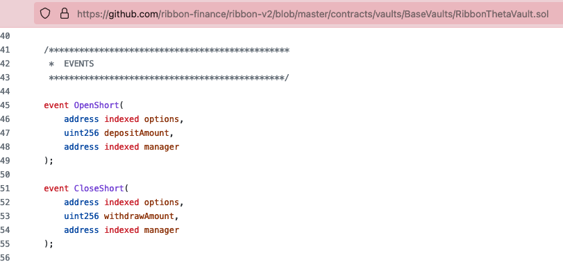
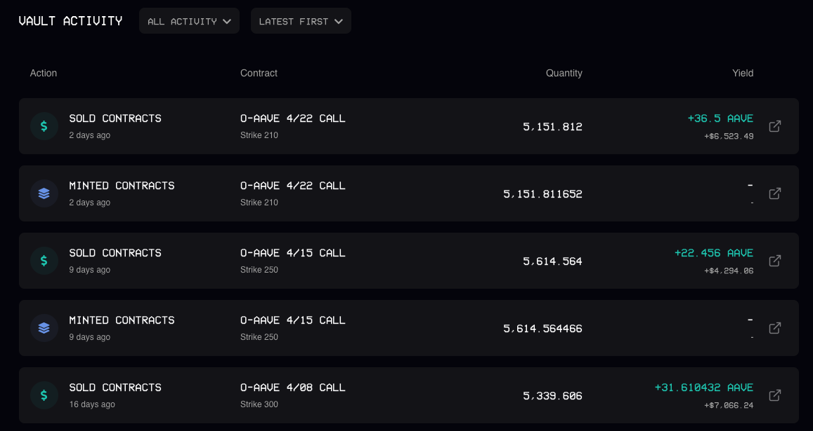
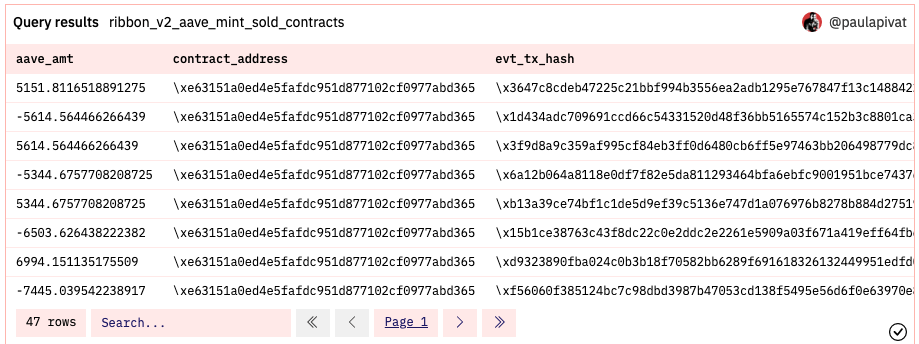
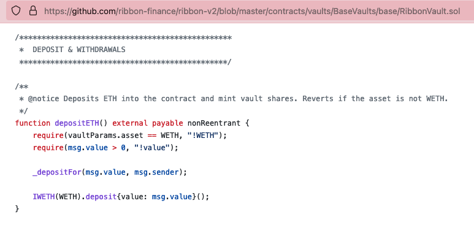

---
authors:
- admin
categories: []
date: "2022-04-16T00:00:00Z"
draft: false
featured: false
image:
  caption: ""
  focal_point: ""
lastMod: "2022-04-16T00:00:00Z"
projects: []
subtitle: A case study
summary: Exploring smart contract code to understand vault deposits and withdraws
tags: ["SQL", "data", "Dune Analytics"]
title: Ribbon Finance Aave Theta Vault
---

I wanted to explore deposits and withdraws from the [AAVE Theta Covered Call Vault](https://app.ribbon.finance/v2/theta-vault/T-AAVE-C) at Ribbon Finance.



I am specifically trying to query the **Current Vault Deposits** number (5725.12 AAVE in the screenshot take above).

Here was my workflow:

First, grab the smart contract address for this vault: `0xe63151A0Ed4e5fafdc951D877102cf0977Abd365`

check on etherscan:



Second, check to see if this contract has been [decoded](https://dune.xyz/0xBoxer/Is-my-Contract-decoded-yet?contract_address_t419c6=0xe63151A0Ed4e5fafdc951D877102cf0977Abd365):



It has been decoded at the following table: `ribbon.RibbonThetaVault`.

Third, run simple queries using the **provided table name** filtering for this contract:



I ran 4 queries filtering for the `0xe63151A0Ed4e5fafdc951D877102cf0977Abd365` contract address (Aave Theta Vault). Since I was interested in deposits and withdraws that's where I started. 

> Question: If interested in deposits/withdraws from a smart contract, is it safe to assume either:

- 'contractname_call_deposit', 
- 'contractname_call_withdraw', 
- 'contractname_evt_deposit', 
- 'contractname_evt_withdraw' 

> would be a good place to start?

Out of the four tables, only `ribbon."RibbonThetaVault_call_deposit"` turned up any results. 

Because I would need **both** deposits and withdraws, and only "_call_deposit" is returning any results, I am going to try an alternative abstraction table:

- `erc20."ERC20_evt_Transfer"`

Since we are interested in deposits and withdrawals from the `Ribbon Aave Theta Vault` the **erc20.ERC20_evt_Transfer** table can be filtered for transactions "to"" (deposit) and "from" (withdrawal) the vault address.

To recap, the addresses involved are: 

- the `T-AAVE-C` [Vault contract]((https://app.ribbon.finance/v2/theta-vault/T-AAVE-C)) `0xe63151A0Ed4e5fafdc951D877102cf0977Abd365` (same as `rAAVE-THETA` Token)

- AAVE Token address: `0x7Fc66500c84A76Ad7e9c93437bFc5Ac33E2DDaE9` (users of the vault need to deposit AAVE Tokens)

Here's a sample query integrating these two addresses:

```{python}
WITH total_aave_vault_txns AS (
SELECT 
    "from",
    "to",
    value/10^18 AS aave_amt,
    contract_address,
    evt_block_time
FROM erc20."ERC20_evt_Transfer"
WHERE contract_address = '\x7Fc66500c84A76Ad7e9c93437bFc5Ac33E2DDaE9'
AND "to" = '\xe63151A0Ed4e5fafdc951D877102cf0977Abd365'

UNION ALL

SELECT 
    "from",
    "to",
    -value/10^18 AS aave_amt,
    contract_address,
    evt_block_time
FROM erc20."ERC20_evt_Transfer"
WHERE contract_address = '\x7Fc66500c84A76Ad7e9c93437bFc5Ac33E2DDaE9'
AND "from" = '\xe63151A0Ed4e5fafdc951D877102cf0977Abd365'
)
SELECT
    SUM(aave_amt)  -- 254.806773340645
FROM total_aave_vault_txns 
```

This [query](https://dune.xyz/queries/609486) yields the same number as Aave Token contained in the contract's wallet, which is `254.806773340645` at the time of this writing.



This is fine, but not what I'm looking for 😢 

Rather than the amount of AAVE token in the contract's wallet (~254), I'm looking to see how many AAVE tokens users have *deposited* in the vault (~5725), so now I'm going to dig into the contract. 

### Exploring the Contract Code

I search and found [Ribbon Finance V2's Vault repo](https://github.com/ribbon-finance/ribbon-v2/tree/master/contracts/vaults), which contains code for their most updated vaults. While some vaults, like stETH and Yearn, have their own folders, the Aave Theta vault does not so I navigate to "BaseVaults" to see solidity code for `RibbonThetaVault.sol`, which is the same contract name I found when checking to see if the `0xe63151A0Ed4e5fafdc951D877102cf0977Abd365` (Aave Theta vault) had been decoded (see above). 

I looked through two files in the [BaseVaults](https://github.com/ribbon-finance/ribbon-v2/tree/master/contracts/vaults/BaseVaults):

- RibbonThetaVault.sol
- base/RibbonVault.sol 

I start with `RibbonThetaVault.sol` as this matches the table name in Dune when checking if the contract address had been decoded. I ran a search for "deposit" and "withdraw" and found the following:

- OpenShort
- CloseShort



I created the following [query](https://dune.xyz/queries/609785) in Dune to see if this could get me closer to the desired "Current Vault Deposits":

```{python}
WITH deposit_withdraw AS (
SELECT 
    "depositAmount"/10^18 AS aave_amt,
    contract_address,
    evt_tx_hash,
    evt_block_time
FROM ribbon."RibbonThetaVault_evt_OpenShort"
WHERE contract_address = '\xe63151A0Ed4e5fafdc951D877102cf0977Abd365'

UNION ALL

SELECT
    -"withdrawAmount"/10^18 AS aave_amt,
    contract_address,
    evt_tx_hash,
    evt_block_time
FROM ribbon."RibbonThetaVault_evt_CloseShort"
WHERE contract_address = '\xe63151A0Ed4e5fafdc951D877102cf0977Abd365'
)
SELECT
    *
FROM deposit_withdraw
ORDER BY evt_block_time DESC

```

This query did manage to get **Vault Activity**:






Getting closer, but not quite there yet. I did notice one interesting descriptor in the [RibbonThetaVault code](https://github.com/ribbon-finance/ribbon-v2/blob/master/contracts/vaults/BaseVaults/RibbonThetaVault.sol) on line 24:

> RibbonThetaVault should not inherit from any other contract aside from RibbonVault, RibbonThetaVaultStorage

Within the same directory, I'm now looking at `RibbonVault.sol` and I see a "Deposit & Withdraws" section,



with the following events **emit**:

- emit Deposit(creditor, amount, currentRound);
- emit InitiateWithdraw(msg.sender, numShares, currentRound);
- emit Withdraw(msg.sender, withdrawAmount, withdrawalShares);
- emit Redeem(msg.sender, numShares, depositReceipt.round);

This leads me back to where we started, both Deposit and Withdraw events did *not* yield results when filtering for the AAVE Theta Vault contract address, while InitiateWithdraw and Redeem did. 

For context, I had [previously](https://dune.xyz/queries/537056/1010779) tried joining `erc20."ERC20_evt_Transfer"` and `ethereum."logs"` to produce a slower query, but *that* did not get me the desired 'Current Vault Deposit' figure either. 


If you'd like help with on-chain analysis, please [get in touch](https://twitter.com/paulapivat).