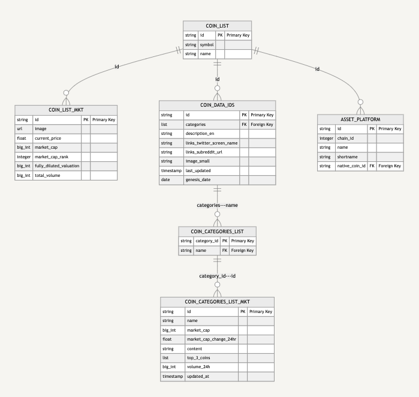

---
authors:
- admin
categories: []
date: "2024-06-08T00:00:00Z"
draft: false
featured: false
image:
  caption: ""
  focal_point: ""
lastMod: "2024-06-08T00:00:00Z"
projects: []
subtitle: Modeling data to build pipelines
summary: Modeling, then pulling, API data
tags: ["Python", "API", "data modeling", "pipelines", "coingecko", "ETL/ELT"]
title: ELT pipeline ingesting CoinGecko's data
---

From a data analyst perspective, a significant difference between Web2 and Web3 is the existence of "public" data infrastructure. In crypto, analysts are familiar with [Dune Analytics](https://dune.com/) or [FlipSide Crypto](https://flipsidecrypto.xyz/) among [other data providers](https://www.primodata.org/blockchain-data). Although these are private companies, the nature of **public blockchains** enhances data accessibility compared to platforms like Google’s BigQuery.

Teams of data engineers, database and backend specialists have done the heavy lifting so analysts can simply "use SQL" right in the browser. This makes the [data workflow in crypto](https://read.cryptodatabytes.com/p/2022-guide-to-web3-data-thinking) unique (and arguably better).

However, when building data-intensive applications, you cannot rely solely on public infrastructure. Often, you'll need to integrate data from various sources. This post will explore [CoinGecko's API (demo tier)](https://www.coingecko.com/en/api) and describe a process of exploring the data, building an initial model as well as laying the foundation for building data pipelines.

> Imagine analysts as restaurant patrons, utensils in hand, ready to consume. This post invites you to the back kitchen to understand how the meal is prepared.

I wrote this as a note to my future self for when I need to fetch data from an API again, though the process is applicable beyond CoinGecko.

## Tools

My setup, not strictly required to follow along, is as follows:

- Python 3.11.6
- pyenv to manage virtual environments and python versions (follow [Banteg's instructions](https://x.com/bantg/status/1677475400048312320?s=20))

Libraries:
- pandas              2.2.2
- pip                 24.0
- python-dotenv       1.0.1
- requests            2.32.3


## Exploratory Phase: Handling JSON data

API providers typically use a **Requests - Response** format to show how data is structured. JSON (javascript object notation) is the norm for text-based structured data delivered over the web, which translates into **nested dictionaries** and **lists** in Python. Depending on the endpoint, data might be nested several levels deep and organized in key-value pairs, with values being strings, integers, floats, or additional lists or dictionaries.

I find it helpful to make calls to understand what the data looks like visually (in terminal). A simple loop helps iterating through a dictionary (or list):

```
# iterating through a dictionary
for key, value in data.items():
    print("Keys: ", key)
```

But what if the data is **nested** and **messy**, containing multiple lists and dictionaries?

This helper function navigates through nested JSON data, prints key-value pairs, and maintains an index of data structure instances. For instance, querying a list of coins might return a list of dictionaries:: 

```
def traverse_json(data, path=[]):
    if isinstance(data, dict):
        print("Working with Dictionary \n")
        for key, value in data.items():
            traverse_json(value, path + [str(key)])  
    elif isinstance(data, list):
        print("Working with List \n")
        for index, item in enumerate(data):
            traverse_json(item, path + [str(index)])  
    else:
        # Terminal value, print path and value
        print(" -> ".join(path) + ":", data)


# Start traversal
traverse_json(data)

```

I'll go through each endpoint I need and make a note of the data structure (List of Dictionaries or a single Dictionary) that it returns. Time spent in the exploratory phase helps get a mental model of the data and begins informing data modeling you might do down the line. 

### Example: Trending Search List

The **Trending Search List** endpoint `https://api.coingecko.com/api/v3/search/trending` allows users to query trending searched coins, nfts and categories on CoinGecko in the last 24 hours ("categories" here are specific to labels/tags that CoinGecko has curated). Here is the output of the `traverse_json()` function to give you a feel for the response data from this endpoint. The key(s) returned in the dictionary are: coins, nfts and categories. The values are lists of dictionaries (i.e., the coins list had 14 dictionaries, the nfts list had six dictionaries, the categories value had five dictionaries.)

```
# Truncated for space

# Fourteen coins searched in the last 24 hours

coins -> 14 -> item -> id: jetton
coins -> 14 -> item -> coin_id: 31360
coins -> 14 -> item -> name: JetTon Games
coins -> 14 -> item -> symbol: JETTON
coins -> 14 -> item -> market_cap_rank: 745
Working with List 

# Six NFTs searched in the last 24 hours

nfts -> 6 -> id: meebits
nfts -> 6 -> name: Meebits
nfts -> 6 -> symbol: ⚇
nfts -> 6 -> thumb: https://coin-images.coingecko.com/nft_contracts/images/28/standard/meebits.png?1707287182
nfts -> 6 -> nft_contract_id: 28
Working with List 

# Five Categories searched in the last 24 hours

categories -> 5 -> id: 29
categories -> 5 -> name: Smart Contract Platform
categories -> 5 -> market_cap_1h_change: 0.03473537849426241
categories -> 5 -> slug: smart-contract-platform
categories -> 5 -> coins_count: 244
Working with List 
```

## Keep API Keys Secret

You don't want to accidentally push your API keys to Github,  create an `.env` (store your API keys here) and `.gitignore` file at the root of your project folder to ensure `.env` files are not pushed to Github. Finally, use **python-dotenv** to access your environment variables:

```
from dotenv import load_dotenv
import os

load_dotenv()

headers = {
    "accept": "application/json",
    "x-cg-demo-api-key": os.getenv("coingecko_demo_api"),
}

# Coin List (ID Map)
# Response: List of dictionaries

url = "https://api.coingecko.com/api/v3/coins/list"

response = requests.get(url, headers=headers)

print(response.text)
```

## Physical Data Model

My goal is to facilitate communication between the data, product and engineering teams; having a visual model is immensely helpful here to get on the same page as to what data is needed and what data to ingest. This helps guide an exploratory conversation into a discussion of implementation details. Here's our physical data model:



This is drawn in Notion using the [Mermaid](https://mermaid.js.org/) language. After trying out several graphing and visualization tools, this option was the simplest, with the least dependencies. In my opinion, manually drawing out the chart should precede installing any graphing library. Here's the code you can try out in Notion:

```
erDiagram
    COIN_LIST {
        string id PK "Primary Key"
        string symbol
        string name
    }
    
    COIN_LIST_MKT {
		    string id PK "Primary Key"
		    url image
		    float current_price 
		    big_int market_cap 
		    integer market_cap_rank
		    big_int fully_diluted_valuation 
		    big_int total_volume
    }
    
    COIN_DATA_IDS {
        string id PK "Primary Key"
        list categories FK "Foreign Key"
        string description_en
        string links_twitter_screen_name
        string links_subreddit_url
        string image_small
        timestamp   last_updated
        date  genesis_date
    }
    
    ASSET_PLATFORM {
		    string id PK "Primary Key"
		    integer chain_id 
		    string name 
		    string shortname
		    string native_coin_id FK "Foreign Key"
    }
    
    COIN_CATEGORIES_LIST {
		    string category_id PK "Primary Key"
		    string name FK "Foreign Key"
    }
    
    COIN_CATEGORIES_LIST_MKT {
		    string id PK "Primary Key"
		    string name
		    big_int market_cap 
		    float market_cap_change_24hr
		    string content
		    list top_3_coins
		    big_int volume_24h
		    timestamp updated_at
		    
    }

    COIN_LIST ||--o{ COIN_DATA_IDS : "id" 
    COIN_LIST ||--o{ COIN_LIST_MKT : "id"
    COIN_LIST ||--o{ ASSET_PLATFORM : "id"
    COIN_DATA_IDS || --o{ COIN_CATEGORIES_LIST : "categories---name"
    COIN_CATEGORIES_LIST || --o{ COIN_CATEGORIES_LIST_MKT : "category_id---id"

```

You don't have to list all columns in a table, but identifying primary keys, foreign keys and where the joins are is helpful. After a data model is drawn and consensus reached on what data to include (and what to leave out), we can proceed to ingesting data. 

## Extract & Load

The rest of the article will focus on an **Extract, Load, Transform (ELT)** process for ingesting external data. The exact process is described in this [README](https://github.com/PaulApivat/RAG/blob/main/coingecko/README.md). I am using SQLite as my temporary data warehouse because its light weight, works well with python and, most importantly, can be shared with my teammates to facilitate communication. 

The data pipeline process described in this article is **not** production ready and will undergo several adjustments after I hand-off to our engineers. 

While some may opt to transform data _as_ it is loading before it hits the warehouse, I find a fetch and load _as is_ to be cleaner, knowing i'll transform it later down the line. Here's the code to accomplish much of this:

```
def fetch_and_load_data(conn, url, table_name):
    """Fetch data from the given URL and load it into specified SQLite table.
    Check if data is list of dictionaries OR a dictionary. Create table (if not exist) with generic column names, then insert data.

    """
    response = requests.get(url, headers=headers)
    data = response.json()

    with conn:
        cursor = conn.cursor()

        if isinstance(data, list):
            cursor.execute(
                f"CREATE TABLE IF NOT EXISTS {table_name} (id INTEGER PRIMARY KEY AUTOINCREMENT, data TEXT)"
            )
            for item in data:
                cursor.execute(
                    f"INSERT INTO {table_name} (data) VALUES (?)", (str(item),)
                )
        elif isinstance(data, dict):
            cursor.execute(
                f"CREATE TABLE IF NOT EXISTS {table_name} (id INTEGER PRIMARY KEY AUTOINCREMENT, data TEXT)"
            )
            cursor.execute(f"INSERT INTO {table_name} (data) VALUES (?)", (str(data),))
        logging.info(f"Data loaded into {table_name}")


```

You can see the [whole load file](https://github.com/PaulApivat/RAG/blob/main/coingecko/coin_data_load.py) here. I am storing five URL endpoints in a dictionary, looping through and running the `fetch_and_load_data()` function on each endpoint. This function is flexible enough to handle both lists and dictionaries, which should cover most API endpoints. 

## Transform

I store the initial data load in a database named `coingecko_load.db`, an SQLite file that can be easily shared. Afterward, I query these tables and apply various transformation functions to flatten the JSON data into table formats. These transformed tables are then inserted into a new database, `coingecko_load_transform.db`. I prefer to keep loaded and transformed data separate as SQLite is lightweight and efficient enough to manage them across two distinct files. However, the efficiency of this approach may differ based on the data volume you handle.

This approach highlights the clear distinction between the **original** and **transformed** databases::
```
def main():
    conn_original = create_connection("coingecko_load.db")
    conn_transformed = create_connection("coingecko_load_transform.db")

    if conn_original and conn_transformed:
        # Get list of tables from source database
        tables = conn_original.execute(
            "SELECT name FROM sqlite_master WHERE type='table' AND name NOT LIKE 'sqlite_%';"
        ).fetchall()
        for table_name_tuple in tables:
            process_table(conn_original, conn_transformed, table_name_tuple[0])

        conn_original.close()
        conn_transformed.close()
        logging.info("All tables processed and databases closed.")
    else:
        logging.error("Database connection could not be established.")

```

You can check the [whole file](https://github.com/PaulApivat/RAG/blob/main/coingecko/coin_data_transform.py) here to see various transformation functions at work. 

## Conclusion

The comprehensive steps needed to produce the final `coin_data_ids` table are detailed in the project [README](https://github.com/PaulApivat/RAG/tree/main/coingecko). In summary, this document covers the entire process from extracting data from an external API (CoinGecko) to modeling the data, followed by implementing a lightweight ELT process. The physical data model and the shareable SQLite files facilitate seamless communication among data, product, and engineering teams. This can serve as a starting point for implementing production-ready data pipelines. 


I'm always down to talk data, [shoot me a DM](https://twitter.com/paulapivat).