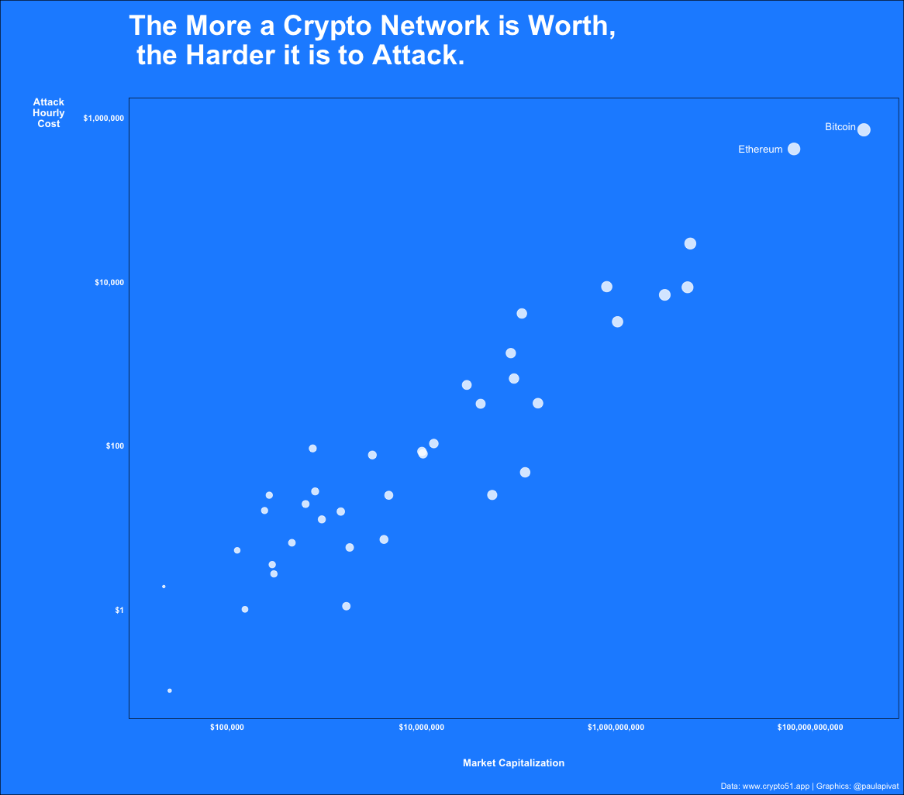

---
authors:
- admin
categories: []
date: "2021-02-07T00:00:00Z"
draft: false
featured: false
image:
  caption: ""
  focal_point: ""
lastMod: "2021-02-07T00:00:00Z"
projects: []
subtitle: Visualizing the Relationship between Market Cap and Cost to Attack
summary: Using R and Python to read, pre-process, wrangle and visualize data.
tags: ["Cryptocurrency", "Bitcoin", "Ethereum", "Data Viz", "RStats", "ggplot2", "Python"]
title: The More a Network is Worth, the Harder it is to Attack
---

### Table of contents

- [Data](#data)
- [Implication](#implication)

## Overview

In this post, I use Python and R to access, parse, manipulate, then visualize data from [Crypto51.app](https://www.crypto51.app/) to show the strong relationship between Market Capitalization and Cost to Attack among public crypto networks.

The more a network is thought to be worth, the more expensive it is to attack. An important, but often overlooked reason to celebrate price gains. 


## Data

In this post, I query an API endpoint setup at [Crypto51.app](https://www.crypto51.app/) to get `JSON` data. Then, I use Python to parse and convert to `dataframe`. Finally, I use R to wrangle and visualize.

Let's get it!

Here is the Python code to read in `JSON` and convert to a `dataframe`:

```python
import pandas as pd
import json
import requests

r = requests.get('https://api.crypto51.app/coins.json')
dct = dict()
dct = r.json()

# loop through:
# last_updated
# coins
for x, y in dct.items():
    print(x)

type(dct['coins']) # list
len(dct['coins'])  # 57 dictionaries in side this list

# convert list of 57 dictionaries into a pandas dataframe
df = pd.DataFrame.from_dict(dct['coins'])
df.head()
df.to_csv('crypto51.csv', index=False)
```

After creating a CSV, I'm transition to R, out of preference for `dataframe` manipulation and visualization with this tool (you could do the following in `pandas` and `seaborn`).

We'll load the `tidyverse` and read in the CSV file we created. Then we'll use a series of `magrittr` [pipes](https://magrittr.tidyverse.org/reference/pipe.html) to sequence our data manipulation in one flow. We'll remove projects with **no market_cap** data. We'll remove the Handshake project because of missing data for `attack_hourly_cost`. 

We'll change `attack_hourly_cost` data type into numeric. Then we'll use `ggplot2` to visualize a scatter plot with both X and Y axes transformed with `scale_*_log10()` to make the scatter plot more interpretable. 

Bitcoin and Ethereum are annotated as the two leading projects. 

```python
library(tidyverse)

df <- read_csv("crypto51.csv")

df %>%
    # remove projects with no market_cap
    slice(1:38) %>% 
    filter(attack_hourly_cost != "?") %>% 
    # change character to numeric
    mutate(
        attack_hourly_cost = as.numeric(attack_hourly_cost)
    ) %>% 
    ggplot(aes(x=market_cap, y=attack_hourly_cost)) +
    geom_point(aes(size = log10(market_cap)), color = "white", alpha = 0.8) +
    # use log10 transformation to make chart more interpretable
    scale_y_log10(label= scales::dollar) +
    scale_x_log10(label= scales::dollar) +
    theme_minimal() +
    theme(
        legend.position = 'none',
        panel.background = element_rect(fill = "dodger blue"),
        panel.grid.major = element_blank(),
        panel.grid.minor = element_blank(),
        plot.background = element_rect(fill = "dodger blue"),
        plot.title = element_text(colour = "white", face = "bold", size = 30, 
                                  margin = margin(10,0,30,0)),
        plot.caption = element_text(color = "white"),
        axis.title = element_text(colour = "white", face = "bold"),
        axis.title.x = element_text(margin = margin(30,0,10,0)),
        axis.text = element_text(colour = "white", face = "bold"),
        axis.title.y = element_text(margin = margin(0,20,0,30), angle = 0)
    ) +
    labs(
        x = "Market Capitalization",
        y = "Attack\nHourly\nCost",
        title = "The More a Crypto Network is Worth,\n the Harder it is to Attack.",
        caption = "Data: www.crypto51.app | Graphics: @paulapivat"
    ) +
    # annotate instead of geom_text
    annotate("text", x = 205174310335, y = 800000, label = "Bitcoin", color = "white") +
    annotate("text", x = 30762751140, y = 418437, label = "Ethereum", color = "white")
```


## Implication

### The More a Crypto Network is Worth, the Harder it is to Attack


All time high.


You'd be hard pressed to find three more delicious words than these.

When it comes to crypto, everyone keeps an eye on their portfolio value.

Your bags aside, there is *another* reason to celebrate price gains.

Bitcoin's big innovation was making **digital transaction difficult to replicate** (unlike most digital files that are easily duplicated). 

Nodes follow the longest chain as the "correct" chain. However, this opens things up for any node(s) with more than 51% of the network hashing power to pull *shenanigans*, such as **double-spending**. Sending funds to one address on the main chain and the same funds to another address on a different chain.

More hardware and hash power allow a node to secretly mine a side chain, which they can later “fool” the rest of the network into accepting. 

Since their inception, Bitcoin and Ethereum have gotten more difficult to mine over time. And when price increases, the capital costs of buying new equipment goes up. 

This makes it more difficult for any one entity to accumulate too much hash power and pull shenanigans. **As a result, the entire network is more secure**.

In fact, the data provided by crypto51.app suggests a near perfect correlation between Market Capitalization and Cost to Attack, at r = 0.94. 



**The more a crypto network is worth, the more expensive it is to attack.**

Another reason to celebrate price gains.


## References

1. www.crypto51.app


For more content on data science, machine learning, R, Python, SQL and more, [find me on Twitter](https://twitter.com/paulapivat).