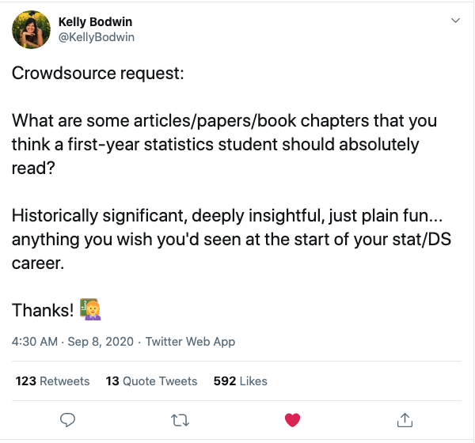
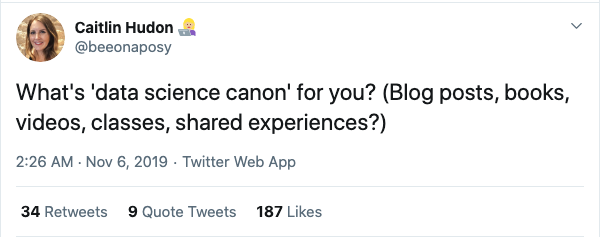

---
authors:
- admin
categories: []
date: "2020-09-10T00:00:00Z"
draft: false
featured: false
image:
  caption: ""
  focal_point: ""
lastMod: "2020-09-10T00:00:00Z"
projects: []
subtitle: What is considered canon?
summary: What is Data Science canon?
tags: ["Data Science"]
title: Essential Readings in Data Science
---

## Data Science Literature Review

I saw an [intriguing question](https://twitter.com/KellyBodwin/status/1303083136046170112?s=20) posed on Twitter and some of the responses were illuminating.

Here's [another variant](https://twitter.com/beeonaposy/status/1191798851289649154?s=20) of the question:

Although Data Science has a long history, it's considered a relatively young field. 

This space will be used to document recommended reading for new entrants:

1. Downey, Allen (2016) There is only one test. [source](http://allendowney.blogspot.com/2016/06/there-is-still-only-one-test.html)

2. Wickham, Hadley (2014) Tidy Data. The Journal of Statistical Software, vol 59. [original](https://vita.had.co.nz/papers/tidy-data.html), [update](https://tidyr.tidyverse.org/articles/tidy-data.html)

3. James, G., Witten, D., Hastie, T. & Tibshirani, R. (2014) An Introduction to Statistical Learning with Applications in R. [source](http://faculty.marshall.usc.edu/gareth-james/ISL/index.html)

4. Shmueli, G. (2010) To explain or to predict? Statistical Science, 25(3), 289-310. [source](https://projecteuclid.org/euclid.ss/1294167961)

5. Hernan, M.A., Hsu, J. & Healy, B. (2019) A second chance to get causal inference right: A classification of Data Science tasks. Chance, vol 32(1). [source](https://amstat.tandfonline.com/doi/full/10.1080/09332480.2019.1579578)

6. Gelman, A., Pasarica, C. & Dodhia, R. (2002) Let's practice what we preach: Turning tables into graphs. The American Statistician, vol 56(2). [source](https://www.tandfonline.com/doi/abs/10.1198/000313002317572790)

7. Scott Formann-Roe (June, 2012) Understanding the Bias-Variance Tradeoff. [source](http://scott.fortmann-roe.com/docs/BiasVariance.html)

8. Donoho, D (2017) 50 Years of Data Science. Journal of Computational and Graphical Statistics, vol 26(4). [source](https://www.tandfonline.com/doi/full/10.1080/10618600.2017.1384734)

9. Wilson, G., Bryan, J., Cranston, K., Kitzes, J., Nederbragt, L. & Teal, T.K. (2017) Good enough practices in scientific computing. Plos Computational Biology. [source](https://journals.plos.org/ploscompbiol/article?id=10.1371/journal.pcbi.1005510)

10. Kevin Markham (2019) 100 pandas tricks to save you time and energy. [source](https://www.dataschool.io/python-pandas-tips-and-tricks/)

11. Chris Albon's code snippets. [source](https://chrisalbon.com/)

12. Howard, J. & Gugger, S. (Aug 4, 2020) Deep Learning for Coders with fastai and PyTorch: AI Applications without a PhD 1st Ed. [source](https://course.fast.ai/)

13. Brandon Rohrer (Jan, 2020) End-to-End Machine Learning: Complete Course Catalog. [source](https://end-to-end-machine-learning.teachable.com/p/complete-course-library-full-end-to-end-machine-learning-catalog); [second source](https://e2eml.school/blog.html)

14. John Rauser (Dec, 2016) How Humans See Data [youtube](https://www.youtube.com/watch?v=fSgEeI2Xpdc)

15. Broman, K.W. & Woo, K.H. (2018) Data Organization in Spreadsheets. The American Statistician, vol 72(1). [source](https://www.tandfonline.com/doi/full/10.1080/00031305.2017.1375989)

16. Sculley, D., Holt, G., Golovin, D., Davydov, E., Phillips, T., Ebner, D., Chaudhary, V., & Young, M. (2014) Machine Learning: The High Interest Credit Card of Technical Debt. [source](https://research.google/pubs/pub43146/)

17. 3Blue1Brown for Linear Algebra [youtube](https://www.youtube.com/playlist?list=PLZHQObOWTQDPD3MizzM2xVFitgF8hE_ab)

18. Jenny Bryan. Stat 545: Data Wrangling, Exploration and Analysis with R. [source](https://stat545.com/)

