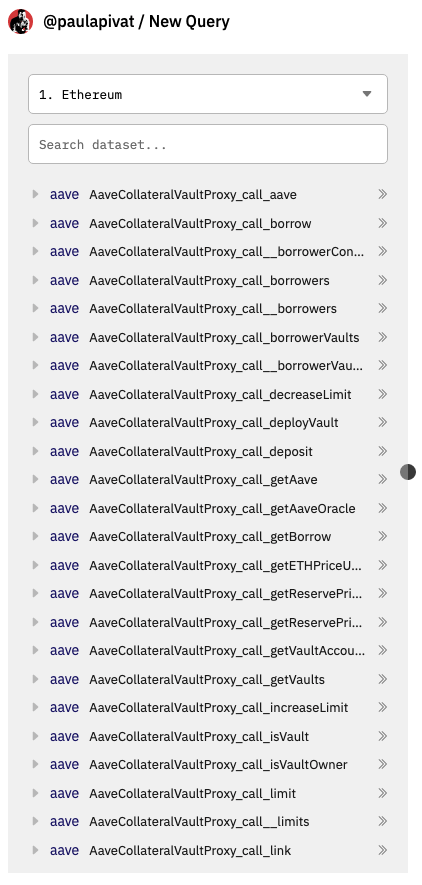
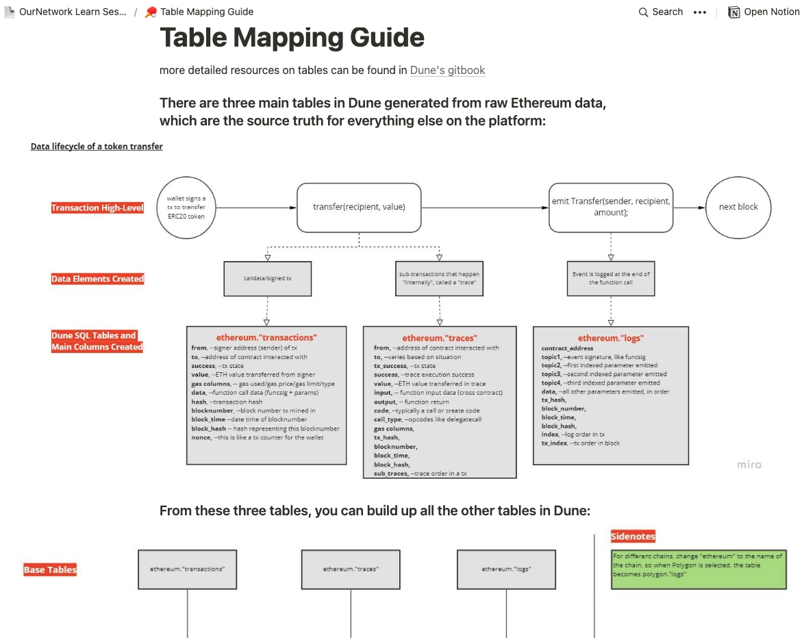

---
authors:
- admin
categories: []
date: "2022-04-14T00:00:00Z"
draft: false
featured: false
image:
  caption: ""
  focal_point: ""
lastMod: "2022-04-14T00:00:00Z"
projects: []
subtitle: Smart contract sleuthing with @ OurNetwork_
summary: Going beyond the basic with Dune queries 
tags: ["SQL", "data", "Dune Analytics"]
title: Demystifying Dune Analytics
---

Although I had been using Dune to create [dashboards](https://dune.xyz/paulapivat) for several months, much of the tool remained confusing. I would frequently get thrown off to open a new query and see this:

I struggled to know *which* table to use, until the [OurNetwork Learn](https://ournetwork.mirror.xyz/gP16wLY-9BA1E_ZuOSv1EUAgYGfK9mELNza8cfgMWPQ) courses, led by [Andrew Hong](https://twitter.com/andrewhong5297) was released.

While I'm still making my way through the materials, I've picked up some tips for other aspiring web3 data analysts.

### Source Tables

First, *most* tables can be created from these three*:

1. ethereum."transactions"
2. ethereum."logs"
3. ethereum."traces"

*Also worth getting acquainted with these tables:

4. ethereum."contracts"
5. ethereum."blocks"
6. ethereum."sigantures"

This fact alone elevated my understanding of Dune. This **Table Mapping Guide** from [OurNetwork Learn Sessions](https://www.notion.so/Table-Mapping-Guide-2c12f7c8c5304aabb8078fcde3ce38f9) provides a really nice graphical overview:

It breaks down what happens in a smart contract transaction, at a high level. Take a transaction included in one block. For example, your wallet signs a transaction to send some tokens. There is a transfer function that's called. Then an event is emitted/logged on-chain before it happens all over again in the next block. A caveat is the transfer of Ether as the native currency of Ethereum is technically not a token.

One thing to note is that Dune Analytics maps **on-chain** transaction (excluding pre-chain transactions, which would require engaging with a JSON-RPC endpoint for mempool analysis, out of the scope of this post).

> From these three* tables, you can build up other tables in Dune.

This line in the guide made things click for me. 

You might wonder why bother with "other tables" when you can derive all the queries you need from these main 3. Speed and efficiency. Querying the `ethereum` tables is akin to querying a large chain. 

Often times your queries simply time out, which leads us to the first step of any Dune Analytics analysis.

### Decoding the Contract

After multiple queries getting time out, I realized my approach was too slow and inefficient. To avoid this, check [Is my Contract decoded yet?](https://dune.xyz/0xBoxer/Is-my-Contract-decoded-yet?contract_address=0x74C6CadE3eF61d64dcc9b97490d9FbB231e4BdCc) * courtesy of [0xBoxer](https://twitter.com/0xBoxer) at Dune.

*Separate check for contracts on Polygon, xDai, BSC etc. 

The team has done the heavy data-engineering lift of going through smart contracts, decode individual functions, building a pipeline into SQL tables for easier querying. If you don't see your contract of interest, you can [submit it for decoding.](https://dune.xyz/contracts/new)

Other [useful Dune Utility Queries](https://www.notion.so/Dune-Utility-Queries-6e6828030407476eac0bc12a021cb6c5) can be found [here](https://www.notion.so/Dune-Utility-Queries-6e6828030407476eac0bc12a021cb6c5).

If you'd like help with on-chain analysis, please [get in touch](https://twitter.com/paulapivat).