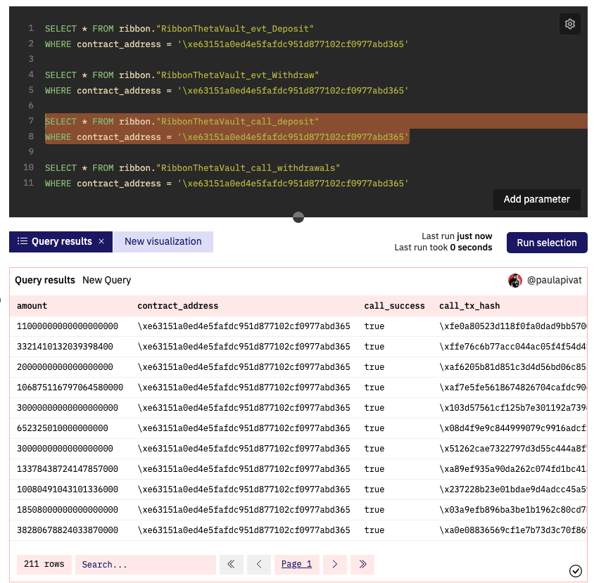

---
authors:
- admin
categories: []
date: "2022-04-14T00:00:00Z"
draft: false
featured: false
image:
  caption: ""
  focal_point: ""
lastMod: "2022-04-14T00:00:00Z"
projects: []
subtitle: Smart contract sleuthing with @ OurNetwork_
summary: Going beyond the basic with Dune queries 
tags: ["SQL", "data", "Dune Analytics"]
title: Demystifying Dune Analytics
---

Although I had been using Dune to create [dashboards](https://dune.xyz/paulapivat) for several months, much of the tool remained confusing. I would frequently get thrown off to open a new query and see this:


I struggled to know *which* table to use, until the [OurNetwork Learn](https://ournetwork.mirror.xyz/gP16wLY-9BA1E_ZuOSv1EUAgYGfK9mELNza8cfgMWPQ) courses, led by [Andrew Hong](https://twitter.com/andrewhong5297) was released.

While I'm still making my way through the materials, I've picked up some tips for other aspiring web3 data analysts.

### Source Tables

First, *most* tables can be created from these three*:

1. ethereum."transactions"
2. ethereum."logs"
3. ethereum."traces"

*Also worth getting acquainted with these tables:

4. ethereum."contracts"
5. ethereum."blocks"
6. ethereum."sigantures"

This fact alone elevated my understanding of Dune. This **Table Mapping Guide** from [OurNetwork Learn Sessions](https://www.notion.so/Table-Mapping-Guide-2c12f7c8c5304aabb8078fcde3ce38f9) provides a really nice graphical overview:


It breaks down what happens in a smart contract transaction, at a high level. Take a transaction included in one block. For example, your wallet signs a transaction to send some tokens. There is a transfer function that's called. Then an event is emitted/logged on-chain before it happens all over again in the next block. A caveat is the transfer of Ether as the native currency of Ethereum is technically not a token.

One thing to note is that Dune Analytics maps **on-chain** transaction (excluding pre-chain transactions, which would require engaging with a JSON-RPC endpoint for mempool analysis, out of the scope of this post).

> From these three* tables, you can build up other tables in Dune.

This line in the guide made things click for me. 

You might wonder why bother with "other tables" when you can derive all the queries you need from these main 3. Speed and efficiency. Querying the `ethereum` tables is akin to querying a large chain. 

Often times your queries simply time out, which leads us to the first step of any Dune Analytics analysis.

### Decoding the Contract

After multiple queries getting time out, I realized my approach was too slow and inefficient. To avoid this, check [Is my Contract decoded yet?](https://dune.xyz/0xBoxer/Is-my-Contract-decoded-yet?contract_address=0x74C6CadE3eF61d64dcc9b97490d9FbB231e4BdCc) * courtesy of [0xBoxer](https://twitter.com/0xBoxer) at Dune.

*Separate check for contracts on Polygon, xDai, BSC etc. 

The team has done the heavy data-engineering lift of going through smart contracts, decode individual functions, building a pipeline into SQL tables for easier querying. If you don't see your contract of interest, you can [submit it for decoding.](https://dune.xyz/contracts/new)

Other [useful Dune Utility Queries](https://www.notion.so/Dune-Utility-Queries-6e6828030407476eac0bc12a021cb6c5) can be found [here](https://www.notion.so/Dune-Utility-Queries-6e6828030407476eac0bc12a021cb6c5).

### Using the main ethereum tables

Sometimes a contract has not been decoded and you can't afford to wait. You'll need to rely on the main `ethereum` tables.

For example, I wanted to explore deposits and withdraws from the [AAVE Theta Covered Call Vault](https://app.ribbon.finance/v2/theta-vault/T-AAVE-C) at Ribbon Finance.

Here was my workflow:

First, grab the smart contract address for this vault; check on etherscan:


Second, check to see if this contract has been [decoded](https://dune.xyz/0xBoxer/Is-my-Contract-decoded-yet?):


Third, run a simple query using the **provided table name** (i.e., RibbonThetaVault) filtering for this contract:



I ran 4 sample queries filtering for the Aave Theta Vault contract address using the provided `RibbonThetaVault` table. Since I was interested in deposits and withdraws that's where I started. Out of the four tables, only the highlighted one turned up any results `ribbon."RibbonThetaVault_call_deposit"`.

Because I would need **both** deposits and withdraws, I opted not to rely on these tables and instead use:
- `erc20."ERC20_evt_Transfer"`
- `ethereum."logs"`

The rationale being that we are interested in deposits and withdrawals of a the `Ribbon Aave Theta Vault` token, an **ERC20** token so the Dune abstraction table of **erc20.ERC20_evt_Transfer** can filter for transactions - "to"" (deposit) and "from" (withdrawal) - involving this token. Moreover, `topic1` containing either a **deposit** or **withdraw** event can be decoded with:

`bytea2numeric( decode ( SUBSTRING ( encode(el."data", 'hex') , 1, 64 ), 'hex'))/10^18` 

and filtered by either a deposit or withdraw event hash:

```{python}
WHERE el.topic1 = '\x90890809c654f11d6e72a28fa60149770a0d11ec6c92319d6ceb2bb0a4ea1a15' -- Deposit into Vault 

WHERE el.topic1 = '\xf279e6a1f5e320cca91135676d9cb6e44ca8a08c0b88342bcdb1144f6511b568' -- Withdraw from Vault

```

(h/t to Andrew Hong's [Intermediate SQL guide](https://towardsdatascience.com/your-guide-to-intermediate-sql-while-learning-ethereum-at-the-same-time-7b25119ef1e2 ) for this technique.)

I suspect there could be alternative solutions for getting deposit/withdraw from Ribbon vaults and will update this post with new information.

### New Insights

NOTE: It may be possible to rely only on the `erc20.ERC20_evt_Transfer` table without `ethereum.logs`.

Distinguishing between:
- the `T-AAVE-C` vault contract `0xe63151A0Ed4e5fafdc951D877102cf0977Abd365`
- the `rAAVE-THETA` Token Tracker: `0xe63151A0Ed4e5fafdc951D877102cf0977Abd365` (token received for depositing AAVE)
- AAVE Token: `0x7Fc66500c84A76Ad7e9c93437bFc5Ac33E2DDaE9` (Frontend: Current Vault Deposits & Max Vault Capacity in AAVE tokens)

Here's a sample query integrating these two addresses to yield the Aave Token Holding within the **contract wallet**, not the [Current Vault Deposits](https://app.ribbon.finance/v2/theta-vault/T-AAVE-C) on the frontend:

```{python}
WITH total_aave_vault_txns AS (
SELECT 
    "from",
    "to",
    value/10^18 AS aave_amt,
    contract_address,
    evt_block_time
FROM erc20."ERC20_evt_Transfer"
WHERE contract_address = '\x7Fc66500c84A76Ad7e9c93437bFc5Ac33E2DDaE9'
AND "to" = '\xe63151A0Ed4e5fafdc951D877102cf0977Abd365'

UNION ALL

SELECT 
    "from",
    "to",
    -value/10^18 AS aave_amt,
    contract_address,
    evt_block_time
FROM erc20."ERC20_evt_Transfer"
WHERE contract_address = '\x7Fc66500c84A76Ad7e9c93437bFc5Ac33E2DDaE9'
AND "from" = '\xe63151A0Ed4e5fafdc951D877102cf0977Abd365'
)
SELECT
    SUM(aave_amt)  -- 573.3053547183199
FROM total_aave_vault_txns 
```

The above query yields the same number as Aave Token as assets in wallet **not** deposits in Vault. We may have to rely on `ethereum.logs` anyways.

### Further exploration

- Proxy Contracts: `AdminUpgradeabilityProxy`
- reading smart contract function/events, on Github/Etherscan, and find it on 3 main ethereum tables
- query optimization
- Dune User generated views? 
- Other abstractions: dex.trades, prices.usd, erc20._transfer, erc20._evt


If you'd like help with on-chain analysis, please [get in touch](https://twitter.com/paulapivat).