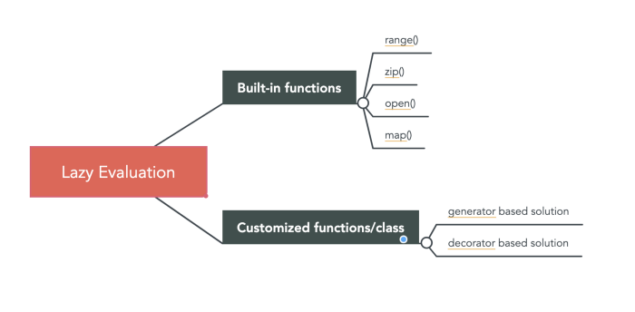

---
authors:
- admin
categories: []
date: "2020-10-23T00:00:00Z"
draft: false
featured: false
image:
  caption: ""
  focal_point: ""
lastMod: "2020-10-29T00:00:00Z"
projects: []
subtitle: Python crash course
summary: Survey of python features relevant for Data Science
tags: []
title: Data Science from Scratch (ch2)
---

**Table of Content:**
- [Set Up](#setup)
- [Functions](#functions)
- [Strings](#strings)
- [Exceptions](#exceptions)
- [Lists](#lists)
- [Tuples](#tuples)
- [Dictionaries](#dictionaries)
- [defaultdict](#defaultdict)
- [Counters](#counters)
- [Sets](#sets)
- [Control Flow](#controlflow)
- [Truthiness](#truthiness)
- [Sorting](#sorting)
- [List Comprehensions](#list_comprehensions)
- [Assert](#assert)
- [Object-Oriented Programming](#object-oriented_programming)
- [Iterables & Generators](#iterables_and_generators)

## Chapter 2: A Crash Course in Python


This is the first of many chapters i'll be covering from Joel Grus' Data Science from Scratch book (2nd edition). This chapter provides a quick survey of python features needed for "doing" data science from scratch, including essential setup of virtual environments and other tooling.

While the chapter is not meant to be comprehensive, I may supplement certain sections with external content for greater detail in certain parts. 

My goal is twofold. First, to go through this book and, as a byproduct, learn python. Second, to look out for and highlight the areas where the *pythonic* way of doing things is necessary to accomplish something in the data science process. 

At several sections throughout this chapter, the author emphasises how much a particular feature will be used later in the book (e.g., functions, dictionaries, list, list comprehensions (and for-loops), assert, iterables and generators, randomness, type annotations). Things *not* used as much (e.g., sets, automated test, subclasses that inherit functionality from a parent class, zip and argument unpacking, args, kwargs).

Additional code can be found in this [repo](https://github.com/PaulApivat/dsfs)

## Setup
### Installation, Virtual Environment and Modules

These section takes the reader through installing a virtual environment using Anaconda Python distribution. The author points out a best practice, "you should always work in a virtual environment and never use 'base' Python installation". Moreover, the author favors IPython over jupyter notebooks (he's a noted [critic of the notebook](https://www.youtube.com/watch?v=7jiPeIFXb6U))

Jeremy Howard of fast.ai offers a contrasting perspective. He *does* [like notebooks](https://www.youtube.com/watch?v=9Q6sLbz37gk&feature=emb_title).

The first time I installed Python, it took me awhile to get things right and eventually I relied on jupyter notebooks through Anaconda. As we go through this book, I'll be using virtual environments and IPython as much as I can (although I may sprinkle in a notebook here and there). My IDE for interacting with the conda virtual environment and IPython will be VSCode. 

Fortunately, I had a relatively painless process setting up a virtual environment and IPython, although I had to take a slight detour to setup the `code` command for VSCode.

Here's a summary of the commands I used for setup:


## Functions

Three things are emphasized here: passing functions as arguments for other functions, lambda functions and default parameter values. 

The illustration of functions being passed as arguments is demonstrated below. A function `double` is created. A function `apply_to_one` is created. The `double` function is pointed at `my_double`. We pass `my_double` into the `apply_to_one` function and set that to `x`. 

Whatever function is passed to `apply_to_one`, *its* argument is 1. So passing `my_double` means we are doubling 1, so x is 2.

But the important thing is that a function got passed to another function (aka higher order functions).

```
def double(x):
    """
    this function doubles and returns the argument
    """
    return x * 2
    
def apply_to_one(f):
    """Calls the function f with 1 as its argument"""
    return f(1)
    
my_double = double

# x is 2 here
x = apply_to_one(my_double)

# extending this example
def apply_five_to(e):
    """returns the function e with 5 as its argument"""
    return e(5)

# doubling 5 is 10
w = apply_five_to(my_double)
```

Since functions are going to be used extensively, here's another more complicated example. I found this from [Trey Hunner's site](https://treyhunner.com/2020/01/passing-functions-as-arguments/). Two functions are defined - `square` and `cube`. Both functions are saved to a list called `operations`. Another list, `numbers` is created. 

Finally, a for-loop is used to iterate through `numbers`, and the `enumerate` property allows access to both index and item in numbers. That's used to find whether the `action` is a `square` or `cube` (operations[0] is `square`, operations[1] is `cube`), which is then given as its argument, the items inside the `numbers` list. 

```
# create two functions
def square(n): return n**2
def cube(n): return n**3

# store those functions inside a list, operations, to reference later
operations = [square, cube]

# create a list of numbers
numbers = [2,1,3,4,7,11,18,29]

# loop through the numbers list
# using enumerate the identify index and items
# [i % 2] results in either 0 or 1, that's pointed at action
# using the dunder, name, retrieves the name of the function - either square or cube - from the operations list
# print __name__ along with the item from the numbers list
# action is either a square or cube

for i, n in enumerate(numbers):
    action = operations[i % 2]
    print(f"{action.__name__}({n}):", action(n))

# print
square(2): 4
cube(1): 1
square(3): 9
cube(4): 64
square(7): 49
cube(11): 1331
square(18): 324
cube(29): 24389

# more explicit, yet verbose way to write the for-loop
for index, num in enumerate(numbers):
    action = operations[index % 2]
    print(f"{action.__name__}({num}):", action(num))

```

This section also introduces `lambda` functions (aka anonymous functions) to demonstrate how functions, being first-class in Python, can, like any variable, be passed into the argument of another function. However, with `lambda` instead of defining functions with `def`, it is defined inside another function. Here's an illustration:

```
# we'll reuse apply_five_to, which takes in a function and provides '5' as the argument
def apply_five_to(e):
    """returns the function e with 5 as its argument"""
    return e(5)

# this lambda function adds '4' to any argument
# when passing this lambda function to apply_five_to
# you get y = 5 + 4
y = apply_five_to(lambda x: x + 4)

# we can also change what the lambda function does without defining a separate function
# here the lambda function multiplies the argument by 4
# y = 20
y = apply_five_to(lambda x: x * 4)

```
Lambda functions are convenient in that you can pass it into another function *immediately* without having to define it separately, but the consensus seems to be that you should just use `def`.

Here's an external example of `lambda` functions from [Trey Hunner](https://treyhunner.com/2020/01/passing-functions-as-arguments/). In this example, a `lambda` function is used within a `filter` function that takes in two arguments.

```
# calling help(filter) displays an explanation

class filter(object)
 |  filter(function or None, iterable) --> filter object

# create a list of numbers
numbers = [2,1,3,4,7,11,18,29]

# the lambda function will return n if it is an even number
# we filter the numbers list using the lambda function
# wrapped in a list, this returns [2,4,18]
list(filter(lambda n: n % 2 == 0, numbers))

```

There are whole books, or at least whole chapters, that can be written about Python functions, but we'll limit our discussion for now to the idea that **functions can be passed as arguments to other functions**. I'll report back on this section as we progress through the book.

## Strings

Strings may not be terribly exciting for data science or machine learning, unless you're getting into natural language processing, so we'll keep it brief here. The key take aways are that *backslashes* encode special characters and that **f-strings** is the most updated way to do string interpolation. Here are some examples:

```python
# point strings to variables (we'll use my name)
first_name = "Paul"
last_name = "Apivat"

# f-string (recommended), 'Paul Apivat'
f_string = f"{first_name} {last_name}"

# string addition, 'Paul Apivat'
string_addition = first_name + " " + last_name

# string format, 'Paul Apivat'
string_format = "{0} {1}".format(first_name, last_name)

# percent format (NOT recommended), 'Paul Apivat'
pct_format = "%s %s" %('Paul','Apivat')
```

## Exceptions

The author covers exceptions to make the point that they're not all that bad in Python and it's worth handling exceptions yourself to make code more readable. Here's my own example that's slightly different from the book:

```python
integer_list = [1,2,3]

heterogeneous_list = ["string", 0.1, True]

# you can sum a list of integers, here 1 + 2 + 3 = 6
sum(integer_list)

# but you cannot sum a list of heterogeneous data types
# doing so raises a TypeError
sum(heterogeneous_list)

# the error crashes your program and is not fun to look at
---------------------------------------------------------------------------
TypeError                                 Traceback (most recent call last)
<ipython-input-12-3287dd0c6c22> in <module>
----> 1 sum(heterogeneous_list)

TypeError: unsupported operand type(s) for +: 'int' and 'str'

# so the idea is to handle the exceptions with your own messages
try:
    sum(heterogeneous_list)
except TypeError:
    print("cannot add objects of different data types")
```

At this point, the primary benefits to handling exceptions yourself is for code readability, so we'll come back to this section if we see more useful examples.  

## Lists 

Lists are fundamental to Python so I'm going to spend some time exploring their features. For data science, `NumPy arrays` are used frequently, so I thought it'd be good to implement all `list` operations covered in this section in `Numpy arrays` to *tease apart their similarities and differences*. 

Below are the similarities. 

This implies that whatever can be done in python `lists` can also be done in numpy `arrays`, including: getting the *nth* element in the list/array with square brackets, slicing the list/array, iterating through the list/array with *start, stop, step*, using the `in` operator to find list/array membership, checking length and unpacking list/arrays. 

```python
# setup
import numpy as np

# create comparables
python_list = [1,2,3,4,5,6,7,8,9]
numpy_array = np.array([1,2,3,4,5,6,7,8,9])

# bracket operations

# get nth element with square bracket
python_list[0] # 1
numpy_array[0] # 1
python_list[8] # 9
numpy_array[8] # 9
python_list[-1] # 9
numpy_array[-1] # 9

# square bracket to slice 
python_list[:3] # [1, 2, 3]
numpy_array[:3] # array([1, 2, 3])

python_list[1:5] # [2, 3, 4, 5]
numpy_array[1:5] # array([2, 3, 4, 5])

# start, stop, step
python_list[1:8:2] # [2, 4, 6, 8]
numpy_array[1:8:2] # array([2, 4, 6, 8])

# use in operator to check membership
1 in python_list # true
1 in numpy_array # true

0 in python_list # false
0 in numpy_array # false

# finding length
len(python_list) # 9
len(numpy_array) # 9

# unpacking
x,y = [1,2] # now x is 1, y is 2
w,z = np.array([1,2]) # now w is 1, z is 2


```

Now, here are the differences. 

These tasks can be done in python `lists`, but require a different approach for NumPy `array` including: modification (extend in list, append for array). Finally, lists can store mixed data types, while NumPy array will convert to string. 

```python

# python lists can store mixed data types
heterogeneous_list = ['string', 0.1, True]
type(heterogeneous_list[0]) # str
type(heterogeneous_list[1]) # float
type(heterogeneous_list[2]) # bool

# numpy arrays cannot store mixed data types
# numpy arrays turn all data types into strings
homogeneous_numpy_array = np.array(['string', 0.1, True]) # saved with mixed data types
type(homogeneous_numpy_array[0]) # numpy.str_
type(homogeneous_numpy_array[1]) # numpy.str_
type(homogeneous_numpy_array[2]) # numpy.str_


# modifying list vs numpy array

# lists can use extend to modify list in place
python_list.extend([10,12,13])  # [1, 2, 3, 4, 5, 6, 7, 8, 9, 10, 12, 13]
numpy_array.extend([10,12,13]) # AttributeError: 'numpy.ndarray'

# numpy array must use append, instead of extend
numpy_array = np.append(numpy_array,[10,12,13])

# python lists can be added with other lists
new_python_list = python_list + [14,15] # [1, 2, 3, 4, 5, 6, 7, 8, 9, 10, 12, 13, 14, 15]
numpy_array + [14,15] # ValueError

# numpy array cannot be added (use append instead)
# array([ 1,  2,  3,  4,  5,  6,  7,  8,  9, 10, 12, 13, 14, 15])
new_numpy_array = np.append(numpy_array, [14,15]) 

# python lists have the append attribute
python_list.append(0) # [1, 2, 3, 4, 5, 6, 7, 8, 9, 10, 12, 13, 0]

# the append attribute for numpy array is used differently
numpy_array = np.append(numpy_array, [0])

```

Python `lists` and NumPy `arrays` have much in common, but there are meaningful differences as well.

#### Python Lists vs NumPy Arrays: What's the difference

Now that we know that there *are* meaningful differences, what can we attribute these differences to? This [explainer from UCF](https://webcourses.ucf.edu/courses/1249560/pages/python-lists-vs-numpy-arrays-what-is-the-difference) highlights **performance** differences including:

- Size
- Performance
- Functionality

I'm tempted to go down this 🐇 🕳️ of further `lists` vs `array` comparisons, but we'll hold off for now.


## Tuples

Similar to `lists`, but `tuples` are immutable. 

```python

my_list = [1,2]   # check type(my_list)
my_tuple = (1,2)  # check type(my_tuple)
other_tuple = 3,4 # tuples don't require parentheses

my_list[1] = 3    # lists ARE mutable, my_list is now [1,3]

# exception handling when trying to change tuple
try:
    my_tuple[1] = 3
except TypeError:
    print("tuples are immutable")

```

`Tuples` are good at returning multiple values from functions:

```python

# use tuple to return multiple values
def sum_and_product(x,y):
    """you can return multiple values from functions using tuples"""
    return (x + y), (x * y)
    
sp = sum_and_product(4,5)  # sp is (9,20), a tuple

```
However, `lists` can also be used to return multiple values:

```python

def sum_and_product_list(x,y):
    return [(x + y), (x * y)]

spl = sum_and_product_list(5,6)  # [11, 30]
type(spl) # list
```
Finally, both `tuples` and `lists` can be used for multiple assignments, here's a pythonic way to swap variables:

```python
x, y = 1,2
x,y = y,x
```

Tuples, for the most part, seem to be redundant with `lists`, but we'll see if there are special use-cases for immutability down the line. 

## Dictionaries

Dictionaries are good for storing structured data. They have a key/value pair so you can look up values of certain keys. The author provides some ways to initialize a dictionary, with comments about what is *more or less pythonic* (I'll take the author's word for it, but open to other perspectives).

Some of the things you can do with `dictionaries` are query keys, values, assign new key/value pairs, check for existence of keys or retrieve certain values.

```python

empty_dict = {}                   # most pythonic
empty_dict2 = dict()              # less pythonic
grades = {"Joel": 80, "Grus": 99} # dictionary literal

type(grades)  # type check, dict

# use bracket to look up values
grades["Grus"]  # 99
grades["Joel"]  # 80

# KeyError for looking up non-existent keys
try:
   kate_grades = grades["Kate"]
except KeyError:
   print("That key doesn't exist")
   
# use in operator to check existence of key
joe_has_grade = "Joel" in grades  
joe_has_grade # true

kate_does_not = "Kate" in grades
kate_does_not # false

# use 'get' method to get values in dictionaries
grades.get("Joel") # 80
grades.get("Grus") # 99
grades.get("Kate") # default: None

# assign new key/value pair using brackets
grades["Tim"] = 93

grades # {'Joel': 80, 'Grus': 99, 'Tim': 93}

```

Dictionaries are good for representing structured data that can be queries. The key take-away here is that in order to iterate through `dictionaries` to get either `keys`, `values` or both, we'll need to use specific methods likes `keys()`, `values()` or `items()`.

```python

tweet = {
    "user": "paulapivat",
    "text": "Reading Data Science from Scratch",
    "retweet_count": 100,
    "hashtags": ["#66daysofdata", "datascience", "machinelearning", "python", "R"]
    }
    
# query specific values
tweet["retweet_count"] # 100

# query values within a list
tweet["hashtags"] # ['#66daysofdata', 'datascience', 'machinelearning', 'python', 'R']
tweet["hashtags"][2] # 'machinelearning'

# retrieve ALL keys
tweet_keys = tweet.keys()
tweet_keys              # dict_keys(['user', 'text', 'retweet_count', 'hashtags'])
type(tweet_keys)        # different data type: dict != dict_keys

# retrieve ALL values
tweet_values = tweet.values() 
tweet_values  # dict_values(['paulapivat', 'Reading Data Science from Scratch', 100, ['#66daysofdata', 'datascience', 'machinelearning', 'python', 'R']])

type(tweet_values)      # different data type: dict != dict_values

# create iterable for Key-Value pairs (in tuple)
tweet_items = tweet.items()

# iterate through tweet_items()
for key,value in tweet_items:
    print("These are the keys:", key)
    print("These are the values:", value)
    
# cannot iterate through original tweet dictionary
# ValueError: too many values to unpack (expected 2)
for key, value in tweet:
    print(key)
    
# cannot use 'enumerate' because that only provides index and key (no value)
for key, value in enumerate(tweet):
    print(key)   # print 0 1 2 3 - index values
    print(value) # user text retweet_count hashtags (incorrectly print keys)
```

Just like in `lists` and `tuples`, you can use the `in` operator to find membership. The one caveat is you cannot look up *values* that are in `lists`, unless you use bracket notation to help.

```python

# search keys
"user" in tweet # true
"bball" in tweet # false

"paulapivat" in tweet_values # true
'python' in tweet_values # false (python is nested in 'hashtags')
"hashtags" in tweet  # true

# finding values inside a list requires brackets to help
'python' in tweet['hashtags']  # true

```

**What is or is not hashable?**

`Dictionary` keys must be hashable.

`Strings` are hashable. So we can use `strings` as dictionary keys, but we **cannot** use `lists` because they are not hashable.

```python

paul = "paul"
type(paul)        # check type, str

hash(paul)        # -3897810863245179227 ; strings are hashable
paul.__hash__()   # -3897810863245179227 ; another way to find the hash

jake = ['jake']   # this is a list
type(jake)        # check type, list

# lists are not hashable - cannot be used as dictionary keys
try:
   hash(jake)
except TypeError:
   print('lists are not hashable')

```


## defaultdict

`defaultdict` is a **subclass** of dictionaries (`dict`, see previous post), so it *inherits* most of its behavior from `dict` with additional features. To understand how those features make it different, and more convenient in some cases, we'll need to run into some errors. 

If we try to count words in a document, the general approach is to create a dictionary where the dictionary `keys` are words and the dictionary `values` are counts of those words. 

Let's try do do this with a regular dictionary. 

First, to setup, we'll take a list of words and `split()` into individual words. I took this paragraph from [another project](https://rpubs.com/paulapivat/vintage_nba_seasons) i'm working on and artificially added some extra words to ensure that certain words appeared more than once (it'll be apparent why soon).

```python

# paragraph
lines = ["This table highlights 538's new NBA statistic, RAPTOR, in addition to the more established Wins Above Replacement (WAR). An extra column, Playoff (P/O) War, is provided to highlight stars performers in the post-season, when the stakes are higher. The table is limited to the top-100 players who have played at least 1,000 minutes minutes the table Wins NBA NBA RAPTOR more players"]

# split paragraphy into individual words
lines = " ".join(lines).split()

type(lines) # list
```

Now that we have our `lines` list, we'll create an empty `dict` called `word_counts` and have each word be the `key` and each `value` be the count of that word.

```python
# empty list
word_counts = {}

# loop through lines to count each word
for word in lines:
    word_counts[word] += 1
    
# KeyError: 'This'
```
We received a `KeyError` for the very first word in `lines` (i.e. 'This') because the **list tried to count a key that didn't exist**. We've learned to handle exceptions so we can use `try` and `except`.

Here, we're looping through `lines` and when we try to count a key that doesn't exist, like we did previously, we're *now* anticipating a `KeyError` and will set the initial count to 1, then it can continue to loop-through and count the word, which now exists, so it can be incremented up. 

```python
# empty list
word_counts = {}

# exception handling
for word in lines:
    try:
        word_counts[word] += 1
    except KeyError:
        word_counts[word] = 1

# call word_counts
# abbreviated for space
word_counts

{'This': 1,
 'table': 3,
 'highlights': 1,
 "538's": 1,
 'new': 1,
 'NBA': 3,
 'statistic,': 1,
 'RAPTOR,': 1,
 'in': 2,
 'addition': 1,
 'to': 3,
 'the': 5,
 'more': 2,
 ...
 'top-100': 1,
 'players': 2,
 'who': 1,
 'have': 1,
 'played': 1,
 'at': 1,
 'least': 1,
 '1,000': 1,
 'minutes': 2,
 'RAPTOR': 1}
```
Now, there are other ways to achieve the above:

```python
# use conditional flow
word_counts = {}

for word in lines:
    if word in word_counts:
        word_counts[word] += 1
    else:
        word_counts[word] = 1
        
# use get
for word in lines:
    previous_count = word_counts.get(word, 0)
    word_counts[word] = previous_count + 1
```

Here's where the author makes the case for `defaultdict`, arguing that the two aforementioned approaches are unweildy. We'll come back full circle to try our first approach, using `defaultdict` instead of the traditional `dict`.

`defaultdict` is a subclass of `dict` and must be imported from `collections`:

```python
from collections import defaultdict

word_counts = defaultdict(int)

for word in lines:
    word_counts[word] += 1
    
# we no longer get a KeyError
# abbreviated for space
defaultdict(int,
            {'This': 1,
             'table': 3,
             'highlights': 1,
             "538's": 1,
             'new': 1,
             'NBA': 3,
             'statistic,': 1,
             'RAPTOR,': 1,
             'in': 2,
             'addition': 1,
             'to': 3,
             'the': 5,
             'more': 2,
             ...
             'top-100': 1,
             'players': 2,
             'who': 1,
             'have': 1,
             'played': 1,
             'at': 1,
             'least': 1,
             '1,000': 1,
             'minutes': 2,
             'RAPTOR': 1})

```
Unlike a regular dictionary, when `defaultdict` tries to look up a key it doesn't contain, it'll automatically add a value for it using the argument we provided when we first created the `defaultdict`. If you see above, we entered an `int` as the argument, which allows it to automatically *add an integer value*. 

If you want your `defaultdict` to have `values` be `lists`, you can pass a `list` as argument. Then, when you `append` a value, it is automatically contained in a `list`.

```python
dd_list = defaultdict(list) # defaultdict(list, {})

dd_list[2].append(1)        # defaultdict(list, {2: [1]})

dd_list[4].append('string') # defaultdict(list, {2: [1], 4: ['string']})

```
You can also pass a `dict` into `defaultdict`, ensuring that all appended values are contained in a `dict`:

```python

dd_dict = defaultdict(dict) # defaultdict(dict, {})

# match key-with-value
dd_dict['first_name'] = 'lebron' # defaultdict(dict, {'first_name': 'lebron'})
dd_dict['last_name'] = 'james'   

# match key with dictionary containing another key-value pair
dd_dict['team']['city'] = 'Los Angeles'

# defaultdict(dict,
#            {'first_name': 'lebron',
#             'last_name': 'james',
#             'team': {'city': 'Los Angeles'}})

```
#### Application: Grouping with defaultdict

The follow example is from [Real Python](https://realpython.com/python-defaultdict/), a fantastic resource for all things Python. 

It is common to use `defaultdict` to group items in a sequence or collection, setting the initial parameter (aka `.default_factory`) set to `list`.

```python
dep = [('Sales', 'John Doe'),
       ('Sales', 'Martin Smith'),
       ('Accounting', 'Jane Doe'),
       ('Marketing', 'Elizabeth Smith'),
       ('Marketing', 'Adam Doe')]
       
from collections import defaultdict

dep_dd = defaultdict(list)

for department, employee in dep:
    dep_dd[department].append(employee)
    
dep_dd
#defaultdict(list,
#            {'Sales': ['John Doe', 'Martin Smith'],
#             'Accounting': ['Jane Doe'],
#             'Marketing': ['Elizabeth Smith', 'Adam Doe']})

```

What happens when you have **duplicate** entries? We're jumping ahead slightly to use `set` handle duplicates and only group unique entries:

```python

# departments with duplicate entries
dep = [('Sales', 'John Doe'),
       ('Sales', 'Martin Smith'),
       ('Accounting', 'Jane Doe'),
       ('Marketing', 'Elizabeth Smith'),
       ('Marketing', 'Elizabeth Smith'),
       ('Marketing', 'Adam Doe'),
       ('Marketing', 'Adam Doe'),
       ('Marketing', 'Adam Doe')]

# use defaultdict with set
dep_dd = defaultdict(set)

# set object has no attribute 'append'
# so use 'add' to achieve the same effect
for department, employee in dep:
    dep_dd[department].add(employee)
    
dep_dd
#defaultdict(set,
#            {'Sales': {'John Doe', 'Martin Smith'},
#             'Accounting': {'Jane Doe'},
#             'Marketing': {'Adam Doe', 'Elizabeth Smith'}})
```

#### Application: Accumulating with defaultdict

Finally, we'll use `defaultdict` to accumulate values:

```python
incomes = [('Books', 1250.00),
           ('Books', 1300.00),
           ('Books', 1420.00),
           ('Tutorials', 560.00),
           ('Tutorials', 630.00),
           ('Tutorials', 750.00),
           ('Courses', 2500.00),
           ('Courses', 2430.00),
           ('Courses', 2750.00),]

# enter float as argument        
dd = defaultdict(float)  # collections.defaultdict

# defaultdict(float, {'Books': 3970.0, 'Tutorials': 1940.0, 'Courses': 7680.0})
for product, income in incomes:
    dd[product] += income
    
for product, income in dd.items():
    print(f"Total income for {product}: ${income:,.2f}")

# Total income for Books: $3,970.00
# Total income for Tutorials: $1,940.00
# Total income for Courses: $7,680.00
```
I can see that `defaultdict` and `dictionaries` can be handy for grouping, counting and accumulating values in a column. We'll come back to revisit these foundational concepts once the data science applications are clearer. 

In summary, `dictionaries` and `defaultdict` can be used to group items, accumulate items and count items. Both can be used even when the `key` doesn't (yet) exist, but its `defaultdict` handles this more succintly. For now, we'll stop here and proceed to the next topic: counters. 

## Counters

`Counter` is a `dict` **subclass** for counting hashable objects (see [doc](https://docs.python.org/3/library/collections.html#collections.Counter)). 
Back to our example in the previous section, we can use `Counter` instead of `dict`, specifically for counting:

```python
from collections import Counter

# we can count the letters in this paragraph
count_letters = Counter("This table highlights 538's new NBA statistic, RAPTOR, in addition to the more established Wins Above Replacement (WAR). An extra column, Playoff (P/O) War, is provided to highlight stars performers in the post-season, when the stakes are higher. The table is limited to the top-100 players who have played at least 1,000 minutes minutes the table Wins NBA NBA RAPTOR more players")

# call count_letters
count_letters

# returns
Counter({'T': 4,
         'h': 19,
         'i': 22,
         's': 24,
         ' ': 61,
         't': 29,
         'a': 20,
         'b': 5,
         'l': 14,
         'e': 35,
         'g': 5,
         '5': 1,
         '3': 1,
         '8': 1,
         "'": 1,
         'n': 13,
         'w': 3,
         'N': 3,
         'B': 3,
         'A': 8,
         'c': 3,
         ',': 6,
         'R': 6,
         'P': 4,
         'O': 3,
         'd': 7,
         'o': 15,
         'm': 8,
         'r': 13,
         'W': 4,
         'v': 3,
         'p': 8,
         '(': 2,
         ')': 2,
         '.': 2,
         'x': 1,
         'u': 3,
         'y': 4,
         'f': 3,
         '/': 1,
         '-': 2,
         'k': 1,
         '1': 2,
         '0': 5})

```
`Counter` very easily did what `defaultdict(int)` did previously. We can even call the `most_common` method to get the most common letters:

```python

# get the thirteen most common letters
for letter, count in count_letters.most_common(13):
   print(letter, count)
   
# returns - 13 items
  61
e 35
t 29
s 24
i 22
a 20
h 19
o 15
l 14
n 13
r 13
A 8
m 8
```

## Sets

We had a glimpse of `set` previously. There are two things the author emphasize with `set`. First, they're faster than lists for checking membership:

```python

lines_list = ["This table highlights 538's new NBA statistic, RAPTOR, in addition to the more established Wins Above Replacement (WAR). An extra column, Playoff (P/O) War, is provided to highlight stars performers in the post-season, when the stakes are higher. The table is limited to the top-100 players who have played at least 1,000 minutes minutes the table Wins NBA NBA RAPTOR more players"]

"zip" in lines_list # False, but have to check every element

lines_set = set(lines_list)
type(lines_set) # set

"zip" in lines_set # Very fast to check
```
Because this was an arbitrary example, it's not obvious that checking membership in `set` is faster than `list` so we'll take the author's word for it.

The second highlight for `set` is to find **distinct** items in a collection:

```python
number_list = [1,2,3,1,2,3] # list with six items
item_set = set(number_list) # turn it into a set

item_set # now has three items {1, 2, 3}
turn_into_list = list(item_set) # turn into distinct item list
```

## Controlflow

I believe the main take away from this section is to briefly highlight the various control flows possible.

Here's a traditional if-else statement:

```python
x = 5

if x % 2 == 0:
    parity = "even"
else:
    parity = "odd"
    
parity # 'odd'
```
The author may, from time to time, opt to use a shorter *ternary* if-else one-liner, like so:

```python
parity = "even" if x % 2 == 0 else "odd"
```
The author points out that while **while-loops** exist:

```python
x = 0

while x < 10:
    print(f"{x} is less than 10")
    x += 1
```
**for** and **in** will be used more often (the code below is both shorter and more readable):

```python
for x in range(10):
    print(f"{x} is less than 10")
```
We'll also **note** that `range(x)` also goes up to `x-1`.

Finally, more complex logic *is* possible, although we'll have to revisit exactly when more complex logic is used in a data science context. 

```python
for x in range(10):
    if x == 3:
        continue
    if x == 5:
        break
    print(x)
```

## Truthiness

Booleans in Python, `True` and `False`, are only have the first letter capitalized. And Python uses `None` to indicate a nonexistent value. We'll try to handle the exception below:

```python
1 < 2 # True (not TRUE)
1 > 2 # False (not FALSE)

x = 1
try:
    assert x is None
except AssertionError:
    print("There was an AssertionError because x is not 'None'")
```
A major takeaway for me is the concept of "truthy" and "falsy". The first thing to note is that anything *after* `if` implies "is true" which is why if-statements can be used to **check** is a list, string or dictionary is empty:

```python
x = [1]
y = []

# if x...is true
# Truthy
if x:
    print("Truthy")
else:
    print("Falsy")

# if y...is true    
# Falsy
print("Truthy") if y else print("Falsy")
```
You'll note the *ternary* version here is slightly less readable. Here are more examples to understand "truthiness".

```python
## Truthy example

# create a function that returns a string
def some_func():
    return "a string"
    
# set s to some_func 
s = some_func()

# use if-statement to check truthiness - returns 'a'
if s:
    first_char = s[0]
else:
    first_char = ""
    
## Falsy example

# another function return empty string
def another_func():
    return ""

# set another_func to y (falsy example)
y = another_func()

# when 'truthy' return second value,
# when 'falsy' return first value
first_character = y and y[0]
```
Finally, the author brings up **all** and **any** functions. The former returns `True` when *every* element is truthy; the latter returns `True` when *at least one* element is truthy:

```python

all([True, 1, {3}]) # True

all([True, 1, {}])  # False

any([True, 1, {}])  # True

all([])             # True

any([])             # False
```
You'll note that the truthiness **within** the list is being evaluated. So `all([])` suggests there are no 'falsy' elements within the list, because it's empty, so it evaluates to `True`. 

On the other hand, `any([])` suggests not even one (or at least one) element is 'truthy', because the list is empty, so it evaluates to `False`. 

## Sorting

Sorting is generally straight forward with either `sorted()` or `sort()`. Here's a more complex example:

```python
# create a list containing one paragraph
lines = ["This table highlights 538's new NBA statistic, RAPTOR, in addition to the more established Wins Above Replacement (WAR). An extra column, Playoff (P/O) War, is provided to highlight stars performers in the post-season, when the stakes are higher. The table is limited to the top-100 players who have played at least 1,000 minutes minutes the table Wins NBA NBA RAPTOR more players"]

# split paragraph into individual words
lines = " ".join(lines_list).split()

# import Counter
from collections import Counter

# count words in lines
word_counts = Counter(lines)

# sort words and count from largest to smallest
wc = sorted(word_counts.items(),
            key=lambda x: x[1],   # key line
            reverse=True)
```
Here's another example involving coffee:

```python

coffee_prices = {
   'cappuccino': 54,
   'latte': 56,
   'espresso': 72,
   'americano': 48,
   'cortado': 41
}

# .items() access dictionary key-value pairs
# key is what the sorted() function will sort by
# reverse indicates descending or ascending 
sorted(coffee_prices.items(), key=lambda x: x[1], reverse=False)

# [('cortado', 41),
# ('americano', 48),
# ('cappuccino', 54),
# ('latte', 56),
# ('espresso', 72)]
```


## list_comprehensions

Previously, we saw **if-statements** expressed in one-line, for example:

```python
y = []

# Falsy
print("Truthy") if y else print("Falsy")
```

We can also write **for-loops** in one-line. And thats a way to think about `list comprehensions`. 

```python

# traditional for-loop
num = []
for x in range(5):
    if x % 2 == 0:
        num.append(x)

num # call num

# list comprehension, provides the same thing
[x for x in range(5) if x % 2 == 0]
```

Here are some examples from Data Science from Scratch:

```python
# [0, 2, 4]
even_numbers = [x for x in range(5) if x % 2 == 0] 

# [0, 1, 4, 9, 16]
squares = [x * x for x in range(5)]

# [0, 4, 16]
even_squares = [x * x for x in even_numbers]
```
[Dan Bader provides](https://dbader.org/blog/list-dict-set-comprehensions-in-python) a helpful way to conceptualizing `list comprehensions`:

```python
(values) = [ (expression) for (item) in (collections) ]
```
A good way to understand `list comprehensions` is to de-construct it back to a regular for-loop:

```python
# recreation of even_numbers
even_bracket = []
for x in range(5):
    if x % 2 == 0:
       even_bracket.append(x)
       
# recreation of squares
square_bracket = []
for x in range(5):
    square_bracket.append(x * x)

# recreate even_squares
square_even_bracket = []
for x in even_bracket:
    square_even_bracket.append(x * x)

```

List comprehensions also allow for **filtering with conditions**.

```python
# traditional for-loop
filtered_bracket = []

for x in range(10):
    if x > 5:
        filtered_bracket.append(x * x)
        
# list comprehension
filtered_comprehension = [x * x
                          for x in range(10)
                          if x > 5]

```
The key take-away here is that `list comprehensions` follow a pattern:

```python
values = [expression
          for item in collection
          if condition]
```

Python also supports dictionaries or sets comprehension, although we'll have to revisit this post as to **why** we would want to do this in a data wrangling, transformation or analysis context.

```python
# {0: 0, 1: 1, 2: 4, 3: 9, 4: 16}
square_dict = {x: x * x for x in range(5)}

# {1}
square_set = {x * x for x in [1,-1]}
```

Finally, comprehensions can include nested for-loops:

```python
pairs = [(x,y)
         for x in range(10)
         for y in range(10)]
```

We will expect to use `list comprehensions` often, so we'll revisit this section as we see more applications in context. 


## Assert

#### Automated Testing and Assert

One of the many cool things about Data Science from Scratch (by Joel Grus) is his use of assertions as a way to "test" code. This is a software engineering practice (see [test-driven development](https://en.wikipedia.org/wiki/Test-driven_development)) that may not be as pervasive in data science, but I suspect, will see [growth in usage](https://www.kdnuggets.com/2020/08/unit-test-data-pipeline-thank-yourself-later.html) and will soon become best practice, if we're not [already there](https://www.datacamp.com/courses/unit-testing-for-data-science-in-python). 

While there are testing frameworks that deserve their own chapters, throughout *this* book, fortunately the author has provided a simple way to test by way of the `assert` key word, here's an example:

```python
# create function to return the largest value in a list
def largest_item(x):
    return max(x)
    
# assert that our function is working properly
# we will see 'nothing' if things are working properly
assert largest_item([10, 20, 5, 40, 99]) == 99

# an AssertionError will pop up if any other value is used
assert largest_item([10, 20, 5, 40, 99]) == 40
---------------------------------------------------------------------------
AssertionError                            Traceback (most recent call last)
<ipython-input-21-12dc291d091e> in <module>
----> 1 assert largest_item([10, 20, 5, 40, 99]) == 40

# we can also create an assertion for input values
def largest_item(x):
    assert x, "empty list has no largest value"
    return max(x)
```

## Object-Oriented_Programming

Object-oriented programming could be it's own chapter, so we won't try to shoot for comprehensiveness here. Instead, we'll try to understand it's basics and the `assert` function is going to help us understand it even better. 

Object-oriented programming could be it's own chapter, so we'll go over a toy example from the book and tie it to the previous section on assert. 

First, we'll create a **class** `CountingClicker` that initializes at count 0, has several methods including a `click` method to increment the count, a `read` method to read the present number of count and a `reset` method to reset the count back to 0.

Then we'll write some `assert` statements to test that our class method is working as intended. 

You'll **note** that there are private methods and public methods. Private methods have the **double underscore** (aka dunder methods), they're generally not called, but python won't stop you. Then we have the more familiar *public* methods. Also, all the methods have to be written **within** the scope of the class `CountingClicker`. 

```python
class CountingClicker:
    """A class can/should have a docstring, just like a function"""
    def __init__(self, count = 0):
        self.count = count
    def __repr__(self):
        return f"CountingClicker(count = {self.count})"
    def click(self, num_times = 1):
        """Click the clicker some number of times."""
        self.count += num_times
    def read(self):
        return self.count
    def reset(self):
        self.count = 0
```

After we've written the class and associated methods, we can write `assert` statements to test them. You'll want to write the below statements **in this order** because we're testing the *behavior* of our `CountingClicker` class. 

```python
clicker = CountingClicker()

assert clicker.read() == 0, "clicker should start with count 0"

clicker.click()

clicker.click()

assert clicker.read() == 2, "after two clicks, clicker should have count of 2"

clicker.reset()

assert clicker.read() == 0, "after reset, clicker should be back to 0"
```
In summary, we created a class `CountingClicker` whose methods allow it to display in text (`__repr__`), `click`, `read` and `reset`.

All these methods belong to the `class` CountingClicker and will be passed along to new instances of classes - we have yet to see what this will look like as it relates to tasks in data science so we'll revisit this post when we have updates on the applied end. 

## Iterables_and_Generators

### A Brief Forey into Lazy Evaluation

A key concept that is introduced when discussing the creation of "generators" is using `for` and `in` to **iterate** over generators (like lists), but **lazily on demand**. This is formally called [lazy evaluation](https://en.wikipedia.org/wiki/Lazy_evaluation) or 'call-by-need' which delays the evaluation of an expression until the value is needed. We can think of this as a form of optimization - avoiding repeating function calls when not needed. 

Here's a graphic borrowed from [Xiaoxu Gao](https://towardsdatascience.com/what-is-lazy-evaluation-in-python-9efb1d3bfed0), check out her post [here](https://towardsdatascience.com/what-is-lazy-evaluation-in-python-9efb1d3bfed0):



We'll create some `generators` (customized function/class), but bear in mind that it will be redundant with `range()`, both of which illustrate lazy evaluation. 

```python
# Example 1: create natural_numbers() function that incrementally counts numbers
def natural_numbers():
    """returns 1, 2, 3, ..."""
    n = 1
    while True:
        yield n
        n += 1

# check it's type
type(natural_numbers()) # generator

# call it, you get: <generator object natural_numbers at 0x7fb4d787b2e0>
natural_numbers()

# the point of lazy evaluation is that it won't do anything
# until you iterate over it (but avoid infinite loop with logic breaks)
for i in natural_numbers():
    print(i)
    if i == 37:
        break
print("exit loop")

# result 1...37 exit loop
```
Here's another example using `range`, a built-in python function that also uses **lazy evaluation**. Even when you call this `generator`, it **won't do anything until you iterate over it**. 

```python
evens_below_30 = (i for i in range(30) if i % 2 == 0)

# check its type - generator
type(evens_below_30)

# call it, you get: <generator object <genexpr> at 0x7fb4d70ef580>
# calling it does nothing
evens_below_30

# now iterate over it with for and in - now it does something
# prints: 0, 2, 4, 6 ... 28
for i in evens_below_30:
    print(i)
```
Finally, this section brings up another important key word **enumerate** for when we want to iterate over a `generator` or `list` and get both `values` and `indices`:

```python
# create list of names
names = ['Alice', 'Lebron', 'Kobe', 'Bob', 'Charles', 'Shaq', 'Kenny']

# Pythonic way
for i, name in enumerate(names):
    print(f"index: {i}, name: {name}")
    
# NOT pythonic
for i in range(len(names)):
    print(f"index: {i}, name: {names[i]}")
    
# Also NOT pythonic
i = 0
for name in names:
    print(f"index {i} is {names[i]}")
    i += 1
```
In my view, the *pythonic way* is much more readable here. 

### Randomness

### Regular Expressions

### zip and Argument Unpacking

### args and kwargs

### Type Annotations

### How to Write Type Annotations


###


