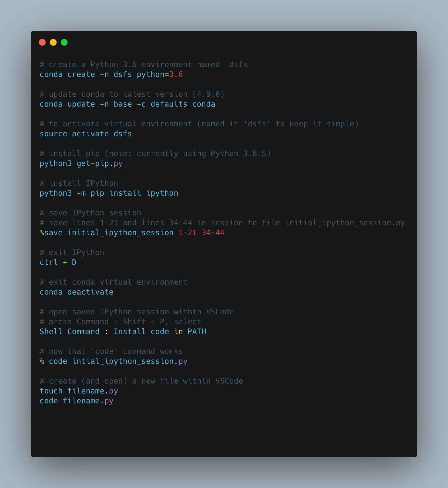

---
authors:
- admin
categories: []
date: "2020-10-23T00:00:00Z"
draft: false
featured: false
image:
  caption: ""
  focal_point: ""
lastMod: "2020-10-23T00:00:00Z"
projects: []
subtitle: Python crash course
summary: Survey of python features relevant for Data Science
tags: []
title: Data Science from Scratch (ch2)
---

## Chapter 2: A Crash Course in Python

This is the first of many chapters i'll be covering from Joel Grus' Data Science from Scratch book (2nd edition). This chapter provides a quick survey of python features needed for "doing" data science from scratch, including essential setup of virtual environments and other tooling.

While the chapter is not meant to be comprehensive, I may supplement certain sections with external content for greater detail in certain parts. 

My goal is twofold. First, to go through this book and, as a byproduct, learn python. Second, to look out for and highlight the areas where the *pythonic* way of doing things is necessary to accomplish something in the data science process. 

At several sections throughout this chapter, the author emphasises how much a particular feature will be used later in the book (e.g., functions, dictionaries, list, list comprehensions (and for-loops), assert, iterables and generators, randomness, type annotations). Things *not* used as much (e.g., sets, automated test, subclasses that inherit functionality from a parent class, zip and argument unpacking, args, kwargs).

Additional code can be found in this [repo](https://github.com/PaulApivat/dsfs)

### Installation, Virtual Environment and Modules

These section takes the reader through installing a virtual environment using Anaconda Python distribution. The author points out a best practice, "you should always work in a virtual environment and never use 'base' Python installation". Moreover, the author favors IPython over jupyter notebooks (he's a noted [critic of the notebook](https://www.youtube.com/watch?v=7jiPeIFXb6U))

The first time I installed Python, it took me awhile to get things right and eventually I relied on jupyter notebooks through Anaconda. As we go through this book, I'll be using virtual environments and IPython as much as I can (although I may sprinkle in a notebook here and there). My IDE for interacting with the conda virtual environment and IPython will be VSCode. 

Fortunately, I had a relatively painless process setting up a virtual environment and IPython, although I had to take a slight detour to setup the `code` command for VSCode.

Here's a summary of the commands I used for setup:



### Functions

Three things are emphasized here: passing functions as arguments for other functions, lambda functions and default parameter values. 

The illustration of functions being passed as arguments is demonstrated below. A function `double` is created. A function `apply_to_one` is created. The `double` function is pointed at `my_double`. We pass `my_double` into the `apply_to_one` function and set that to `x`. 

Whatever function is passed to `apply_to_one`, *its* argument is 1. So passing `my_double` means we are doubling 1, so x is 2.

But the important thing is that a function got passed to another function (aka higher order functions).

```
def double(x):
    """
    this function doubles and returns the argument
    """
    return x * 2
    
def apply_to_one(f):
    """Calls the function f with 1 as its argument"""
    return f(1)
    
my_double = double

# x is 2 here
x = apply_to_one(my_double)

# extending this example
def apply_five_to(e):
    """returns the function e with 5 as its argument"""
    return e(5)

# doubling 5 is 10
w = apply_five_to(my_double)
```

Since functions are going to be used extensively, here's another more complicated example. I found this from [Trey Hunner's site](https://treyhunner.com/2020/01/passing-functions-as-arguments/). Two functions are defined - `square` and `cube`. Both functions are saved to a list called `operations`. Another list, `numbers` is created. 

Finally, a for-loop is used to iterate through `numbers`, and the `enumerate` property allows access to both index and item in numbers. That's used to find whether the `action` is a `square` or `cube` (operations[0] is `square`, operations[1] is `cube`), which is then given as its argument, the items inside the `numbers` list. 

```
# create two functions
def square(n): return n**2
def cube(n): return n**3

# store those functions inside a list, operations, to reference later
operations = [square, cube]

# create a list of numbers
numbers = [2,1,3,4,7,11,18,29]

# loop through the numbers list
# using enumerate the identify index and items
# [i % 2] results in either 0 or 1, that's pointed at action
# using the dunder, name, retrieves the name of the function - either square or cube - from the operations list
# print __name__ along with the item from the numbers list
# action is either a square or cube

for i, n in enumerate(numbers):
    action = operations[i % 2]
    print(f"{action.__name__}({n}):", action(n))

# print
square(2): 4
cube(1): 1
square(3): 9
cube(4): 64
square(7): 49
cube(11): 1331
square(18): 324
cube(29): 24389

# more explicit, yet verbose way to write the for-loop
for index, num in enumerate(numbers):
    action = operations[index % 2]
    print(f"{action.__name__}({num}):", action(num))

```

This section also introduces `lambda` functions (aka anonymous functions) to demonstrate how functions, being first-class in Python, can, like any variable, be passed into the argument of another function. However, with `lambda` instead of defining functions with `def`, it is defined inside another function. Here's an illustration:

```
# we'll reuse apply_five_to, which takes in a function and provides '5' as the argument
def apply_five_to(e):
    """returns the function e with 5 as its argument"""
    return e(5)

# this lambda function adds '4' to any argument
# when passing this lambda function to apply_five_to
# you get y = 5 + 4
y = apply_five_to(lambda x: x + 4)

# we can also change what the lambda function does without defining a separate function
# here the lambda function multiplies the argument by 4
# y = 20
y = apply_five_to(lambda x: x * 4)

```
Lambda functions are convenient in that you can pass it into another function *immediately* without having to define it separately, but the consensus seems to be that you should just use `def`.

Here's an external example of `lambda` functions from [Trey Hunner](https://treyhunner.com/2020/01/passing-functions-as-arguments/). In this example, a `lambda` function is used within a `filter` function that takes in two arguments.

```
# calling help(filter) displays an explanation

class filter(object)
 |  filter(function or None, iterable) --> filter object

# create a list of numbers
numbers = [2,1,3,4,7,11,18,29]

# the lambda function will return n if it is an even number
# we filter the numbers list using the lambda function
# wrapped in a list, this returns [2,4,18]
list(filter(lambda n: n % 2 == 0, numbers))

```

There are whole books, or at least whole chapters, that can be written about Python functions, but we'll limit our discussion for now to the idea that **functions can be passed as arguments to other functions**. I'll report back on this section as we progress through the book.

### Strings

Strings may not be terribly exciting for data science or machine learning, unless you're getting into natural language processing, so we'll keep it brief here. The key take aways are that *backslashes* encode special characters and that **f-strings** is the most updated way to do string interpolation. Here are some examples:

```python
# point strings to variables (we'll use my name)
first_name = "Paul"
last_name = "Apivat"

# f-string (recommended), 'Paul Apivat'
f_string = f"{first_name} {last_name}"

# string addition, 'Paul Apivat'
string_addition = first_name + " " + last_name

# string format, 'Paul Apivat'
string_format = "{0} {1}".format(first_name, last_name)

# percent format (NOT recommended), 'Paul Apivat'
pct_format = "%s %s" %('Paul','Apivat')
```

### Exceptions

The author covers exceptions to make the point that they're not all that bad in Python and it's worth handling exceptions yourself to make code more readable. Here's my own example that's slightly different from the book:

```python
integer_list = [1,2,3]

heterogeneous_list = ["string", 0.1, True]

# you can sum a list of integers, here 1 + 2 + 3 = 6
sum(integer_list)

# but you cannot sum a list of heterogeneous data types
# doing so raises a TypeError
sum(heterogeneous_list)

# the error crashes your program and is not fun to look at
---------------------------------------------------------------------------
TypeError                                 Traceback (most recent call last)
<ipython-input-12-3287dd0c6c22> in <module>
----> 1 sum(heterogeneous_list)

TypeError: unsupported operand type(s) for +: 'int' and 'str'

# so the idea is to handle the exceptions with your own messages
try:
    sum(heterogeneous_list)
except TypeError:
    print("cannot add objects of different data types")
```

At this point, the primary benefits to handling exceptions yourself is for code readability, so we'll come back to this section if we see more useful examples.  

### Lists

### Tuples

### Dictionaries

### defaultdict

### Counters

### Sets

### Control Flow

### Truthiness

### Sorting

### List Comprehensions

### Automated Testing and assert

### Object-Oriented Programming

### Iterables and Generators

### Randomness

### Regular Expressions

### zip and Argument Unpacking

### args and kwargs

### Type Annotations

### How to Write Type Annotations


###


