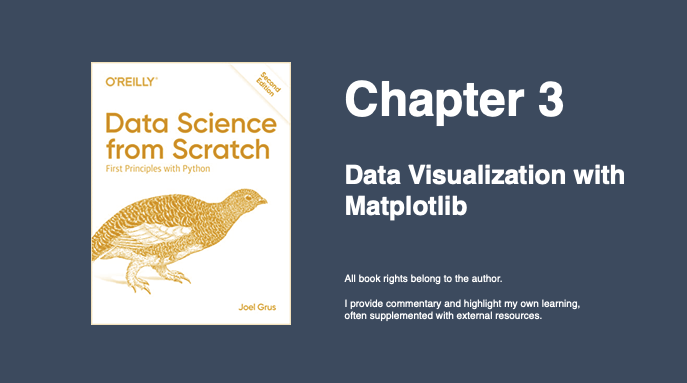
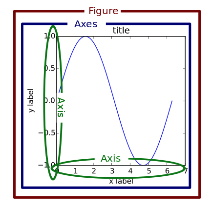
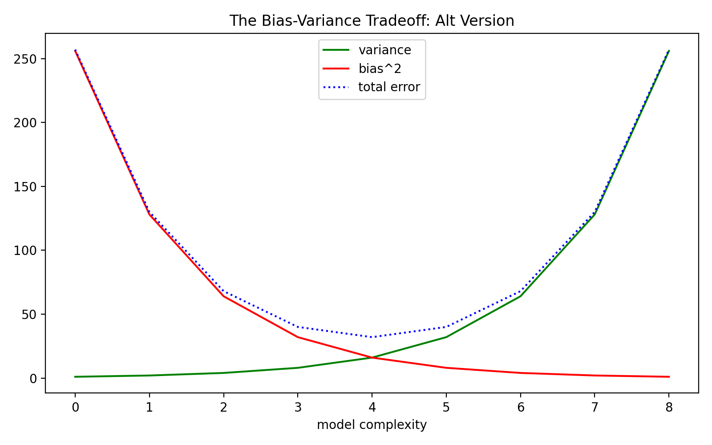

---
authors:
- admin
categories: []
date: "2020-11-05T00:00:00Z"
draft: false
featured: false
image:
  caption: ""
  focal_point: ""
lastMod: "2020-11-05T00:00:00Z"
projects: []
subtitle: Data Visualization with Matplotlib
summary: Visualizing Data in Python
tags: []
title: Making sense of matplotlib 
---


## Data Visualization



Chapter 3 of Data Science from Scratch introduces us to visualizing data using [matplotlib](https://matplotlib.org/). This is widely used in the Python ecosystem, although my sense is that people are *just as happy, if not more*, to use other libraries like [seaborn](https://seaborn.pydata.org/), [Altair](https://altair-viz.github.io/) and [bokeh](https://bokeh.org/). (**note**: seaborn is built on top of matplotlib).

This chapter is fairly brief and is meant as a quick introduction to matplotlib - to get readers familiar with basic charts. Whole books can be written on **data visualization** alone, so this is meant more as an appetizer, rather than a full-course. 

There's a fair amount of detail involved in using matplotlib, so we'll break it down to demystify it.

#### Basic Plotting

This chapter goes through the main basic charts including Line, Bar, Histograms, and Scatter Plots. **At first glance**, they follow a similar pattern. Data is provided as a `list` of numbers (usually more than one list). `pyplot` is imported from `matplotlib` as `plt`. The `plt` module has several **functions** which are accessed to create the plot. 

Here's an example line chart visualizing growth in GDP over time:


Here's the code:

```python

from matplotlib import pyplot as plt

# the data
years = [1950, 1960, 1970, 1980, 1990, 2000, 2010]
gdp = [300.2, 543.3, 1075.9, 2862.5, 5979.6, 10289.7, 14958.3]

# the plot
plt.plot(years, gdp, color="green", marker='o', linestyle='solid')
plt.title("Nominal GDP")
plt.ylabel("Billions of $")
plt.xlabel("Years")
plt.show()

```

You can somewhat get by with just knowing this. Briefly consulting the documentation will let you see some other *chart types* like so:


Let's say we wanted to convert our **line chart** into a **stacked area chart**, we can just change one line:

```python
from matplotlib import pyplot as plt

years = [1950, 1960, 1970, 1980, 1990, 2000, 2010]
gdp = [300.2, 543.3, 1075.9, 2862.5, 5979.6, 10289.7, 14958.3]

plt.stackplot(years, gdp, color="green") # this is the only line we changed

plt.title("Nominal GDP")
plt.ylabel("Billions of $")
plt.xlabel("Years")
plt.show()

```
Here's what the **stacked area chart** version of the previous graph looks like:


To keep things simple, we can change the chart type with just one line and we just need to remember that when converting from chart to chart, we have to be mindful of the parameters that each chart type takes. For example, a **stacked area chart** takes in different parameters than **line charts** (for example, you'll get an `AttributionError` if you try to use `marker` in a stacked area chart.)

Here's an example bar chart comparing movies by the number of Academy awards they've won:


Here's a **stem plot** version:


As with the previous example, changing just one **function** from `plt.bar` to `plt.stem` gave us a different plot:

```python
#---- Original Bar Chart ----#

movies = ["Annie Hall", "Ben-Hur", "Casablanca", "Gandhi", "West Side Story"]
num_oscars = [5,11,3,8,10]

plt.bar(range(len(movies)), num_oscars)
plt.title("My Favorite Movies")
plt.ylabel("# of Academy Awards")
plt.xticks(range(len(movies)), movies)
plt.show()

# ---- Stem Chart ---- #

movies = ["Annie Hall", "Ben-Hur", "Casablanca", "Gandhi", "West Side Story"]
num_oscars = [5,11,3,8,10]

plt.stem(range(len(movies)), num_oscars) # the only change
plt.title("My Favorite Movies")
plt.ylabel("# of Academy Awards")
plt.xticks(range(len(movies)), movies)
plt.show()
```

#### There are levels to this: Hierarchy

I'm all for keeping **matplotlib** as simple as possible but one thing the above examples gloss over is the **matplotlib object hierarchy**, which is something worth understanding to get a feel for how the various functions operate. 

This next figure is borrowed from [Real Python](https://realpython.com/python-matplotlib-guide/) and it nicely highlights the hierarchy inherent in *every* plot:



You'll note the levels: Figure, Axes and Axis. When digging into [matplotlib documentation on axes](https://matplotlib.org/api/axes_api.html?), these levels are brought to the foreground.


To really see this in action, we'll need to code our plot *slightly* differently. For the last chart this chapter examines the **bias-variance tradeoff** which is something we'll learn more about in future chapters, but it highlights the [trade-off](https://en.wikipedia.org/wiki/Bias%E2%80%93variance_tradeoff) in trying to simultanenously minimize two sources of error so our algorithm generalizes to new situations. 

Here's the code:

```python
# BOOK version
variance = [1,2,4,8,16,32,64,128,256]
bias_squared = [256, 128, 64, 32, 16, 8, 4, 2, 1]
total_error = [x + y for x,y in zip(variance, bias_squared)]
xs = [i for i, _ in enumerate(variance)]

plt.plot(xs, variance, 'g-', label='variance')
plt.plot(xs, bias_squared, 'r-', label='bias^2')
plt.plot(xs, total_error, 'b:', label='total error')
plt.legend(loc=9)
plt.xlabel("model complexity")
plt.xticks([])
plt.title("The Bias-Variance Tradeoff")
plt.show()

# ALTERNATE version
variance = [1,2,4,8,16,32,64,128,256]
bias_squared = [256, 128, 64, 32, 16, 8, 4, 2, 1]
total_error = [x + y for x,y in zip(variance, bias_squared)]
xs = [i for i, _ in enumerate(variance)]

fig, ax = plt.subplots(figsize=(8,5))
ax.plot(xs, variance, 'g-', label='variance')
ax.plot(xs, bias_squared, 'r-', label='bias^2')
ax.plot(xs, total_error, 'b:', label='total error')
ax.legend(loc='upper center')
ax.set_xlabel("model complexity")
ax.set_title("The Bias-Variance Tradeoff: Alt Version")
fig.tight_layout()
fig.show()

```

Instead using the `plt` module, we use `fig` and `ax`, here are their data types:

```python
type(fig) # matplotlib.figure.Figure
type(ax)  # matplotlib.axes._subplots.AxesSubplot
```
This makes *explicit* the **matplotlib object hierarchy**, particularly as we see how we access function at the `axes._subplits.AxesSubplot` level (the [documentation has much more detail](https://matplotlib.org/api/axes_api.html?)).

Here's the chart:



In summary, we learned that matplotlib *can* be fairly simple to use for static, simple plots, but we're better served having *some* understanding of **matplotlib's object hierarchy**. We'll examine more chart types as we proceed with the rest of the chapters. 
