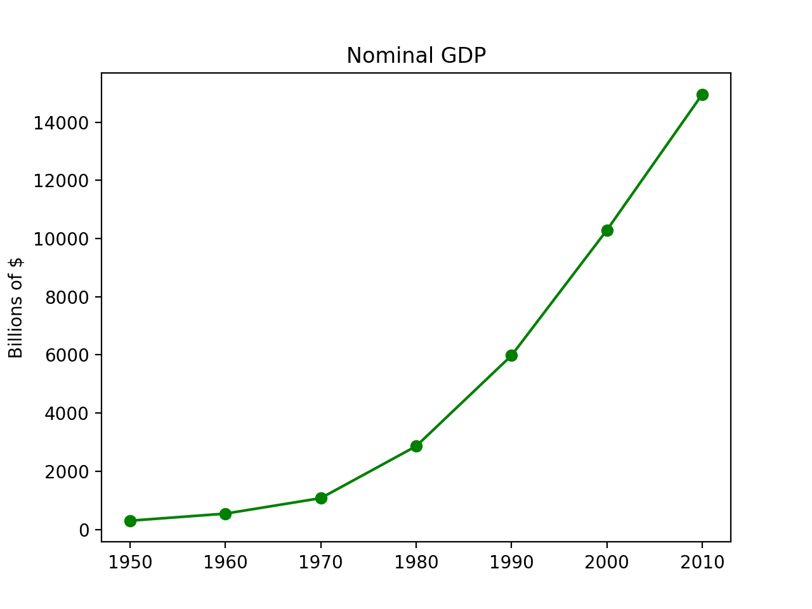
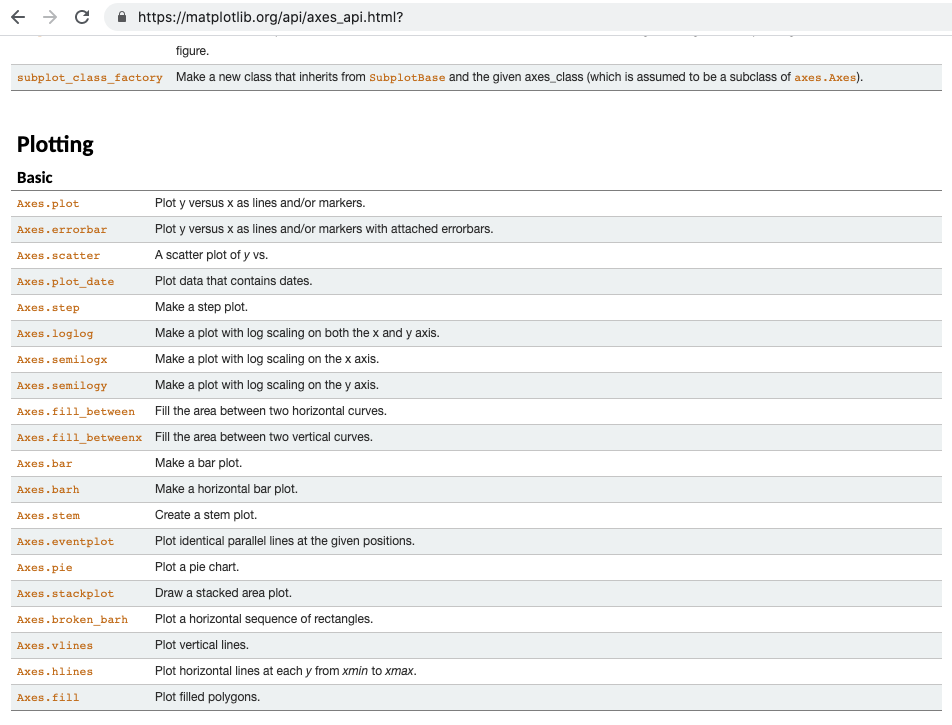
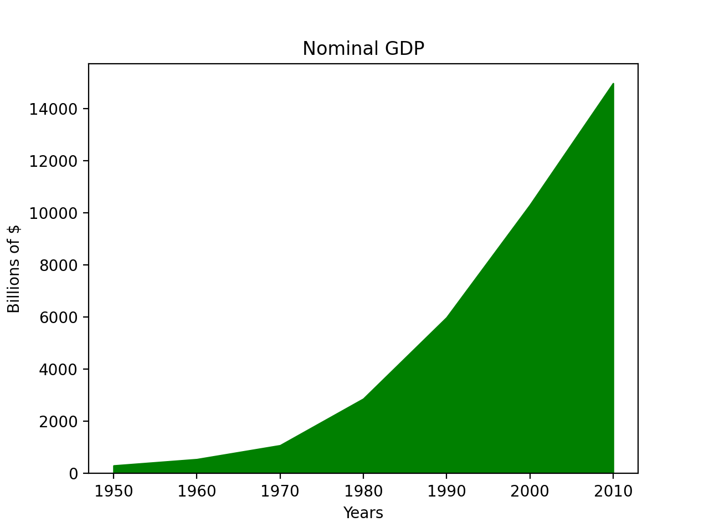
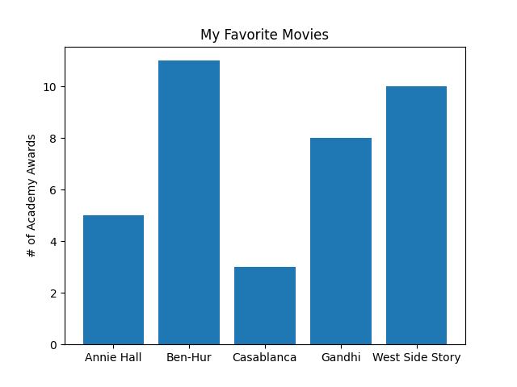
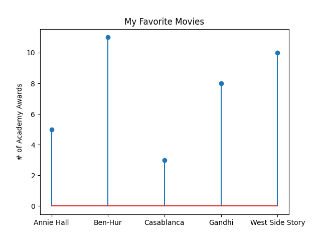

---
authors:
- admin
categories: []
date: "2020-11-05T00:00:00Z"
draft: false
featured: false
image:
  caption: ""
  focal_point: ""
lastMod: "2020-11-05T00:00:00Z"
projects: []
subtitle: Data Visualization with Matplotlib
summary: Visualizing Data in Python
tags: []
title: Introduction to Matplotlib 
---


## Data Visualization

Chapter 3 of Data Science from Scratch introduces us to visualizing data using [matplotlib](https://matplotlib.org/). This is widely used in the Python ecosystem, although my sense is that people are *just as happy, if not more*, to use other libraries like [seaborn](https://seaborn.pydata.org/), [Altair](https://altair-viz.github.io/) and [bokeh](https://bokeh.org/). (**note**: seaborn is built on top of matplotlib).

This chapter is fairly brief and is meant as a quick introduction to matplotlib - to get readers familiar with basic charts. Whole books can be written on **data visualization** alone, so this is meant more as an appetizer, rather than a full-course. 

There's a fair amount of detail involved in using matplotlib, so we'll break it down to demystify it.

#### Basic Plotting

This chapter goes through the main basic charts including Line, Bar, Histograms, and Scatter Plots. **At first glance**, they follow a similar pattern. Data is provided as a `list` of numbers (usually more than one list). `pyplot` is imported from `matplotlib` as `plt`. The `plt` module has several **functions** which are accessed to create the plot. 

Here's an example line chart visualizing growth in GDP over time:



Here's the code:

```python

from matplotlib import pyplot as plt

# the data
years = [1950, 1960, 1970, 1980, 1990, 2000, 2010]
gdp = [300.2, 543.3, 1075.9, 2862.5, 5979.6, 10289.7, 14958.3]

# the plot
plt.plot(years, gdp, color="green", marker='o', linestyle='solid')
plt.title("Nominal GDP")
plt.ylabel("Billions of $")
plt.xlabel("Years")
plt.show()

```

You can somewhat get by with just knowing this. Briefly consulting the documentation will let you see some other *chart types* like so:



Let's say we wanted to convert our **line chart** into a **stacked area chart**, we can just change one line:

```python
from matplotlib import pyplot as plt

years = [1950, 1960, 1970, 1980, 1990, 2000, 2010]
gdp = [300.2, 543.3, 1075.9, 2862.5, 5979.6, 10289.7, 14958.3]

plt.stackplot(years, gdp, color="green") # this is the only line we changed

plt.title("Nominal GDP")
plt.ylabel("Billions of $")
plt.xlabel("Years")
plt.show()

```
Here's what the **stacked area chart** version of the previous graph looks like:



To keep things simple, we can change the chart type with just one line and we just need to remember that when converting from chart to chart, we have to be mindful of the parameters that each chart type takes. For example, a **stacked area chart** takes in different parameters than **line charts** (for example, you'll get an `AttributionError` if you try to use `marker` in a stacked area chart.)

Here's an example bar chart comparing movies by the number of Academy awards they've won:



Here's a **stem plot** version:



As with the previous example, changing just one **function** from `plt.bar` to `plt.stem` gave us a different plot:

```python

```

#### Hierarchy


