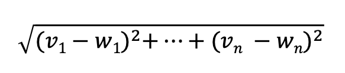
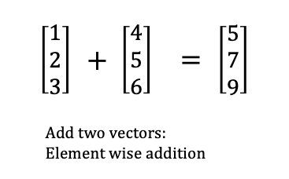
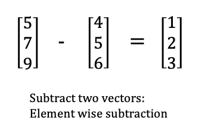
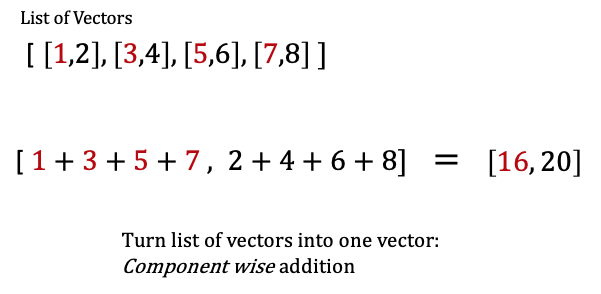
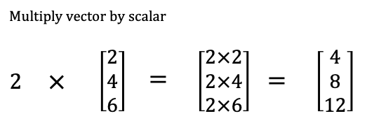
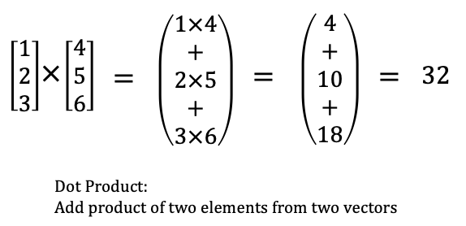
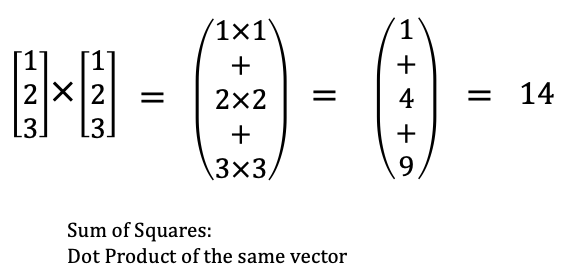
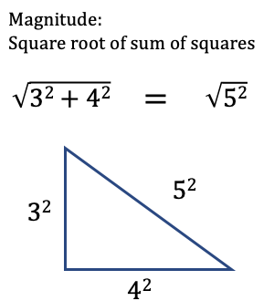
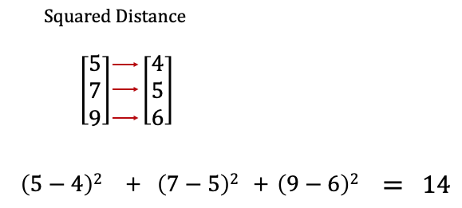

---
authors:
- admin
categories: []
date: "2020-11-10T00:00:00Z"
draft: false
featured: false
image:
  caption: ""
  focal_point: ""
lastMod: "2020-11-10T00:00:00Z"
projects: []
subtitle: Vectors & Matrices
summary: Building tools for working with vectors and matrices from scratch
tags: []
title: Data Science from Scratch (ch4) - Linear Algebra
---

### Table of contents
- [Vectors](#vectors)
- [Matrices](#matrices)

## Overview

We'll see the **from scratch** aspect of the book play out as we implement several building block functions to help us work towards defining the **Euclidean Distance** in code:



While we don't see its application immediately, we can expect to see the **Euclidean Distance** used for K-nearest neighbors (classication) or K-means (clustering) to find the "k closest points" ([source](https://sebastianraschka.com/faq/docs/euclidean-distance.html#:~:text=Machine%20Learning%20FAQ&text=For%20example%2C%20picture%20it%20as,of%20a%20particular%20sample%20point.)). (*note* : there are other types of distance formulas used as well.)

En route towards implementing the **Euclidean Distance**, we also implement the **sum of squares** which is a crucial piece for how **regression** works. 

Thus, the **from scratch** aspect of this book works on two levels. *Within* this chapter, we're building piece by piece up to an important **distance** and **sum of squares** formula. But we're also building tools we'll use in subsequent chapters. 

## Vectors

We start off with implementing functions to **add** and **subtract** two vectors. We also create a function for *component wise sum* of a list of vectors, where a new vector is created whose first element is the sum of all the first elements in the list and so on. 

We then create a function to **multiply** a vector by  scalar, which we use to compute the *component wise mean* of a list of vectors. 

We also create the **dot product** of two vectors or the *sum of their component wise product*, and this is is the generalize version of the **sum of squares**. At this point, we have enough to implement the **Euclidean distance**. Let's take a look at the code:

#### Example Vectors

Vectors are simply a list of numbers:

```python
height_weight_age = [70,170,40]

grades = [95,80,75,62]
```

### Add

You'll *note* that we do **type annotation** on our code throughout. This is a convention advocated by the author (and as a newcomer to Python, I like the idea of being explicit about data type for a function's input and output). 

```python
from typing import List

Vector = List[float]

def add(v: Vector, w: Vector) -> Vector:
    """Adds corresponding elements"""
    assert len(v) == len(w), "vectors must be the same length"
    return [v_i + w_i for v_i, w_i in zip(v,w)]
    
assert add([1,2,3], [4,5,6]) == [5,7,9]
```
Here's another view of what's going on with the `add` function:



### Subtract

```python
def subtract(v: Vector, w: Vector) -> Vector:
    """Subtracts corresponding elements"""
    assert len(v) == len(w), "vectors must be the same length"
    return [v_i - w_i for v_i, w_i in zip(v,w)]
    
assert subtract([5,7,9], [4,5,6]) == [1,2,3]
```
This is pretty much the same as the previous:



### Componentwise Sum

```python
def vector_sum(vectors: List[Vector]) -> Vector:
    """Sum all corresponding elements (componentwise sum)"""
    # Check that vectors is not empty
    assert vectors, "no vectors provided!"
    # Check the vectorss are all the same size
    num_elements = len(vectors[0])
    assert all(len(v) == num_elements for v in vectors), "different sizes!"
    # the i-th element of the result is the sum of every vector[i]
    return [sum(vector[i] for vector in vectors)
            for i in range(num_elements)]
            
assert vector_sum([[1,2], [3,4], [5,6], [7,8]]) == [16,20]
```
Here, a `list` of vectors becomes *one* vector. If you go back to the `add` function, it takes **two** vectors, so if we tried to give it four vectors, we'd get a `TypeError`. So we wrap four vectors in a `list` and provide *that* as the argument for `vector_sum`:



### Multiply Vector with a Number

```python
def scalar_multiply(c: float, v: Vector) -> Vector:
    """Multiplies every element by c"""
    return [c * v_i for v_i in v]
    
assert scalar_multiply(2, [2,4,6]) == [4,8,12]
```
One number is multiplied with *all* numbers in the vector, with the vector retaining its length:




### Componentwise Mean

This is similar to componentwise sum (see above); a list of vectors becomes one vector.

```python
def vector_mean(vectors: List[Vector]) -> Vector: 
    """Computes the element-wise average"""
    n = len(vectors)
    return scalar_multiply(1/n, vector_sum(vectors))
    
assert vector_mean([ [1,2], [3,4], [5,6] ]) == [3,4]
```


### Dot Product

```python
def dot(v: Vector, w: Vector) -> float:
    """Computes v_1 * w_1 + ... + v_n * w_n"""
    assert len(v) == len(w), "vectors must be the same length"
    return sum(v_i * w_i for v_i, w_i in zip(v,w))
    
assert dot([1,2,3], [4,5,6]) == 32
```
Here we multiply the elements, then sum their results. Two vectors becomes a single number (`float`):



### Sum of Squares

```python
def sum_of_squares(v: Vector) -> float:
    """Returns v_1 * v_1 + ... + v_n * v_n"""
    return dot(v,v)
    
assert sum_of_squares([1,2,3]) == 14
```
In fact, `sum_of_squares` is a special case of **dot product**:



### Magnitude

```python
def magnitude(v: Vector) -> float:
    """Returns  the magnitude (or length) of v"""
    return math.sqrt(sum_of_squares(v)) # math.sqrt is the square root function
    
assert magnitude([3,4]) == 5
```
With `magnitude` we square root the `sum_of_squares`. This is none other than the [pythagorean theorem](https://en.wikipedia.org/wiki/Pythagorean_theorem). 




### Squared Distance 

```python
def squared_distance(v: Vector, w: Vector) -> float:
    """Computes (v_1 - w_1) ** 2 + ... + (v_n - w_n) ** 2"""
    return sum_of_squares(subtract(v,w))
```
This is the distance *between* two vectors, *squared*.



### (Euclidean) Distance

```python
import math

def distance(v: Vector, w: Vector) -> float:
    """Also computes the distance between v and w"""
    return math.sqrt(squared_distance(v,w))
```

Finally, we square root the `squared_distance` to get the (euclidean) distance:


### Summary

We literally built from scratch, albeit with some help from Python's `math` module, the blocks needed for essential functions that we'll expect to use later, namely: the `sum_of_squares` and `distance`.

It's pretty cool to see these foundational concepts set us up to understand more complex machine learning algorithms like **regression**, **k-nearest neighbors (classification)**, **k-means (clustering)** and even touch on the **pythagorean theorem**. 

We'll examine matrices next. 

## Matrices

The first thing to note is that `matrices` are represented as `lists` of `lists` which is explicit with type annotation:

```python
from typing import List

Matrix = List[List[float]]
```
You might bet wondering if a `list` of `lists` is somehow different from a `list` of `vectors` we saw previously with the `vector_sum` function. To see, I used **type annotation** to try to define the arguments *differently*.

Here's the `vector_sum` function we defined previously:

```python
def vector_sum(vectors: List[Vector]) -> Vector:
    """Sum all corresponding elements (componentwise sum)"""
    # Check that vectors is not empty
    assert vectors, "no vectors provided!"
    # Check the vectorss are all the same size
    num_elements = len(vectors[0])
    assert all(len(v) == num_elements for v in vectors), "different sizes!"
    # the i-th element of the result is the sum of every vector[i]
    return [sum(vector[i] for vector in vectors)
            for i in range(num_elements)]
            
assert vector_sum([[1,2], [3,4], [5,6], [7,8]]) == [16,20]
```

Here's a **new** function, `vector_sum2` defined differently with type annotation:

```python
def vector_sum2(lists: List[List[float]]) -> List:
   """Sum all corresponding list (componentwise sum?)"""
   assert lists, "this list is empty!"
   # check that lists are the same size
   num_lists = len(lists[0])
   assert all(len(l) == num_lists for l in lists), "different sizes!"
   # the i-th list is the sum of every list[i]
   return [sum(l[i] for l in lists)
           for i in range(num_lists)]

assert vector_sum2([[1,2], [3,4], [5,6], [7,8]]) == [16,20]
```

I did a variety of things to see if `vector_sum` and `vector_sum2` behaved differently, but they appear to be identical:

```python

# both are functions
assert callable(vector_sum) == True
assert callable(vector_sum2) == True

# when taking the same argument, they both return a list
type(vector_sum([[1,2], [3,4], [5,6], [7,8]])) #list
type(vector_sum2([[1,2], [3,4], [5,6], [7,8]])) #list

# the same input yields the same output
vector_sum([[1,2],[3,4]])    # [4,6]
vector_sum2([[1,2],[3,4]])   # [4,6]
```

To keep it simple, in the context of **matrices**, you can think of **vectors** as the *rows of the matrix*.

For example, if we represent the small dataset below as a **matrix**, we can think of *columns* as variables like: height, weight, age; and *each row* as a person:

```python
sample_data = [[70, 170, 40],
               [65, 120, 26],
               [77, 250, 19]]
```
By extension of **rows** and **columns**, we can write a function for the shape of a matrix. This below `shape` function takes in a matrix and returns a `tuple` with two integers, number of rows and number of columns:

```python
from typing import Tuple
  
def shape(A: Matrix) -> Tuple[int, int]:
    """Returns (# of rows of A, # of columns of A)"""
    num_rows = len(A)
    num_cols = len(A[0]) if A else 0  # number of elements in first row
    return num_rows, num_cols
    
assert shape([[1,2,3], [4,5,6]]) == (2,3) # 2 rows, 3 columns
assert shape(sample_data) == (3,3)
```

We can actually write functions to grab either a specific *row* or a specific *columns* :

```python
Vector = List[float]

# rows
def get_row(A: Matrix, i: int) -> Vector:
    """Returns the i-th row of A (as a Vector)"""
    return A[i]  # A[i] is already the ith row

# column
def get_column(A: Matrix, i: int) -> Vector:
    """Returns the j-th column of A (as a Vector)"""
    return [A_i[j]
            for A_i in A]
```

Now, going beyond finding the shape, rows and columns of an existing matrix, we'll also want to **create** matrices and we'll do that using **nested list comprehensions**:

```python
from typing import Callable

def make_matrix(num_rows: int,
                num_cols: int,
                entry_fn: Callable[[int, int], float]) -> Matrix:
    """
    Returns a num_rows x num_cols matrix
    whose (i,j)-th entry is entry_fn(i, j)
    """
    return [[entry_fn(i,j)            # given i, create a list
            for j in range(num_cols)] # [entry_fn(i, 0), ...]
            for i in range(num_rows)] # create one list for each i
```
Then we'll actually *use* the `make_matrix` function to create a special type of matrix called the `identity matrix`:

```python
def identity_matrix(n: int) -> Matrix:
    """Returns the n x n identity matrix"""
    return make_matrix(n, n, lambda i, j: 1 if i == j else 0)

assert identity_matrix(5) == [[1, 0, 0, 0, 0],
                              [0, 1, 0, 0, 0],
                              [0, 0, 1, 0, 0],
                              [0, 0, 0, 1, 0],
                              [0, 0, 0, 0, 1]]
```

### Summary

To be sure there are [other types of matrices](https://machinelearningmastery.com/introduction-to-types-of-matrices-in-linear-algebra/), but in this chapter we're only briefly exploring its construction to prime us.

We know matrices can be used to represent data, each *row* in the dataset being a **vector**. Because we can also know a matrices' *column*, we'll use it to represent linear functions that **map k-dimensional vectors to n-dimensional vectors**. 

Finally, matrices can also be used to map *binary relationships*. 

### Flashback to Ch.1

On our first day at DataScienster&trade; we were given `friendship_pairs` data:

```python
friendship_pairs = [(0,1), (0,2), (1,2), (1,3), (2,3), (3,4),
                    (4,5), (5,6), (5,7), (6,8), (7,8), (8,9)]
```

These `friendship_pairs` can also be represented in matrix form:

```python
#            user 0  1  2  3  4  5  6  7  8  9
friend_matrix = [[0, 1, 1, 0, 0, 0, 0, 0, 0, 0], # user 0
                 [1, 0, 1, 1, 0, 0, 0, 0, 0, 0], # user 1
                 [1, 1, 0, 1, 0, 0, 0, 0, 0, 0], # user 2
                 [0, 1, 1, 0, 1, 0, 0, 0, 0, 0], # user 3
                 [0, 0, 0, 1, 0, 1, 0, 0, 0, 0], # user 4
                 [0, 0, 0, 0, 1, 0, 1, 1, 0, 0], # user 5
                 [0, 0, 0, 0, 0, 1, 0, 0, 1, 0], # user 6
                 [0, 0, 0, 0, 0, 1, 0, 0, 1, 0], # user 7
                 [0, 0, 0, 0, 0, 0, 1, 1, 0, 1], # user 8
                 [0, 0, 0, 0, 0, 0, 0, 0, 1, 0]] # user 9
```

This allows us to check very quickly whether two users are friends or not:

```python
assert friend_matrix[0][2] == 1, "0 and 2 are friends"
assert friend_matrix[0][8] == 0, "0 and 8 are not friends"
```

And if we wanted to check for each user's friend, we could:

```python
friends_of_five = [i
                  for i, is_friend in enumerate(friend_matrix[5])
                  if is_friend]
                  
friends_of_zero = [i
                   for i, is_friend in enumerate(friend_matrix[0])
                   if is_friend]
                   
assert friends_of_five == [4,6,7]
assert friends_of_zero == [1,2]
```