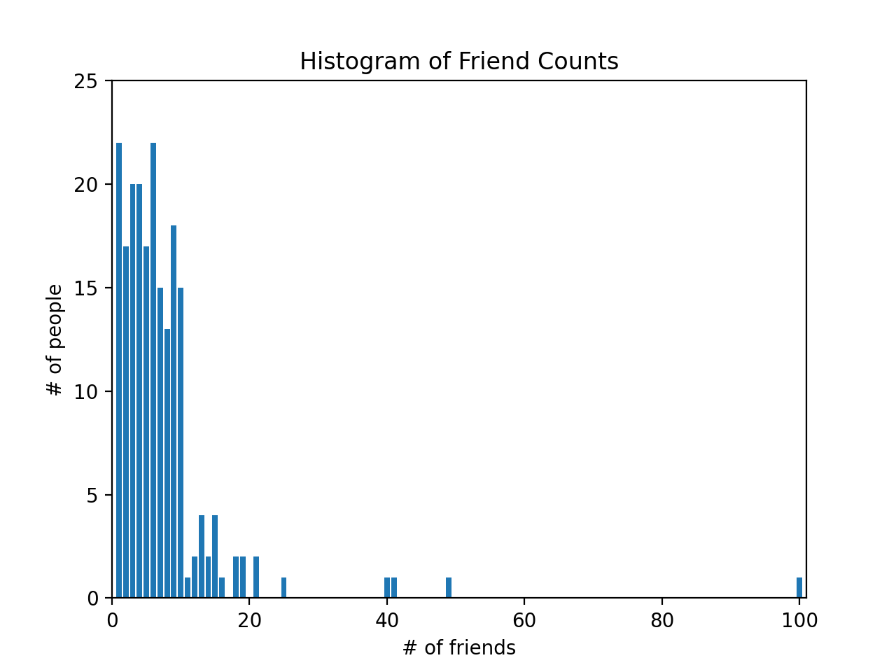

---
authors:
- admin
categories: []
date: "2020-11-19T00:00:00Z"
draft: false
featured: false
image:
  caption: ""
  focal_point: ""
lastMod: "2020-11-19T00:00:00Z"
projects: []
subtitle: Descriptive Statistics & Correlations
summary: Building tools to describe a data and find relationships
tags: []
title: Data Science from Scratch (ch5) - Statistics
---

### Table of contents


## Overview

This post is chapter 5 in continuation of my coverage of [Data Science from Scratch by Joel Grus](https://joelgrus.com/2019/05/13/data-science-from-scratch-second-edition/). 

It should be noted upfront that everything covered in this post can be done more expediently and efficiently in libraries like [NumPy](https://numpy.org/) as well as the [statistics module in Python](https://github.com/python/cpython/blob/3.9/Lib/statistics.py). 

The primary value of this book, and by extension this post, in my opinion, is the emphasis on **learning** how Python primitives can be used to build tools from the ground up. 

Specifically, we'll examine how specific features of the Python language as well as functions we built in a previous post on [linear algebra](https://paulapivat.com/post/dsfs_4/) can be used to build tools used to *describe* data and relationships within data (aka statistics).

I think this is pretty cool. Hopefully you agree. 

#### Example Data

This chapter continues the narrative of you as a newly hired data scientist at DataScienster, the social network for data scientists, and your job is to *describe* how many friends members in this social network has. We have two `lists` of `float` to work with. We'll work with `num_friends` first, then `daily_minutes` later.

I wanted this post to be self-contained, and in order to do that we'll have to read in a larger than average `list` of `floats`. The alternative would be to get the data directly from the book's [github repo (statistics.py)](https://github.com/joelgrus/data-science-from-scratch/blob/master/scratch/statistics.py)

```python
num_friends = [100.0,49,41,40,25,21,21,19,19,18,18,16,15,15,15,15,14,14,13,13,13,13,12,12,11,10,10,10,10,10,10,10,10,10,10,10,10,10,10,10,9,9,9,9,9,9,9,9,9,9,9,9,9,9,9,9,9,9,8,8,8,8,8,8,8,8,8,8,8,8,8,7,7,7,7,7,7,7,7,7,7,7,7,7,7,7,6,6,6,6,6,6,6,6,6,6,6,6,6,6,6,6,6,6,6,6,6,6,5,5,5,5,5,5,5,5,5,5,5,5,5,5,5,5,5,4,4,4,4,4,4,4,4,4,4,4,4,4,4,4,4,4,4,4,4,3,3,3,3,3,3,3,3,3,3,3,3,3,3,3,3,3,3,3,3,2,2,2,2,2,2,2,2,2,2,2,2,2,2,2,2,2,1,1,1,1,1,1,1,1,1,1,1,1,1,1,1,1,1,1,1,1,1,1]

num_friends2 = [10000.0,49,41,40,25,21,21,19,19,18,18,16,15,15,15,15,14,14,13,13,13,13,12,12,11,10,10,10,10,10,10,10,10,10,10,10,10,10,10,10,9,9,9,9,9,9,9,9,9,9,9,9,9,9,9,9,9,9,8,8,8,8,8,8,8,8,8,8,8,8,8,7,7,7,7,7,7,7,7,7,7,7,7,7,7,7,6,6,6,6,6,6,6,6,6,6,6,6,6,6,6,6,6,6,6,6,6,6,5,5,5,5,5,5,5,5,5,5,5,5,5,5,5,5,5,4,4,4,4,4,4,4,4,4,4,4,4,4,4,4,4,4,4,4,4,3,3,3,3,3,3,3,3,3,3,3,3,3,3,3,3,3,3,3,3,2,2,2,2,2,2,2,2,2,2,2,2,2,2,2,2,2,1,1,1,1,1,1,1,1,1,1,1,1,1,1,1,1,1,1,1,1,1,1]

daily_minutes = [1,68.77,51.25,52.08,38.36,44.54,57.13,51.4,41.42,31.22,34.76,54.01,38.79,47.59,49.1,27.66,41.03,36.73,48.65,28.12,46.62,35.57,32.98,35,26.07,23.77,39.73,40.57,31.65,31.21,36.32,20.45,21.93,26.02,27.34,23.49,46.94,30.5,33.8,24.23,21.4,27.94,32.24,40.57,25.07,19.42,22.39,18.42,46.96,23.72,26.41,26.97,36.76,40.32,35.02,29.47,30.2,31,38.11,38.18,36.31,21.03,30.86,36.07,28.66,29.08,37.28,15.28,24.17,22.31,30.17,25.53,19.85,35.37,44.6,17.23,13.47,26.33,35.02,32.09,24.81,19.33,28.77,24.26,31.98,25.73,24.86,16.28,34.51,15.23,39.72,40.8,26.06,35.76,34.76,16.13,44.04,18.03,19.65,32.62,35.59,39.43,14.18,35.24,40.13,41.82,35.45,36.07,43.67,24.61,20.9,21.9,18.79,27.61,27.21,26.61,29.77,20.59,27.53,13.82,33.2,25,33.1,36.65,18.63,14.87,22.2,36.81,25.53,24.62,26.25,18.21,28.08,19.42,29.79,32.8,35.99,28.32,27.79,35.88,29.06,36.28,14.1,36.63,37.49,26.9,18.58,38.48,24.48,18.95,33.55,14.24,29.04,32.51,25.63,22.22,19,32.73,15.16,13.9,27.2,32.01,29.27,33,13.74,20.42,27.32,18.23,35.35,28.48,9.08,24.62,20.12,35.26,19.92,31.02,16.49,12.16,30.7,31.22,34.65,13.13,27.51,33.2,31.57,14.1,33.42,17.44,10.12,24.42,9.82,23.39,30.93,15.03,21.67,31.09,33.29,22.61,26.89,23.48,8.38,27.81,32.35,23.84]

```
## Describing Data

The `num_friends` list is a list of numbers representing "number of friends" a person has, so for example, one person has 100 friends. The first thing we do to describe the data is to create a bar chart plotting the number of people who have 100 friends, 49 friends, 41 friends, and so on. 

We first import `Counter` from `collections`. We also import `matplotlib.pyplot`.

We the `Counter` collection to turn the `num_friends` list into a `defaultdict(int)`-like object mapping keys to counts. For more info, please refer to this [previous post](https://paulapivat.com/post/dsfs_2/#counters) on the topic.

`Counter` is a very convenient way to count the values in num_friends. Once we use the `Counter` collection, a [high-performance container datatype](https://docs.python.org/2/library/collections.html), we can use methods like `most_common`. 

```python
from collections import Counter

import matplotlib.pyplot as plt

friend_counts = Counter(num_friends)

# the five most common values are: 6, 1, 4, 3 and 9 friends
# [(6, 22), (1, 22), (4, 20), (3, 20), (9, 18)]
friend_counts.most_common(5) 
```

To proceed with plotting, we'll use `friend_counts` to create a `list comprehension` that will loop through `friends_count` and for all **keys** from 0-101 (xs) and print a corresponding **value** (if it exists). This becomes the y-axis to `num_friends`, which is the x-axis:

```python
xs = range(101)   # largest num_friend value is 100
ys = [friend_counts[x] for x in xs]
plt.bar(xs, ys)
plt.axis([0, 101, 0, 25])
plt.title("Histogram of Friend Counts")
plt.xlabel("# of friends")
plt.ylabel("# of people")
plt.show()
```

This produced this plot below. You can see one person with 100 friends. 



You can also read more about data visualization [here](https://paulapivat.com/post/dsfs_3/).

Alternatively, we could generate simple statistics to describe the data using built-in Python methods: len, min, max and sorted. 

```python
num_points = len(num_friends) # number of data points in num_friends: 204
largest_value = max(num_friends) # largest value in num_friends: 100
smallest_value = min(num_friends) # smallest value in num_friends: 1

sorted_values = sorted(num_friends) # sort the values in ascending order
second_largest_value = sorted_values[-2] # second largest value from the back: 49
```

### Central Tendencies

The most common way of describing a set of data is to find it's average, which is the sum of all the values, divided by the number of values. *note* : we'll continue to use type annotations. 

```python
from typing import List

def mean(xs: List[float]) -> float:
    return sum(xs) / len(xs)
    
assert 7.3333 < mean(num_friends) < 7.3334
```

However, the mean is **notoriously sensitive to outliers** so statisticians often supplement their analysis with other measures of central tendencies like **median** Because the median is the *middle-most value*, it matters whether there is an *even* or *odd* number of data points.

Here we'll create two private functions for both situations - even and odd number of data points - in calculating the median. This first requires that we sort the data values. Then, in the case case of *even number* values, we'll find the two middle values and split them. In the case of *odd number* of values, we'll divide the *length* of the dataset by 2 (i.e., 50). 

Our median function will return either of the private function `_median_even` or `_median_odd` conditionally depending on if the length of a list of numbers is divisible (%2==0) by 2. 

```python

def _median_even(xs: List[float]) -> float:
    """If len(xs) is even, it's the average of the middle two elements"""
    sorted_xs = sorted(xs)
    hi_midpoint = len(xs) // 2   # e.g. length 4 => hi_midpoint 2
    return (sorted_xs[hi_midpoint - 1] + sorted_xs[hi_midpoint]) / 2
    
def _median_odd(xs: List[float]) -> float:
    """If len(xs) is odd, its the middle element"""
    return sorted(xs)[len(xs) // 2]
    
def median(v: List[float]) -> float:
    """Finds the 'middle-most' value of v"""
    return _median_even(v) if len(v) % 2 == 0 else _median_odd(v)
    
assert median([1,10,2,9,5]) == 5
assert median([1, 9, 2, 10]) == (2 + 9) / 2
```

Because the median is the *middle-most value*, it does not fully depend on every value in the data. For illustration, hypothetically if we have a another list `num_friends2` where one person had 10,000 friends, the **mean** would be much more sensitive to that change than the **median** would be.

```python
num_friends2 = [10000.0,49,41,40,25,21,21,19,19,18,18,16,15,15,15,15,14,14
    ,13,13,13,13,12,12,11,10,10,10,10,10,10,10,10,10,10,10,10,10,10,10,9,9,9,9
    ,9,9,9,9,9,9,9,9,9,9,9,9,9,9,8,8,8,8,8,8,8,8,8,8,8,8,8,7,7,7,7,7,7,7,7,7,7
    ,7,7,7,7,7,6,6,6,6,6,6,6,6,6,6,6,6,6,6,6,6,6,6,6,6,6,6,5,5,5,5,5,5,5,5,5,5
    ,5,5,5,5,5,5,5,4,4,4,4,4,4,4,4,4,4,4,4,4,4,4,4,4,4,4,4,3,3,3,3,3,3,3,3,3,3
    ,3,3,3,3,3,3,3,3,3,3,2,2,2,2,2,2,2,2,2,2,2,2,2,2,2,2,2,1,1,1,1,1,1,1,1,1,1
    ,1,1,1,1,1,1,1,1,1,1,1,1]
    
mean(num_friends2) # 7.333 => 55.86274509803921
median(num_friends2) # 6.0 => 6.0

```
You may also used `quantiles` to describe your data. Whenever you've heard "75th percentile", that is a description of quantiles relative to 100. In fact, the median is the 50% of the data lies (or 50th percentile).

Because `quantile` is a position from 0-100, the second argument is a float from 0.0 to 1.0. We use that float to multiply with the length of the list. Then we wrap in `int` to round down. That gives us a value that we can index a sorted xs to find the quantile. 

```python
def quantile(xs: List[float], p: float) -> float:
    """Returns the pth-percentile value in x"""
    p_index = int(p * len(xs))  
    return sorted(xs)[p_index]
    
assert quantile(num_friends, 0.10) == 1
assert quantile(num_friends, 0.25) == 3
assert quantile(num_friends, 0.75) == 9
assert quantile(num_friends, 0.90) == 13
```

Finally, we have the **mode**, which looks at the most common values. First, we use the `Counter` method on our list parameter and since Counter is a subclass of `dict` we have access to methods like `values()` to find all the values and `items()` to find key value pairs. We define `max_count` to find the max value (22), then the function returns a list comprehension which loops through `counts.items()` to find the key associated with the max_count (22). That is 1 and 6, meaning twenty-two people had one or six friends. 

```python
def mode(x: List[float]) -> List[float]:
    """Returns a list, since there might be more than one mode"""
    counts = Counter(x)
    max_count = max(counts.values())
    return [x_i for x_i, count in counts.items() if count == max_count]
    

assert set(mode(num_friends)) == {1, 6}
```

Because we had already used Counter on `num_friends` previously (see `friend_counts`), we could have just called the `most_common(2)` method to get the same results:

```python
mode(num_friends) # [6, 1]
friend_counts.most_common(2) # [(6, 22), (1, 22)]
```

### Dispersion

Aside from our data's central tendencies, we'll also want to understand it's spread or dispersion. The tools to do this are `data_range`, `variance`, `standard deviation` and `interquartile range`.

Range is a straightforward max value minus min value. 

Variance measures how for a [set of numbers is from their average value](https://en.wikipedia.org/wiki/Variance). What more interested, for our purpose, is how we need to borrow the functions we had previously built in the [linear algebra](https://paulapivat.com/post/dsfs_4/) post to create the variance function.

If you look at its wikipedia page, **variance** is the *squared deviation* of a variable from its mean. 

First, we'll need to create the `de_mean` function that takes a list of numbers and subtract from all numbers in the list, the mean value (this gives us the deviation from the mean). 

Then, we'll `sum_of_squares` all those deviations, which means we'll take all the values, multiply them with itself (square it), then add the values (and divide by length of the list minus one) to get the variance.

Recall that the `sum_of_squares` is a special case of the `dot` product function.

```python
# variance

from typing import List

Vector = List[float]

# see vectors.py in chapter 4 for dot and sum_of_squares

def dot(v: Vector, w: Vector) -> float:
    """Computes v_1 * w_1 + ... + v_n * w_n"""
    assert len(v) == len(w), "vectors must be the same length"
    return sum(v_i * w_i for v_i, w_i in zip(v,w))
    
def sum_of_squares(v: Vector) -> float:
    """Returns v_1 * v_1 + ... + v_n * v_n"""
    return dot(v,v)
    
def de_mean(xs: List[float]) -> List[float]:
    """Translate xs by subtracting its mean (so the result has mean 0)"""
    x_bar = mean(xs)
    return [x - x_bar for x in xs]
    
def variance(xs: List[float]) -> float:
    """Almost the average squared deviation from the mean"""
    assert len(xs) >= 2, "variance requires at least two elements"
    n = len(xs)
    deviations = de_mean(xs)
    return sum_of_squares(deviations) / (n - 1)
    
assert 81.54 < variance(num_friends) < 81.55
```


We'll examine correlations next.

## Correlation

### Simpson's Paradox

### Correlation and Causation

### Summary

