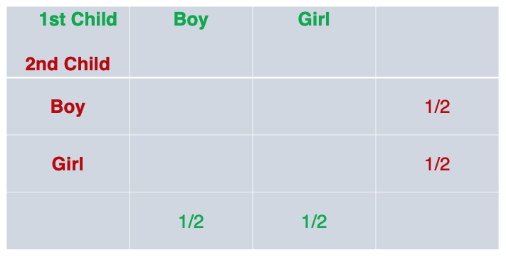
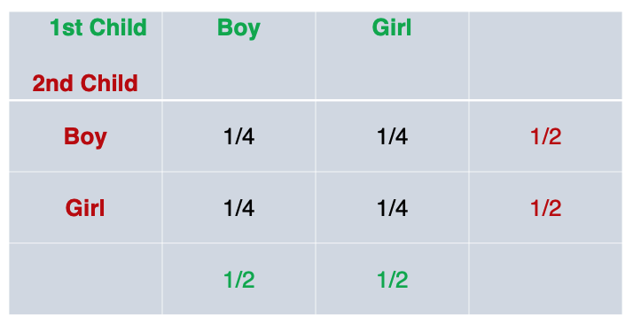
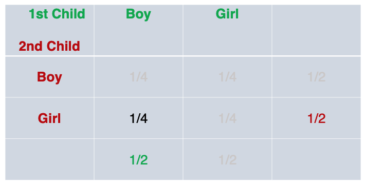
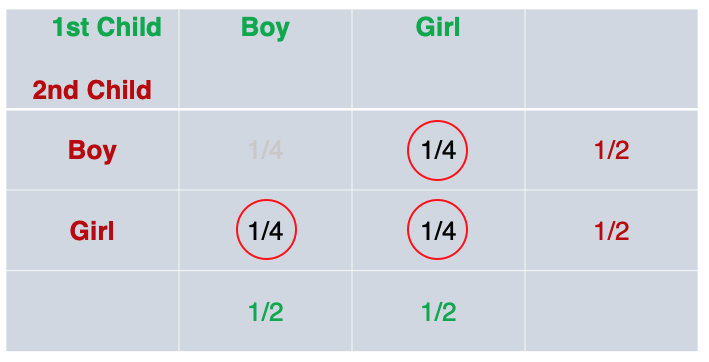
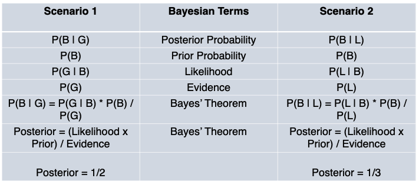
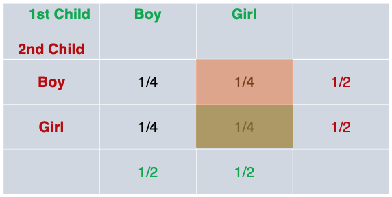
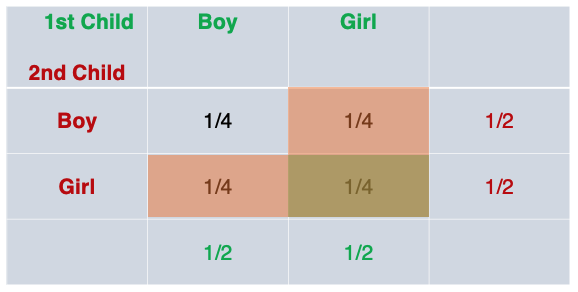

---
authors:
- admin
categories: []
date: "2020-11-22T00:00:00Z"
draft: false
featured: false
image:
  caption: ""
  focal_point: ""
lastMod: "2020-11-22T00:00:00Z"
projects: []
subtitle: Conditional Probability & Bayes Theorem
summary: Gaining an intuition for probability using Python
tags: ["Python", "Data Science", "Probability", "Statistics"]
title: Data Science from Scratch (ch6) - Probability
---

### Table of contents

- [Challenge](#challenge)
- [Marginal and Joint Probability](#marginal_and_joint_probabilities)
- [Conditional Probability](#conditional_probability)
- [Bayes' Theorem](#bayes_theorem)


## Overview

## Challenge

The first challenge in this section is distinguishing between **two** conditional probability statements. 

Here's the setup. We have a family with two (unknown) children with two assumptions. First, each child is equally likely to be a boy or a girl. Second, the gender of the second child is *independent* of the gender of the first child.

> Outcome 1: What is the probability of the event "both children are girls" (B) conditional on the event "the older child is a girl" (G)?

The probability for statement one is roughly 50% or (1/2).

> Outcome 2: What is the probability of the event "both children are girls" (B) conditional on the event "at least one of the children is a girl" (L)?

The probability for statement two is roughly 33% or (1/3).

But at first glance, they look similar. 

## Marginal_and_Joint_Probabilities 

The book jumps straight to conditional probabilities, but first, we'll have to look at **marginal** and **joint** probabilities. Then we'll create a **joint probabilities table** and **sum** probabilities to help us figure out the differences. We'll then *resume* with **conditional probabilities**. 

Before anything, we need to realize the situation we have is one of **independence**. The gender of one child is **independent** of a second child. 

The intuition for this scenario will be different from a **dependent** situation. For example, if we draw two cards from a deck (without replacement), the probabilities are different. The probability of drawing one King ♠️ is (4/52) and the probability of drawing a second King ♣️ is now (3/51); the probability of the second event (a second King) is *dependent* on the result of the first draw. 

Ok back to the two unknown children. 

We can say the probability of the first child being either a boy or a girl is 50/50. Moreover, the probability of the second child, which is **independent** of the first, is *also* 50/50. Remember, our first assumption is that *each child is equally likely to be a boy or a girl*.

Let's put these numbers in a table. The (1/2) probabilities shown here are called **marginal** probabilities (note how they're at the margins of the table).



Since we have two gender (much like two sides of a flipped coin), we can intuitively figure out *all* possible outcomes:

1. first child (Boy), second child (Boy)
2. first child (Boy), second child (Girl)
3. first child (Girl), second child (Boy)
4. first child (Girl), second child (Girl)

There are *4 possible outcomes* so the probability of getting any one of the four outcomes is (1/4). We can actually write these probabilities in the middle of the table, the **joint probabilities**:




To recap, the probability of the first child being either boy or girl is 50/50, simple enough. The probability of the second child being either boy or girl is also 50/50. When put in a table, this yielded the **marginal probability**. 

Now we want to know the probability of say, 'first child being a boy and second child being a girl'. This is a **joint probability** because is is the probability that the first child take a specific gender (boy) **AND** the second child take a specific gender (girl).

If two event are **independent**, and in this case they are, their **joint probabilities** are the *product* of the probabilities of **each one happening**.

The probability of the first child being a Boy (1/2) **and** second child being a Girl (1/2); The product of each marginal probability is the joint probability (1/2 * 1/2 = 1/4).



This can be repeated for the other three joint probabilities. 

## Conditional_Probability

Now we get into **conditional probability** which is the probability of one event happening (i.e., second child being a Boy or Girl) **given that** or **on conditional that** another event happened (i.e., first child being a Boy).

At this point, it might be a good idea to get familiar with notation.

A joint probability is the product of each individual event happening (assuming they are independent events). For example we might have two individual events:

- P(1st Child = Boy): 1/2
- P(2nd Child = Boy): 1/2

Here is their **joint probability**:
- P(1st Child = Boy, 2nd Child = Boy) =>
- P(1st Child = Boy) * P(2nd Child = Boy) => 
- (1/2 * 1/2 = 1/4)

There is a relationship between **conditional** probabilities and **joint** probabilities. 

- P(1st Child = Boy | 2nd Child = Boy) = P(1st Child = Boy, 2nd Child = Boy) / P(2nd Child = Boy)

Namely, the **conditional** probability is equal to the **joint** probability divided by the conditional.


Thie works out to: 
- P(1st Child = Boy | 2nd Child = Boy) = (1/4) / (1/2) 
or 
- (1/4) * (2/1) 
= 1/2

In other words, the probability that the second child is a boy, given that the first child is a boy is *still* 50% (this implies that with respect to **conditional** probability, if the events are **independent** it is not different from a single event). 

Now we're ready to tackle the two challenges posed at the beginning of this post.

> Challenge 1: What is the probability of the event "both children are girls" (B) conditional on the event "the older child is a girl" (G)?

Let's break it down. First we want the probability of the event that "both children are girls". We'll take the product of two events; the probability that the first child is a girl (1/2) and the probability that the second child is a girl (1/2). So the  **joint probability of both** child being girls is 1/2 * 1/2 = 1/4

- P(1st Child = Girl, 2nd Child = Girl) = 1/4

Second, we want that to be **given that** the "older child is a girl". 

- P(1st Child = Girl) = 1/2

**Conditional probability**: 
- P(Both Child = Girls | 1st Child = Girl) = P(1st Child = Girl, 2nd Child = Girl) / P(1st Child = Girl)

- P(Both Child = Girls | 1st Child = Girl) = (1/4) / (1/2) 
- (1/4) * (2/1) = **1/2** or roughly **50%**

Now let's break down the second challenge: 

> Challenge 2: What is the probability of the event "both children are girls" (B) conditional on the event "at least one of the children is a girl" (L)?

Again, we start with "both children are girls":

- P(1st Child = Girl, 2nd Child = Girl) = 1/4

Then, we have "on condition that at least one of the children is a girl". We'll reference a **joint probability table**. We see that when trying to figure out the probability that "at least one of the children is a girl", we rule out the scenario where **both** children are boys. The remaining 3 out of 4 probabilities, fit the condition. 



The probability of at least one children being a girl is:
- (1/4) + (1/4) + (1/4) = 3/4

So (introducing notation):

- P(B) = "probability of both child being girls" (i.e., 1st Child = Girl, 2nd Child = Girl)
- P(L) = "probability of at least one child being a girl"


- P(B|L) = P(B,L) / P(L)
- P(B|L) = (1/4) / (3/4) = (1/4) * (4/3) = **1/3** or roughly **33%**

#### Key Take-away

When two events are **independent**, their **joint probability** is the product of each event:
- P(E,F) = P(E) * P(F)

Their **conditional** probability is the **joint probability** divided by the conditional (i.e., P(F)).
- P(E|F) = P(E,F) / P(F)

And so for our two challenge scenarios, we have:

Challenge 1:
- B = probability that both children are girls
- G = probability that the *older* children is a girl

This can be stated as: P(B|G) = P(B,G) / P(G)

Challenge 2:
- B = probability that both children are girls
- L = probability that *at least one* children is a girl

This can be stated as: P(B|L) = P(B,L) / P(L)

#### Python Code

Now that we have an intuition and have worked out the problem on paper, we can use code to express conditional probability:

```python
import enum, random
class Kid(enum.Enum):
    BOY = 0
    GIRL = 1
    
def random_kid() -> Kid:
    return random.choice([Kid.BOY, Kid.GIRL])
    
both_girls = 0
older_girl = 0
either_girl = 0

random.seed(0)
for _ in range(10000):
    younger = random_kid()
    older = random_kid()
    if older == Kid.GIRL:
        older_girl += 1
    if older == Kid.GIRL and younger == Kid.GIRL:
        both_girls += 1
    if older == Kid.GIRL or younger == Kid.GIRL:
        either_girl += 1
        
print("P(both | older):", both_girls / older_girl)   # 0.5007089325501317
print("P(both | either):", both_girls / either_girl) # 0.3311897106109325
```
We can see that code confirms our intuition. 

We use a `for-loop` and `range(10000)` to randomly simulate 10,000 scenarios. The `random_kid` function randomly picks either a boy or girl (assumption #1). We set the following variables to start a 0, `both_girls` (both children are girls); `older_girl` (first child is a girl); and `either_girl` (at least one child is a girl). 

Then, each of these variables are incremented by 1 through each of the 10,000 loops if it meets certain conditions. After we finish looping, we can call on each of the three variables to see if they match our calculations above:

```python
either_girl #7,464 / 10,000 ~ roughly 75% or 3/4 probability that there is at least one girl
both_girls  #2,472 / 10,000 ~ roughly 25% or 1/4 probability that both children are girls
older_girl  #4,937 / 10,000 ~ roughly 50% or 1/2 probability that the first child is a girl
```


We will look at Bayes Theorem next.

## Bayes_Theorem

Previously, we established an understanding of **conditional** probability, but building up with **marginal** and **joint** probabilities. We explored the conditional probabilities of two outcomes:


> Outcome 1: What is the probability of the event "both children are girls" (B) conditional on the event "the older child is a girl" (G)?

The probability for outcome one is roughly 50% or (1/2).

> Outcome 2: What is the probability of the event "both children are girls" (B) conditional on the event "at least one of the children is a girl" (L)?

The probability for outcome two is roughly 33% or (1/3).

**Bayes' Theorem** is simply *an alternate* way of calculating conditional probability.

Previously, we used the **joint** probability to calculate the **conditional** probability. 

### Outcome 1

Here's the conditional probability for outcome 1, using a joint probability:

- P(G) = 'Probability that first child is a girl' (1/2)
- P(B) = 'Probability that both children are girls' (1/4)

- P(B|G) = P(B,G) / P(G) 
- P(B|G) =  (1/4) / (1/2) = **1/2** or roughly **50%**

Technically, we *can't* use joint probability because the two events are *not independent*. 

To clarify, the probability of the older child being a certain gender and the probability of the younger child being a certain gender *is* independent, but `P(B|G)` the 'probability of *both* child being a girl' and 'the probability of the older child being a girl' are *not independent*; and hence we express it as a *conditional* probability.

So, the joint probability of `P(B,G)` is just event B,`P(B)`. 

Here's an alternate way to calculate the conditional probability (**without** joint probability):

- `P(B|G) = P(G|B) * P(B) / P(G)`  **This is Bayes Theorem**
- P(B|G) = 1 * (1/4) / (1/2)
- P(B|G) = (1/4) * (2/1) 
- P(B|G) = 1/2 = **50%**

**note**: P(G|B) is 'the probability that the first child is a girl, given that **both** children are girls is a certainty (1.0)'

The **reverse** conditional probability, can also be calculated, without joint probability:

> What is the probability of the older child being a girl, given that both children are girls? 


- `P(G|B) = P(B|G) * P(G) / P(B)`  **This is Bayes Theorem (reverse case)**
- P(G|B) = (1/2) * (1/2) / (1/4)
- P(G|B) = (1/4) / (1/4)
- P(G|B) = 1 = **100%**

This is consistent with what we already derived above, namely that P(G|B) is a **certainty** (probability = 1.0), that the older child is a girl, **given that** both children are girls. 

We can point out two additional observations / rules:

1. While, joint probabilities are **symmetrical**: P(B,G) == P(G,B),
2. Conditional probabilities are **not symmetrical**: P(B|G) != P(G|B)

### Bayes' Theorem: Alternative Expression

**Bayes Theorem** is a way of calculating conditional probability *without* the joint probability, summarized here:

- `P(B|G) = P(G|B) * P(B) / P(G)`  **This is Bayes Theorem**
- `P(G|B) = P(B|G) * P(G) / P(B)`  **This is Bayes Theorem (reverse case)**

You'll note that `P(G)` is the denominator in the former, and `P(B)` is the denominator in the latter. 

> What if, for some reasons, we don't have access to the denominator? 

We could derive both `P(G)` and `P(B)` in another way using the `NOT` operator:

- P(G) = P(G,B) + P(G,not B) = P(G|B) * P(B) + P(G|not B) * P(not B)
- P(B) = P(B,G) + P(B,not G) = P(B|G) * P(G) + P(B|not G) * P(not G)

Therefore, the alternative expression of Bayes Theorem for the probability of *both* children being girls, given that the first child is a girl ( P(B|G) ) is:

- P(B|G) = P(G|B) * P(B) / ( P(G|B) * P(B) + P(G|not B) * P(not B) )
- P(B|G) =     1 * 1/4 / (1 * 1/4 + 1/3 * 3/4)
- P(B|G) =  1/4  /  (1/4 + 3/12)
- P(B|G) =  1/4  /  2/4  =  1/4 * 4/2
- P(B|G) =  1/2 or roughly **50%**

We can check the result in code:

```python
def bayes_theorem(p_b, p_g_given_b, p_g_given_not_b):
   # calculate P(not B)
   not_b = 1 - p_b
   # calculate P(G)
   p_g = p_g_given_b * p_b + p_g_given_not_b * not_b
   # calculate P(B|G)
   p_b_given_g = (p_g_given_b * p_b) / p_g
   return p_b_given_g
   
#P(B)
p_b = 1/4

# P(G|B)
p_g_given_b = 1

# P(G|notB)
p_g_given_not_b = 1/3

# calculate P(B|G)
result = bayes_theorem(p_b, p_g_given_b, p_g_given_not_b)

# print result
print('P(B|G) = %.2f%%' % (result * 100))
```

For the probability that the first child is a girl, given that *both* children are girls ( P(G|B) ) is:

- P(G|B) = P(B|G) * P(G) / ( P(G|B) * P(G) + P(B|not G) * P(not G) )
- P(G|B) =   1/2 * 1/2  / ((1/2 * 1/2) + (0 * 1/2))
- P(G|B) =  1/4  /  1/4
- P(G|B) = 1 

Let's unpack Outcome 2.

### Outcome 2

> Outcome 2: What is the probability of the event "both children are girls" (B) conditional on the event "at least one of the children is a girl" (L)?

The probability for outcome two is roughly 33% or (1/3).

We'll go through the same process as above. 

We could use **joint** probability to calculate the **conditional** probability. As with the previous outcome, the joint probability of `P(B,G)` is just event B,`P(B)`. 

- P(B|L) = P(B,L) / P(L) = 1/3 

Or, we could use Bayes' Theorem to figure out the **conditional** probability **without joint** probability:

- P(B|L) = P(L|B) * P(B) / P(L) 
- P(B|L) =  (1 * 1/4) / (3/4)
- P(B|L) = 1/3

And, if there's no `P(L)`, we can calculate that indirectly, also using Bayes' Theorem:

- P(L) = P(L|B) * P(B) + P(L|not B) * P(not B)
- P(L) =  1 * (1/4) + (2/3) * (3/4)
- P(L) =  (1/4) + (2/4)
- P(L) = 3/4

Then, we can use `P(L)` in the way Bayes' Theorem is commonly expressed, when we don't have the denominator:

- P(B|L) = P(L|B) * P(B) / ( P(L|B) * P(B) + P(L|not B) * P(not B) )
- P(B|L) =  1 * (1/4) / (3/4)
- P(B|L) = 1/3

Now that we've gone through the calculation for two conditional probabilities, `P(B|G)` and `P(B|L)`, using Bayes Theorem, and implemented code for one of the scenarios, let's take a step back and assess what this *means*. 

### Bayesian Terminology

I think its useful to understand that probability in general shines when we want to describe uncertainty and that Bayes' Theorem allows us to quantify how much the data we observe, should change our beliefs.



We have two **posteriors**, `P(B|G)` and `P(B|L)`, both with equal **priors** and **likelihood**, but with *different* **evidence**.

Said differently, we want to know the 'probability that both children are girls`, given *different* conditions. 

In the first case, our condition is 'the first child is a girl' and in the second case, our condition is '*at least one* of the child is a girl'. The question is which condition will increase the probability that **both** children are girls? 

Bayes' Theorem allows us to update our belief about the probability in these two cases, as we incorporate varied data into our framework.

What the calculations tell us is that the **evidence** that 'one child is a girl' increases the probability that **both** children are girls *more than* the other piece of **evidence** that 'at least one child is a girl' increases that probability. 

And our beliefs should be updated accordingly. 

At the end of the day, understanding conditional probability (and Bayes Theorem) comes down to **counting**. For our hypothetical scenarios, we only need one hand:

When we look at the probability table for outcome one, `P(B|G)`, we can see how the posterior probability comes out to 1/2:



When we look at the probability table for outcome two, `P(B|L)`, we can see how the posterior probability comes out to 1/3:




For more content on data science, machine learning, R, Python, SQL and more, [find me on Twitter](https://twitter.com/paulapivat).