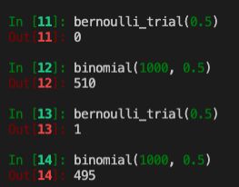
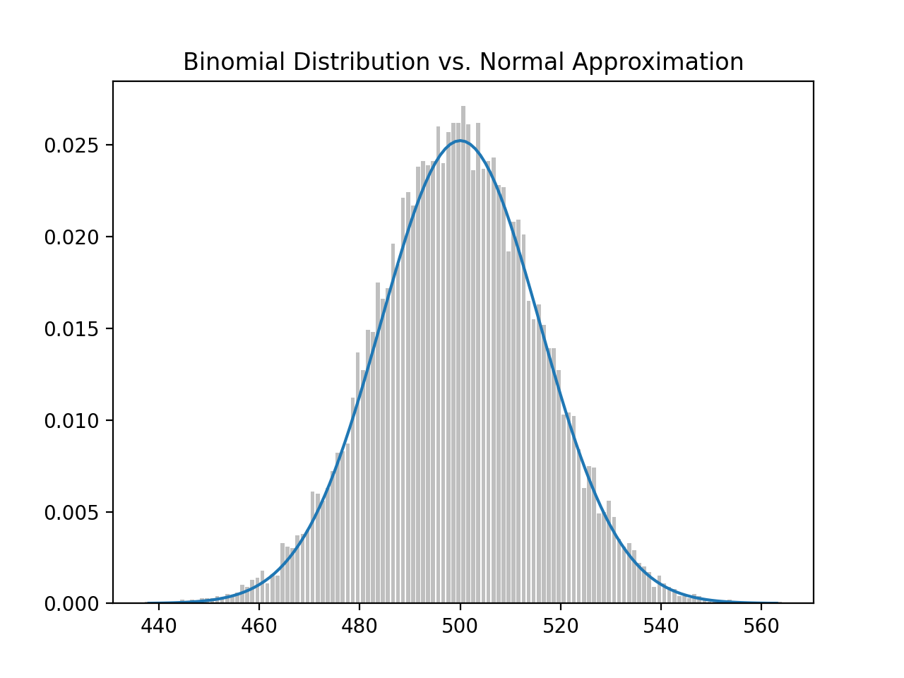
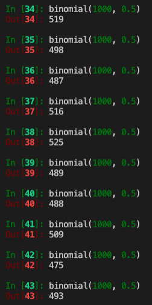
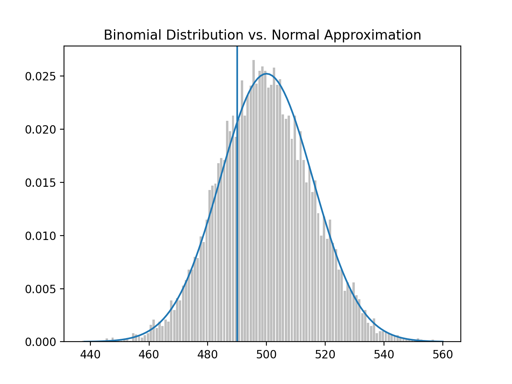
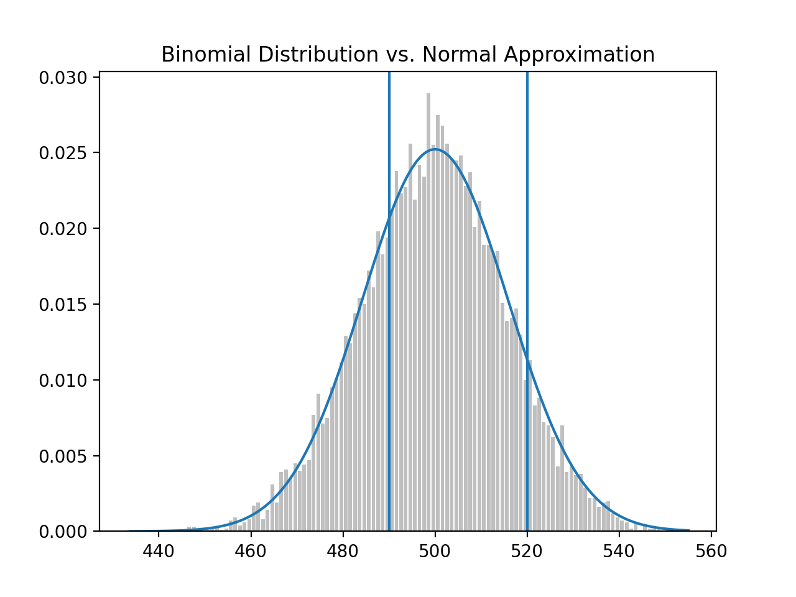
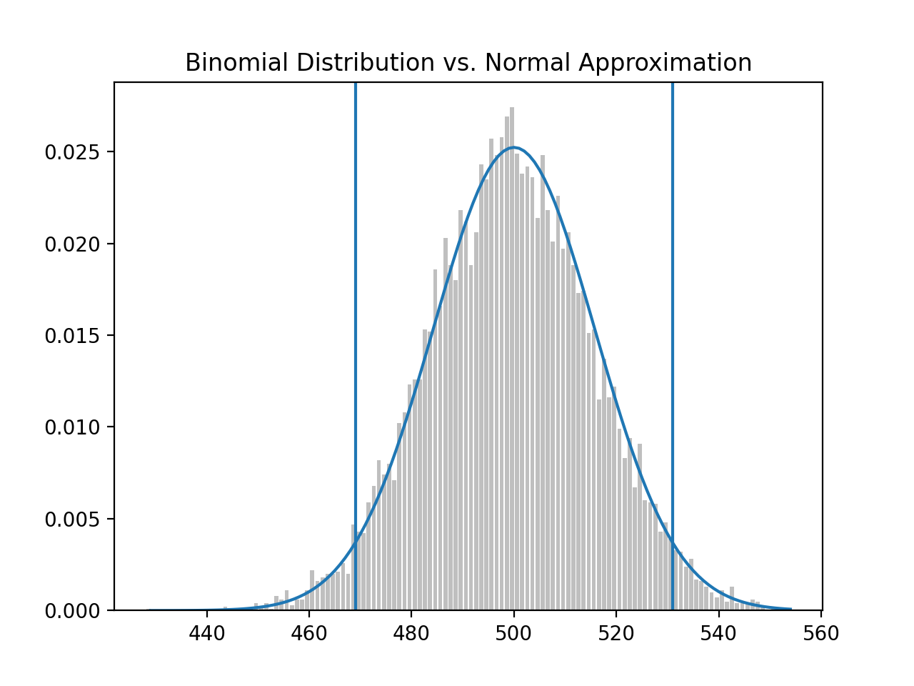
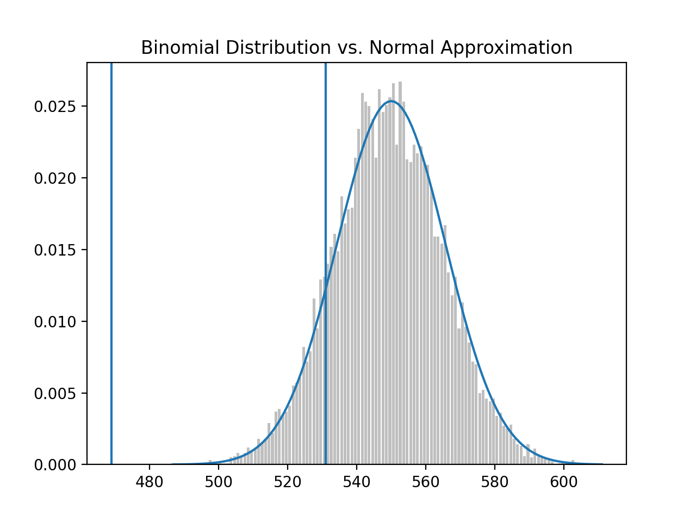
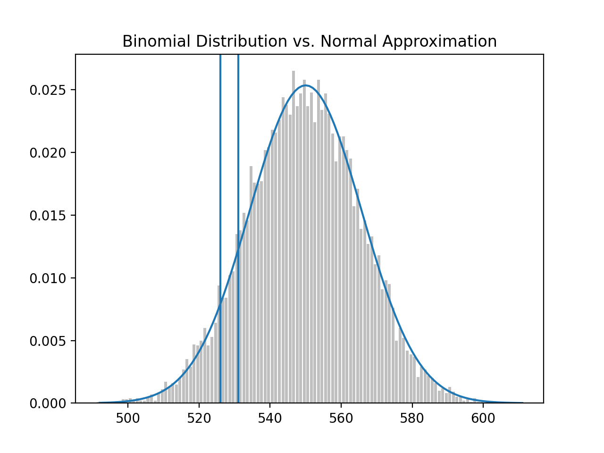
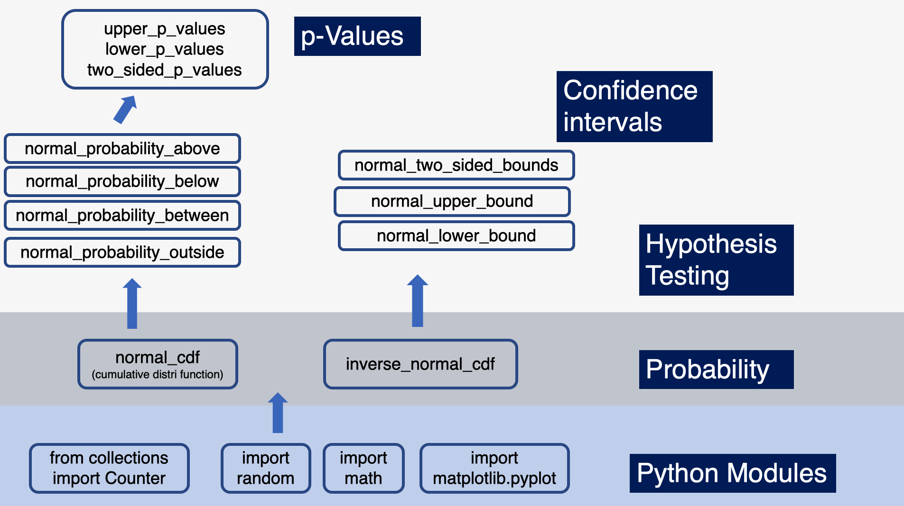
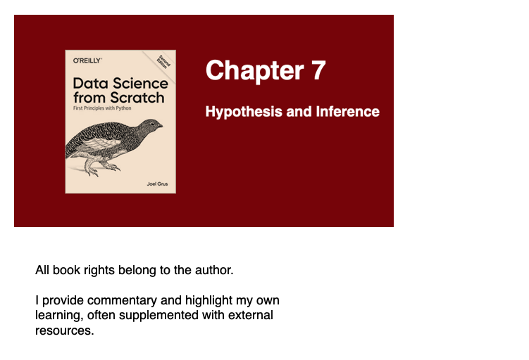

---
authors:
- admin
categories: []
date: "2020-12-15T00:00:00Z"
draft: false
featured: false
image:
  caption: ""
  focal_point: ""
lastMod: "2020-12-15T00:00:00Z"
projects: []
subtitle: Connecting probability and statistics to hypothesis testing and inference
summary: An overview of statistical Hypothesis Testing, Estimation and Bayesian Inference
tags: ["Python", "Data Science", "Probability", "Statistics"]
title: Data Science from Scratch (ch7) - Hypothesis and Inference
---

### Table of contents

- [Central Limit Theorem](#central_limit_theorem)
- [Hypothesis Testing](#hypothesis_testing)
- [p-Values](#p_values)
- [Confidence Intervals](#confidence_intervals)
- [Connecting dots with Python](#connecting_dots)

## Overview

This is a continuation of my progress through Data Science from Scratch by Joel Grus. We'll use a classic coin-flipping example in this post because it is simple to illustrate with both **concept** and **code**. The goal of this post is to connect the dots between several concepts including the Central Limit Theorem, Hypothesis Testing, p-Values and confidence intervals, using python to build our intuition. 

## Central_Limit_Theorem

Terms like "null" and "alternative" hypothesis are used quite frequently, so let's set some context. The "null" is the **default** position. The "alternative", alt for short, is something we're *comparing to* the default (null). 

The classic coin-flipping exercise is to test the *fairness* off a coin. If a coin is fair, it'll land on heads 50% of the time (and tails 50% of the time). Let's translate into hypothesis testing language:

**Null Hypothesis**: Probability of landing on Heads = 0.5.

**Alt Hypothesis**: Probability of landing on Heads != 0.5.

Each coin flip is a **Bernoulli trial**, which is an experiment with two outcomes - outcome 1, "success", (probability *p*) and outcome 0, "fail" (probability *p - 1*). The reason it's a Bernoulli trial is because there are only two outcome with a coin flip (heads or tails). Read more about [Bernoulli here](https://en.wikipedia.org/wiki/Bernoulli_trial). 

Here's the code for a single Bernoulli Trial:

```python
def bernoulli_trial(p: float) -> int:
    """Returns 1 with probability p and 0 with probability 1-p"""
    return 1 if random.random() < p else 0
```

When you **sum the independent Bernoulli trials**, you get a **Binomial(n,p)** random variable, a variable whose *possible* values have a probability distribution. The **central limit theorem** says as **n** or the *number* of independent Bernoulli trials get large, the Binomial distribution approaches a normal distribution.

Here's the code for when you sum all the Bernoulli Trials to get a Binomial random variable:

```python
def binomial(n: int, p: float) -> int:
    """Returns the sum of n bernoulli(p) trials"""
    return sum(bernoulli_trial(p) for _ in range(n))
```

**Note**: A single 'success' in a Bernoulli trial is 'x'. Summing up all those x's into X, is a Binomial random variable. Success doesn't imply desirability, nor does "failure" imply undesirability. They're just terms to count the cases we're looking for (i.e., number of heads in multiple coin flips to assess a coin's fairness).

Given that our **null** is (p = 0.5) and **alt** is (p != 0.5), we can run some independent bernoulli trials, then sum them up to get a binomial random variable. 



Each `bernoulli_trial` is an experiment with either 0 or 1 as outcomes. The `binomial` function sums up **n** bernoulli(0.5) trails. We ran both twice and got different results. Each bernoulli experiment can be a success(1) or faill(0); summing up into a binomial random variable means we're taking the probability p(0.5) *that a coin flips head* and we ran the experiment 1,000 times to get a random binomial variable. 

The first 1,000 flips we got 510. The second 1,000 flips we got 495. We can repeat this process many times to get a *distribution*. We can plot this distribution to reinforce our understanding. To this we'll use `binomial_histogram` function. This function picks points from a Binomial(n,p) random variable and plots their histogram.

```python
from collections import Counter
import matplotlib.pyplot as plt

def normal_cdf(x: float, mu: float = 0, sigma: float = 1) -> float:
    return (1 + math.erf((x - mu) / math.sqrt(2) / sigma)) / 2
    

def binomial_histogram(p: float, n: int, num_points: int) -> None:
    """Picks points from a Binomial(n, p) and plots their histogram"""
    data = [binomial(n, p) for _ in range(num_points)]
    # use a bar chart to show the actual binomial samples
    histogram = Counter(data)
    plt.bar([x - 0.4 for x in histogram.keys()],
            [v / num_points for v in histogram.values()],
            0.8,
            color='0.75')
    mu = p * n
    sigma = math.sqrt(n * p * (1 - p))
    # use a line chart to show the normal approximation
    xs = range(min(data), max(data) + 1)
    ys = [normal_cdf(i + 0.5, mu, sigma) -
          normal_cdf(i - 0.5, mu, sigma) for i in xs]
    plt.plot(xs, ys)
    plt.title("Binomial Distribution vs. Normal Approximation")
    plt.show()

# call function   
binomial_histogram(0.5, 1000, 10000)
```

This plot is then rendered:



What we did was sum up independent `bernoulli_trial`(s) of 1,000 coin flips, where the probability of head is p = 0.5, to create a `binomial` random variable. We then repeated this a large number of times (N = 10,000), then plotted a histogram of the distribution of all binomial random variables. And because we did it so many times, it approximates the standard normal distribution (smooth bell shape curve). 

Just to demonstrate how this works, we can generate several `binomial` random variables:



If we do this 10,000 times, we'll generate the above histogram. You'll notice that because we are testing whether the coin is fair, the probability of heads (success) *should* be at 0.5 and, from 1,000 coin flips, the **mean**(`mu`) should be a 500. 

We have another function that can help us calculate `normal_approximation_to_binomial`:

```python
import random
from typing import Tuple
import math


def normal_approximation_to_binomial(n: int, p: float) -> Tuple[float, float]:
    """Return mu and sigma corresponding to a Binomial(n, p)"""
    mu = p * n
    sigma = math.sqrt(p * (1 - p) * n)
    return mu, sigma
    
# call function
# (500.0, 15.811388300841896)
normal_approximation_to_binomial(1000, 0.5)
```
When calling the function with our parameters, we get a mean `mu` of 500 (from 1,000 coin flips) and a standard deviation `sigma` of 15.8114. Which means that 68% of the time, the binomial random variable will be 500 +/- 15.8114 and 95% of the time it'll be 500 +/- 31.6228 (see [68-95-99.7 rule](https://en.wikipedia.org/wiki/68%E2%80%9395%E2%80%9399.7_rule)) 

## Hypothesis_Testing

Now that we have seen the results of our "coin fairness" experiment plotted on a binomial distribution (approximately normal), we will be, for the purpose of testing our hypothesis, be interested in the probability of its realized value (binomial random variable) lies **within or outside a particular interval**.

This means we'll be interested in questions like:

- What's the probability that the binomial(n,p) is below a threshold?
- Above a threshold?
- Between an interval?
- Outside an interval? 

First, the `normal_cdf` (normal cummulative distribution function), which we learned in a [previous post](https://paulapivat.com/post/dsfs_6/#distributions), *is* the probability of a variable being *below* a certain threshold. 

Here, the probability of X (success or heads for a 'fair coin') is at 0.5 (`mu` = 500, `sigma` = 15.8113), and we want to find the probability that X falls below 490, which comes out to roughly 26%

```python
normal_probability_below = normal_cdf

# probability that binomal random variable, mu = 500, sigma = 15.8113, is below 490

# 0.26354347477247553
normal_probability_below(490, 500, 15.8113)
```

On the other hand, the `normal_probability_above`, probability that X falls *above* 490 would be
1 - 0.2635 = 0.7365 or roughly 74%.

```python
def normal_probability_above(lo: float,
                             mu: float = 0,
                             sigma: float = 1) -> float:
    """The probability that an N(mu, sigma) is greater than lo."""
    return 1 - normal_cdf(lo, mu, sigma)
    
# 0.7364565252275245
normal_probability_above(490, 500, 15.8113)
```

To make sense of this we need to recall the binomal distribution, that approximates the normal distribution, but we'll draw a vertical line at 490.



We're asking, given the binomal distribution with `mu` 500 and `sigma` at 15.8113, what is the probability that a binomal random variable falls below the threshold (left of the line); the answer is approximately 26% and correspondingly falling above the threshold (right of the line), is approximately 74%. 

### Between interval

We may also wonder what the probability of a binomial random variable **falling between 490 and 520**:



Here is the function to calculate this probability and it comes out to approximately 63%. *note*: Bear in mind the full area under the curve is 1.0 or 100%. 

```python
def normal_probability_between(lo: float,
                               hi: float,
                               mu: float = 0,
                               sigma: float = 1) -> float:
    """The probability that an N(mu, sigma) is between lo and hi."""
    return normal_cdf(hi, mu, sigma) - normal_cdf(lo, mu, sigma)

# 0.6335061861416337
normal_probability_between(490, 520, 500, 15.8113)
```
Finally, the area outside of the interval should be 1 - 0.6335 = 0.3665:

```python
def normal_probability_outside(lo: float,
                               hi: float,
                               mu: float = 0,
                               sigma: float = 1) -> float:
    """The probability that an N(mu, sigma) is not between lo and hi."""
    return 1 - normal_probability_between(lo, hi, mu, sigma)
    
# 0.3664938138583663
normal_probability_outside(490, 520, 500, 15.8113)
```

In addition to the above, we may also be interested in finding (symmetric) intervals around the mean that account for a *certain level of likelihood*, for example, 60% probability centered around the mean. 

For this operation we would use the `inverse_normal_cdf`:

```python
def inverse_normal_cdf(p: float,
                       mu: float = 0,
                       sigma: float = 1,
                       tolerance: float = 0.00001) -> float:
    """Find approximate inverse using binary search"""
    # if not standard, compute standard and rescale
    if mu != 0 or sigma != 1:
        return mu + sigma * inverse_normal_cdf(p, tolerance=tolerance)
    low_z = -10.0     # normal_cdf(-10) is (very close to) 0
    hi_z = 10.0       # normal_cdf(10) is (very close to) 1
    while hi_z - low_z > tolerance:
        mid_z = (low_z + hi_z) / 2      # Consider the midpoint
        mid_p = normal_cdf(mid_z)       # and the CDF's value there
        if mid_p < p:
            low_z = mid_z               # Midpoint too low, search above it
        else:
            hi_z = mid_z                # Midpoint too high, search below it
    return mid_z
```

First we'd have to find the cutoffs where the upper and lower tails each contain 20% of the probability. We calculate `normal_upper_bound` and `normal_lower_bound` and use those to calculate the `normal_two_sided_bounds`.

```python
def normal_upper_bound(probability: float,
                       mu: float = 0,
                       sigma: float = 1) -> float:
    """Returns the z for which P(Z <= z) = probability"""
    return inverse_normal_cdf(probability, mu, sigma)


def normal_lower_bound(probability: float,
                       mu: float = 0,
                       sigma: float = 1) -> float:
    """Returns the z for which P(Z >= z) = probability"""
    return inverse_normal_cdf(1 - probability, mu, sigma)


def normal_two_sided_bounds(probability: float,
                            mu: float = 0,
                            sigma: float = 1) -> Tuple[float, float]:
    """
    Returns the symmetric (about the mean) bounds
    that contain the specified probability
    """
    tail_probability = (1 - probability) / 2
    # upper bound should have tail_probability above it
    upper_bound = normal_lower_bound(tail_probability, mu, sigma)
    # lower bound should have tail_probability below it
    lower_bound = normal_upper_bound(tail_probability, mu, sigma)
    return lower_bound, upper_bound
```
So if we wanted to know what the cutoff points were for a 60% probability around the mean and standard deviation (`mu` = 500, `sigma` = 15.8113), it would be between **486.69 and 513.31**.

Said differently, this means roughly 60% of the time, we can expect the binomial random variable to fall between 486 and 513. 

```python
# (486.6927811021805, 513.3072188978196)
normal_two_sided_bounds(0.60, 500, 15.8113)
```

### Significance and Power

Now that we have a handle on the binomial normal distribution, thresholds (left and right of the mean), and cut-off points, we want to make a **decision about significance**. Probably the most important part of *statistical significance* is that it is a decision to be made, not a standard that is externally set. 

Significance is a decision about how willing we are to make a *type 1* error (false positive), which we explored in a [previous post](https://paulapivat.com/post/dsfs_6/#applying_bayes_theorem). The convention is to set it to a 5% or 1% willingness to make a type 1 error. Suppose we say 5%. 

We would say that out of 1,000 coin flips, 95% of the time, we'd get between 469 and 531 heads on a "fair coin" and 5% of the time, outside of this 469-531 range. 

```python
# (469.0104394712448, 530.9895605287552)
normal_two_sided_bounds(0.95, 500, 15.8113)
```

If we recall our hypotheses:

**Null Hypothesis**: Probability of landing on Heads = 0.5 (fair coin)

**Alt Hypothesis**: Probability of landing on Heads != 0.5 (biased coin)

Each binomial distribution (test) that consist of 1,000 bernoulli trials, each *test* where the number of heads falls outside the range of 469-531, we'll **reject the null** that the coin is fair. And we'll be wrong (false positive), 5% of the time. It's a false positive when we **incorrectly reject** the null hypothesis, when it's actually true. 

We also want to avoid making a type-2 error (false negative), where we **fail to reject** the null hypothesis, when it's actually false. 

**Note**: Its important to keep in mind that terms like *significance* and *power* are used to describe **tests**, in our case, the test of whether a coin is fair or not. Each test is the sum of 1,000 independent bernoulli trials. 

For a "test" that has a 95% significance, we'll assume that out of a 1,000 coin flips, it'll land on heads between 469-531 times and we'll determine the coin is fair. For the 5% of the time it lands outside of this range, we'll determine the coin to be "unfair", but we'll be wrong because it actually is fair. 

To calculate the power of the test, we'll take the assumed `mu` and `sigma` with a 95% bounds (based on the assumption that the probability of the coin landing on heads is 0.5 or 50% - a fair coin). We'll determine the lower and upper bounds:

```python
lo, hi = normal_two_sided_bounds(0.95, mu_0, sigma_0)
lo # 469.01026640487555
hi # 530.9897335951244
```

And if the coin was *actually biased*, we should reject the null, but we fail to. Let's suppose the actual probability that the coin lands on heads is 55% ( **biased** towards head):

```python
mu_1, sigma_1 = normal_approximation_to_binomial(1000, 0.55)
mu_1    # 550.0
sigma_1 # 15.732132722552274
```

Using the same range 469 - 531, where the coin is assumed 'fair' with `mu` at 500 and `sigma` at 15.8113:




If the coin, in fact, had a bias towards head (p = 0.55), the distribution would shift right, but if our 95% significance test remains the same, we get:



The probability of making a type-2 error is 11.345%. This is the probability that we're see that the coin's distribution is within the previous interval 469-531, thinking we should accept the null hypothesis (that the coin is fair), but in actuality, failing to see that the distribution has shifted to the coin having a *bias* towards heads. 

```python
# 0.11345199870463285
type_2_probability = normal_probability_between(lo, hi, mu_1, sigma_1)
```

The other way to arrive at this is to find the probability, under the *new* `mu` and `sigma` (new distribution), that X (number of successes) will fall *below* 531. 

```python
# 0.11357762975476304
normal_probability_below(531, mu_1, sigma_1)
```
So the probability of making a type-2 error or the probability that the *new* distribution falls below 531 is approximately 11.3%.

The **power to detect** a type-2 error is 1.00 minus the probability of a type-2 error (1 - 0.113 = 0.887), or 88.7%.

```python
power = 1 - type_2_probability # 0.8865480012953671
```

Finally, we may be interested in **increasing power** to detect a type-2 error. Instead of using a `normal_two_sided_bounds` function to find the cut-off points (i.e., 469 and 531), we could use a *one-sided test* that rejects the null hypothesis ('fair coin') when X (number of heads on a coin-flip) is much larger than 500. 

Here's the code, using `normal_upper_bound`:

```python
# 526.0073585242053
hi = normal_upper_bound(0.95, mu_0, sigma_0)
```

This means shifting the upper bounds from 531 to 526, providing more probability in the upper tail. This means the probability of a type-2 error goes down from 11.3 to 6.3. 



```python
# previous probability of type-2 error
# 0.11357762975476304
normal_probability_below(531, mu_1, sigma_1)


# new probability of type-2 error
# 0.06356221447122662
normal_probability_below(526, mu_1, sigma_1)
```
And the new (stronger) **power to detect** type-2 error is 1.0 - 0.064 = 0.936 or 93.6% (up from 88.7% above).

## p_values

p-Values represent *another way* of deciding whether to accept or reject the Null Hypothesis. Instead of choosing bounds, thresholds or cut-off points, we could compute the probability, assuming the Null Hypothesis is true, that we would see a value *as extreme as* the one we just observed. 

Here is the code:

```python
def two_sided_p_values(x: float, mu: float = 0, sigma: float = 1) -> float:
    """
    How likely are we to see a value at least as extreme as x (in either
    direction) if our values are from an N(mu, sigma)?
    """
    if x >= mu:
        # x is greater than the mean, so the tail is everything greater than x
        return 2 * normal_probability_above(x, mu, sigma)
    else:
        # x is less than the mean, so the tail is everything less than x
        return 2 * normal_probability_below(x, mu, sigma)
```

If we wanted to compute, assuming we have a "fair coin" (`mu` = 500, `sigma` = 15.8113), what is the probability of seeing a value like 530? (**note**: We use 529.5 instead of 530 below due to [continuity correction](https://en.wikipedia.org/wiki/Continuity_correction))

Answer: approximately 6.2%

```python
# 0.06207721579598835
two_sided_p_values(529.5, mu_0, sigma_0)
```
The p-value, 6.2% is higher than our (hypothetical) 5% significance, so we don't reject the null. On the other hand, if X was slightly more extreme, 532, the probability of seeing that value would be approximately 4.3%, which is less than 5% significance, so we would reject the null.

```python
# 0.04298479507085862
two_sided_p_values(532, mu_0, sigma_0)
```
For one-sided tests, we would use the `normal_probability_above` and `normal_probability_below` functions created above:

```python
upper_p_value = normal_probability_above
lower_p_value = normal_probability_below
```

Under the `two_sided_p_values` test, the extreme value of 529.5 had a probability of 6.2% of showing up, but not low enough to reject the null hypothesis. 

However, with a one-sided test, `upper_p_value` for the same threshold is now 3.1% and we would reject the null hypothesis. 

```python
# 0.031038607897994175
upper_p_value(529.5, mu_0, sigma_0)
```
## Confidence_Intervals

A *third* approach to deciding whether to accept or reject the null is to use confidence intervals. We'll use the 530 as we did in the p-Values example. 

```python
p_hat = 530/1000
mu = p_hat
sigma = math.sqrt(p_hat * (1 - p_hat) / 1000) # 0.015782902141241326

# (0.4990660982192851, 0.560933901780715)
normal_two_sided_bounds(0.95, mu, sigma)
```

The confidence interval for a coin flipping heads 530 (out 1,000) times is (0.4991, 0.5609). Since this interval **contains** the p = 0.5 (probability of heads 50% of the time, assuming a fair coin), we do not reject the null.

If the extreme value were *more* extreme at 540, we would arrive at a different conclusion:

```python
p_hat = 540/1000
mu = p_hat
sigma = math.sqrt(p_hat * (1 - p_hat) / 1000)

(0.5091095927295919, 0.5708904072704082)
normal_two_sided_bounds(0.95, mu, sigma)
```

Here we would be 95% confident that the mean of this distribution is contained between 0.5091 and 0.5709 and this **does not** contain 0.500 (albiet by a slim margin), so we reject the null hypothesis that this is a fair coin. 

**note**: Confidence intervals are about the *interval* not probability p. We interpret the confidence interval as, if you were to repeat the experiment many times, 95% of the time, the "true" parameter, in our example p = 0.5, would lie within the observed confidence interval.  

## Connecting_Dots

We used several python functions to build intuition around statistical hypothesis testing. To higlight this "from scratch" aspect of the book here is a diagram tying together the various python function used in this post:



This post is part of an ongoing series where I document my progress through [Data Science from Scratch by Joel Grus](https://joelgrus.com/2019/05/13/data-science-from-scratch-second-edition/). 




For more content on data science, machine learning, R, Python, SQL and more, [find me on Twitter](https://twitter.com/paulapivat).