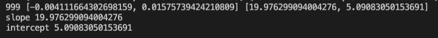

---
authors:
- admin
categories: []
date: "2020-12-22T00:00:00Z"
draft: false
featured: false
image:
  caption: ""
  focal_point: ""
lastMod: "2020-12-22T00:00:00Z"
projects: []
subtitle: Building gradient descent from the ground up
summary: An overview of Gradient Descent
tags: ["Python", "Data Science", "Machine Learning", "Gradient Descent"]
title: Gradient Descent -- Data Science from Scratch (ch8)
---

### Table of contents

- [Overview](#overview)
- [Setup](#setup)
- [Gradient Descent](#gradient_descent)

- [Take Away](#take_away)


## Overview

In this post, we'll explore Gradient Descent from the ground up starting conceptually, then using code to build up our intuition brick by brick. 

While this post is part of an ongoing series where I document my progress through [Data Science from Scratch by Joel Grus](https://joelgrus.com/2019/05/13/data-science-from-scratch-second-edition/), for this post I am drawing on external sources including Aurélien Geron's Hands-On Machine Learning to provide a context for why and when gradient descent is used. 

We'll also be using external libraries such as `numpy`, that are generally avoided in Data Science from Scratch, to help highlight concepts. 

**NOTE:** While the book introduces gradient descent as a standalone topic, I find it more intuitive to reason about it within the context of a regression problem.

## Setup

In any modeling exercise, there is error (because no model is perfect), and our objective is minimize the errors so that when we develop models from our training data, we'll have some confidence that the predictions will work in testing and completely new data.

We'll train a *linear regression model*. Our *training data* will only have three data points. We train the model by setting up parameters (slope & intercept) that best "fits" the data (i.e., best-fitting line), for example:


We know the values for both `x` and `y`, so we can calculate the slope and intercept directly through the **normal equation**:

```python
# Normal Equation

import numpy as np
import matplotlib.pyplot as plt

x = np.array([2, 4, 5])
y = np.array([45, 85, 105])

# computing Normal Equation
x_b = np.c_[np.ones((3, 1)), x]       # add x0 = 1 to each of three instances
theta = np.linalg.inv(x_b.T.dot(x_b)).dot(x_b.T).dot(y)

# array([ 5., 20.])
theta
```
The key line is `np.linalg.inv()` which computes the multiplicative inverse of a matrix.

Our slope is 20 and intercept is 5 (`theta`).

**NOTE**: We could also have used the more familiar "rise over run" ((85 - 45) / (4 - 2)) or (40/2) or 20, but we want to illustrate the **normal equation** which should come in handy when we go beyond the simplistic three data point example. 


We could also use the `LinearRegression` class from `sklearn` to call the least squares (`np.linalg.lstsq()`) function directly:

```python
# Linear Regression

from sklearn.linear_model import LinearRegression
import numpy as np

x = np.array([2, 4, 5])
y = np.array([45, 85, 105])

x = x.reshape(-1, 1)              # reshape because sklearn expect 2D array

x_b = np.c_[np.ones((3, 1)), x]   # add x0 = 1 to each of three instances

theta, residuals, rank, s = np.linalg.lstsq(x_b, y, rcond=1e-6)

# array([ 5., 20.])
print("theta:", theta)
```

This appraoch also yields the slope (20) and intercept (5) directly.

Again we should note that we know the parameters of `x` and `y` in our example, but we want to see how **learning from data** would work. Here's the equation we're working with:

```
y = 20 * x + 5
```

And here's what it looks like (intercept = 5, slope = 20)


## Gradient_Descent

#### Why Gradient Descent?

The **normal equation** and the **least squares** (linear regresion) approach can handle large training sets efficiently, but when your model has a **large number of features** or too **many training instances** to fit into memory, **gradient descent** is an often used alternative.

Moreover, linear least squares assume the errors have a normal distribution and the relationship in the data is linear (this is where closed-form solutions like the **normal equation** excel). When the data is non-linear, an iterative solution (gradient descent) can be used. 

With linear regression we seek to **minimize the sum-of-squares** differences between the observed data and the predicted values (aka the error), in a **non-iterative** fashion. 

Similar to the regression, we are seeking to use gradient descent to find the slope and intercept that minimizes the average squared error, however we do so in an **interative fashion**.

#### Using Gradient Descent to Fit a Model

The process for gradient descent is to start with a **random slope and intercept**, then compute the **gradient** of the **mean squared error**, while adjusting the slope/intercept (`theta`) in the direction that continues to minimize the error. This is repeated iteratively until we find a point where errors are minimized. 

As with the **normal equation** and **linear regression** approach above, we technically *know* the parameters of the linear relationship between `x` and `y`, but we'll pretend like we don't and need to learn from the data.

**NOTE**: This section builds heavily on a previous post on linear algebra. You'll want to [read this post](https://paulapivat.com/post/dsfs_4/) to get a feel for the functions used to construct the functions we see in this post. 

```python
from typing import TypeVar, List, Iterator
import math
import random
import matplotlib.pyplot as plt
from typing import Callable
from typing import List
import numpy as np

x = np.array([2, 4, 5])

# instead of putting y directly, we'll use the equation: 20 * x + 5, which is a direct representation of its relationship to x

# y = np.array([45, 85, 105])   

# both x and y are represented in inputs
inputs = [(x, 20 * x + 5) for x in range(2, 6)]
```
First, we'll start with random values for the slope and intercept; we'll also establish a learning rate, which controls how much a change in the model is warranted in response to the estimated error each time the model parameters, slope and intercept, are updated. 

```python
# 1. start with a random value for slope and intercept
theta = [random.uniform(-1, 1), random.uniform(-1, 1)]

learning_rate = 0.001
```
Next, we'll compute the mean of the gradients, then adjust the slope/intercept in the direction of minimizing the gradient, which is based on the error.

You'll note that this for-loop has 100 iterations. The more interations we go through, the more that errors are minimized and the more we approach a slope/intercept where the model "fits" the data better. 

```python
for epoch in range(100):     # start with 100
    # compute the mean of the gradients
    grad = vector_mean([linear_gradient(x, y, theta) for x, y in inputs])
    # take a step in that direction
    theta = gradient_step(theta, grad, -learning_rate)
    print(epoch, grad, theta)

slope, intercept = theta

#assert 19.9 < slope < 20.1,  "slope should be about 20"
#assert 4.9 < intercept < 5.1, "intercept should be about 5"
print("slope", slope)
print("intercept", intercept)
```

#### Iterative Descent

At 100 iterations, the slope is 18.87 and intercept is 4.87 and the gradient is -32.48 (error for the slope) and -8.45 (error for the intercept). These numbers suggest that we need to decrease the slope and intercept from our random starting point, but our emphasis needs to be on decreasing the slope. 


At 200 iterations, the slope is 19.97 and intercept is 4.86 and the gradient is -1.76 (error for the slope) and -0.48 (error for the intercept). Our errors have been reduced significantly.


At 1000 iterations, the slope is 19.97 (not much difference from 200 iterations) and intercept is 5.09 and the gradients are markedly lower at -0.004 (error for the slope) and 0.02 (error for the intercept). Here the errors may not be much different from zero and we are near our optimal point. 



Through this process, we can note a couple things. The sign in front of the gradient moving from -32.48 to -0.004 for the slope tells us that with each iteration, the slope should go down from where it started, randomly. 

Similarly we see for the 100th and 200th iterations, the sign for the intercept was negative, suggesting that it should also go down from it's random starting point. Howeer, at the 1000th iteration, the sign changed to positive (+ 0.02) suggesting an ever so slight increase in intercept, so it appears we found the point of minimal error for the intercept's gradient. 

In summary, the **normal equation** and **regression** approaches gave us a slope of 20 and intercept of 5. With gradient descent, we approached these values with each successive iterations, 1000 iterations yielding **less error** than 100 or 200 iterations. 

#### Linear Algebra foundations

As mentioned above, the functions used to compute the gradients and adjust the slope/intercept build on functions we explored in [this post](https://paulapivat.com/post/dsfs_4/). Here's a visual showing how the functions we used to iteratively arrive at the slope and intercept through gradient descent was built:


## Take_Away

In any modeling process we are "fitting" a model to the data to see which model fits better. A better fit yields better predictions. Models are evaluated by their error (also known as cost function) - the distance between the predicted value and the actual data points.

With linear regression, there are two *different* ways of training the model. First, is to use an equation that directly computes model parameters to fit the model to the training data (while minimizing errors or 'cost function'); this is the Normal Equation. Second is to use Gradient Descent. 

Gradient Descent is useful you are expecting computational complexity due to the number of features or training instances.


This post is part of an ongoing series where I document my progress through [Data Science from Scratch by Joel Grus](https://joelgrus.com/2019/05/13/data-science-from-scratch-second-edition/). 


For more content on data science, machine learning, R, Python, SQL and more, [find me on Twitter](https://twitter.com/paulapivat).