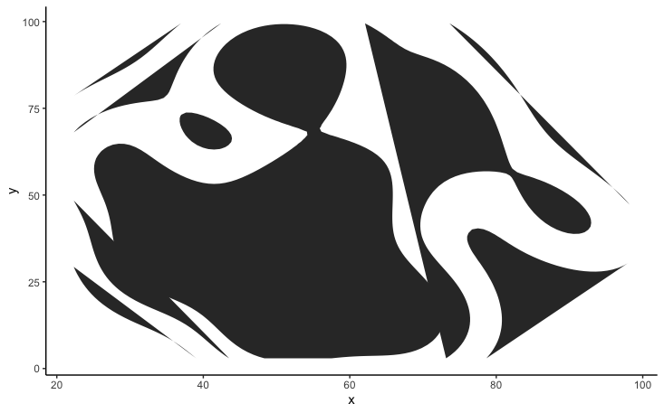

---
authors:
- admin
categories: []
date: "2020-09-03T00:00:00Z"
draft: false
featured: false
image:
  caption: ""
  focal_point: ""
lastMod: "2020-11-19T00:00:00Z"
projects: []
subtitle: Finding beauty in the process
summary: TidyTuesday Outtakes
tags: []
title: A collection of weird pretty plots
---

## TidyTuesday 2020-08-18 (week 34)

In the process of exploring dendrograms, I create jheri curls :)

Another plot with less hair:

I call this Disco Fire:

## TidyTuesday 2020-10-13 (week 42)

Dino-turn-Rorschach test

