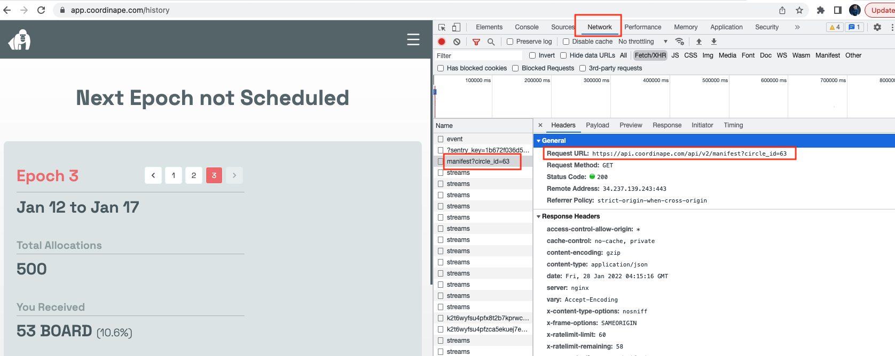
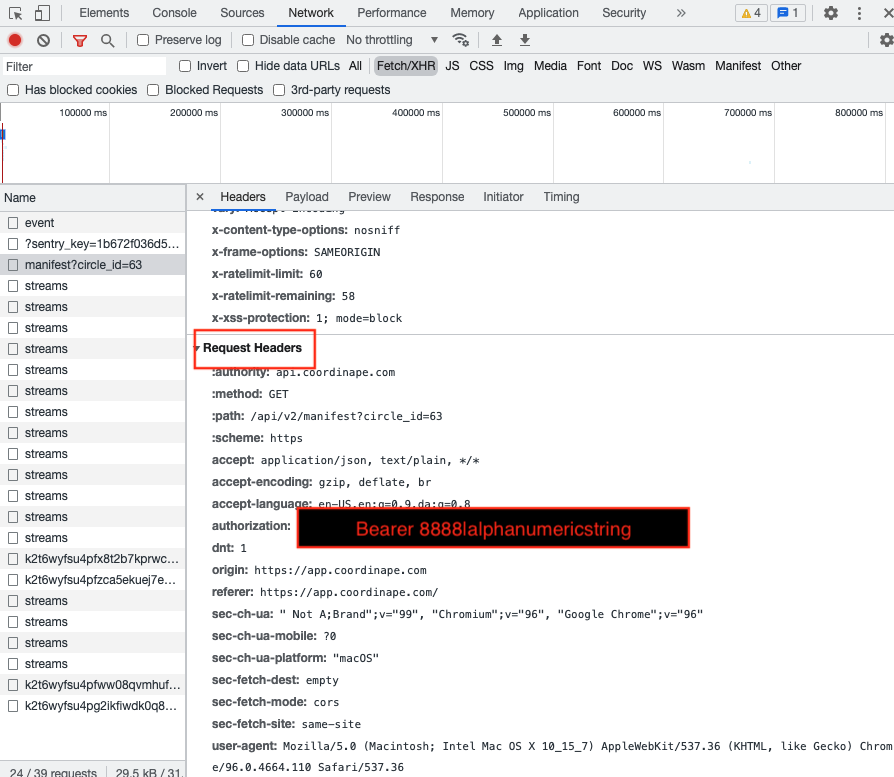
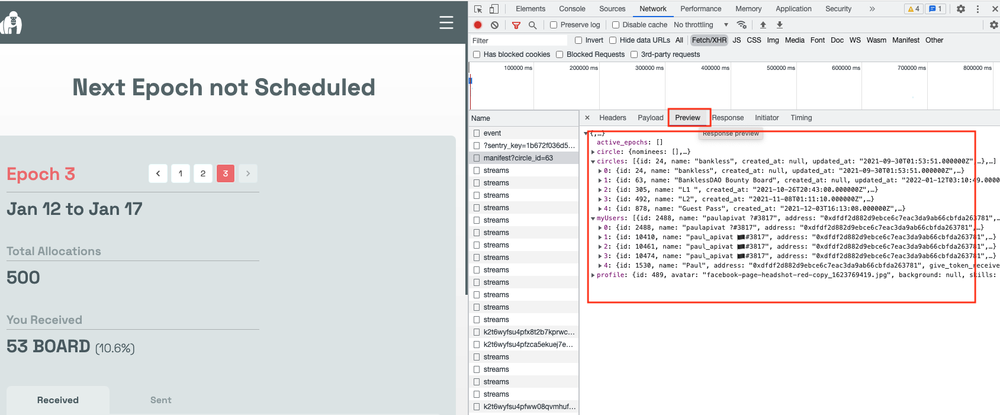

---
authors:
- admin
categories: []
date: "2022-01-28T00:00:00Z"
draft: false
featured: false
image:
  caption: ""
  focal_point: ""
lastMod: "2022-01-28T00:00:00Z"
projects: []
subtitle: Grab API info with inspect element
summary: A brief explainer on grabing API endpoints and bearer tokens for authorization through a web browser
tags: ["Ethereum", "SQL", "Dune Analytics", "Querying", "Analytics"]
title: Using Inspect Element to Grab API Endpoints and Tokens
---

### Introduction

When maintaining data pipelines, sometimes API endpoints get changed or authorization tokens expire prompting a need to grab new **API endpoints** and **bearer tokens**. 

This post provide a brief walk-through on how to use **Inspect Element** on a web browser to grab this data. Which represents a powerful way to access a project's API *before* reaching out to the team.

### Scenario

We have a data pipeline to ingest [Coordinape](https://coordinape.com/) data but after two months, the pipeline script returns a `Response 401` error, suggesting a connection could not be made. We want a way to explore what's going on.

#### API Endpoint with Inspect Element

We go to the Coordinape application and sign-in with our Ethereum wallet. Then, I left click on go to `inspect element`, navigating to the **Network** tab as shown here:

Once in the **Network** tab, select **Fetch/XHR** (XHR stands for XMLHttpRequest, but XML is phased out for JSON). Then we should see a list of events. 

The event highlighted in red indicates a **Request URL** that shows the *current* API endpoint (in Header) 

Here's the endpoint: `https://api.coordinape.com/api/v2/manifest?circle_id=63` (**note&**: in the old endpoint, manifest was token-gifts. It looks like the team has consolidated it's API endpoints)

#### Authorization

To grab the authorization, **bearer token**, scroll down in **Header** down to **Request Headers**:

This is the information you'd store in the `.env` file.

### Data Structure

Finally, you can also get a sense for what kind of data will be returned with this new API endpoint by navigating to the **Preview** tab next to **Headers**.

Here we see circle, circles, myUsers and profile. It looks like we have nested JSON that will need to be flattened. 

For more use of data to explore DAOs and web3 [find me on Twitter](https://twitter.com/paulapivat).