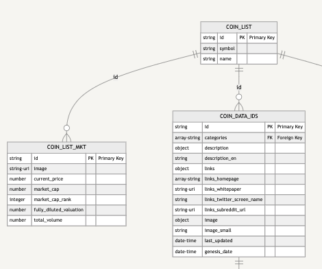
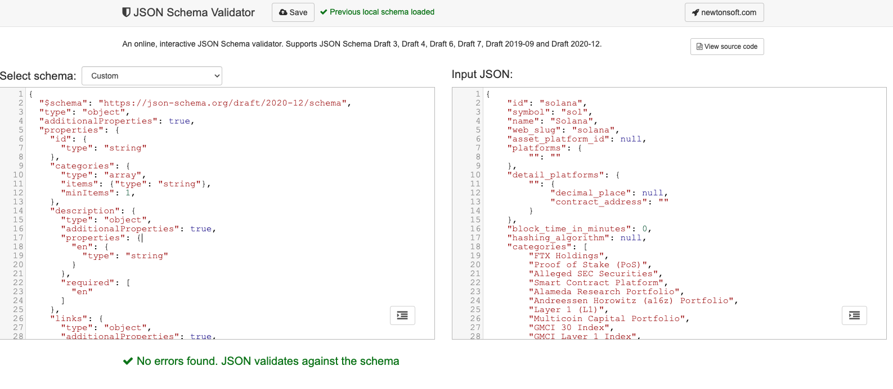
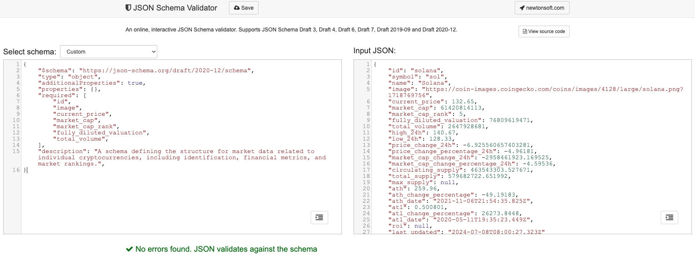
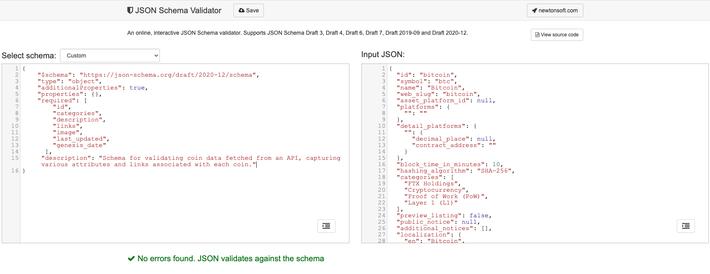

---
authors:
- admin
categories: []
date: "2024-07-14T00:00:00Z"
draft: false
featured: false
image:
  caption: ""
  focal_point: ""
lastMod: "2024-07-14T00:00:00Z"
projects: []
subtitle: Using the jsonschema library in Python
summary: Validating JSON data
tags: ["Python", "API", "data validation", "data cleaning", "coingecko", "data quality"]
title: Validating JSON Data
---


The purpose of this article is to illustrate a process for creating and validating JSON schemas. In contrast to a previous article that outlined a basic ETL flow, this one zooms in on data validation. Validation is a crucial step in an ETL pipeline. Specifically, once we “extract” data from source, we’ll want to validate it as part of a broader “transformation” process that includes cleaning and ensuring quality. We’ll use **CoinGecko API data** to illustrate. 

We’ll show both simple and nested JSON examples and manually develop schemas keeping in mind the need to balance flexibility and constraints. 

The assumption here is that you’re a data analyst / engineer operating within a team creating  data-intensive applications and you’ll be ingesting data from external sources and process that data for application usage. 

### **Why Validate JSON Data?**

Validating JSON data ensures quality and consistency. Validation prevents errors, bugs, and security issues that could arise from handling external data.

Data analysts and scientists often ingest data from external APIs for analysis or application integration, such as dashboard building. Using functions like `CAST` or `TRY_CAST` in SQL to correct data types in queries can be computationally intensive, particularly with large datasets. Validating data types upfront ensures smoother, more efficient analytics and reporting, reducing the need for costly transformations and minimizing the risk of runtime errors and data processing inaccuracies. This consistent data validation not only simplifies error tracing by eliminating data inconsistencies as a potential cause but also decreases the necessity for extensive downstream data cleaning. Moreover, it enhances collaboration between data and engineering teams by preventing surprises and facilitating easier system integration and scalability. Ultimately, rigorous JSON data validation underpins robust Data Quality and Governance frameworks, which are essential for any data-intensive applications.

### **What is JSON?**

**JSON (javascript object notation)** is a lightweight format for data transmission between servers and web applications. It is easy for humans to read and write and for machines to parse and generate. It has become the standard way data is communicated over networks.

Assuming Python is your language of choice, validating external JSON data coming from an API endpoint necessarily means translating between Python and JSON, this is called deserialization.

**Deserializing** from JSON formatted string to Python object representation (e.g., a python dictionary) allows us to work with Python data structures. In this process, it helps to know data types, custom classes in Python that do NOT have a direct equivalence in JSON so they cannot be serialized / de-serialized automatically. 

Here’s a side-by-side comparison:

| Python           | JSON           |
|------------------|----------------|
| `None`           | `null`         |
| `bool`           | `true` / `false` |
| `int`            | `number`       |
| `float`          | `number`       |
| `str`            | `string`       |
| `list`           | `array`        |
| `tuple`          | `array`        |
| `dict`           | `object`       |


### **Collaboration and Consensus**

As much as data validation is a technical process, it is as much a social one. Hence its important to get team consensus on the data model **before the validation process**. It may be necessary to have several back and forth conversations with team members to understand the requirements of the data. It’s a good idea to understand how the application will use the data to highlight which fields are necessary, what format they should be in, how null values should be handled, as well as how different data tables are maybe connected. These requirements will inform the strategies you use to develop your data schema as you seek to balance enforcing constraints on incoming data (so they meet requirements), while being maintaining flexibility to accommodate some diversity that may be inherent in the external data.

After some deliberation, you’ll begin developing schemas that are consistent with the agreed upon data model, yet flexible enough to accommodate future needs.

Below is an example of three tables used for an application.



For reference, here are the corresponding API endpoints from CoinGecko:

- [Coin List (ID Map)](https://docs.coingecko.com/v3.0.1/reference/coins-list)
- [Coin List with Market Data](https://docs.coingecko.com/v3.0.1/reference/coins-markets)
- [Coin Data by ID](https://docs.coingecko.com/v3.0.1/reference/coins-id)

CoinGecko documentation provides example response data that can be used to validate against. 

### **JSON Schema Development**

Assuming we’ve drawn up an a simple entity relationship diagram (noting primary and foreign keys) and we’ve had a discussion with relevant stakeholders on the team, we can begin developing a schema to validate against. 

When learning to create a schema, I recommend using a in-browser based tool like [jsonschemavalidator.net](http://jsonschemavalidator.net/) to manually write the JSON schemas. 

Below is an example of data for the “Coin List with Market Data” endpoint that will populate the `coin_list_mkt` table in the diagram.

```{python}
{
    "id": "solana",
    "symbol": "sol",
    "name": "Solana",
    "image": "https://coin-images.coingecko.com/coins/images/4128/large/solana.png?1718769756",
    "current_price": 132.65,
    "market_cap": 61420814113,
    "market_cap_rank": 5,
    "fully_diluted_valuation": 76809619471,
    "total_volume": 2647928681,
    "high_24h": 140.67,
    "low_24h": 128.33,
    "price_change_24h": -6.925560657403281,
    "price_change_percentage_24h": -4.96181,
    "market_cap_change_24h": -2958461923.169525,
    "market_cap_change_percentage_24h": -4.59536,
    "circulating_supply": 463543303.527671,
    "total_supply": 579682722.651992,
    "max_supply": null,
    "ath": 259.96,
    "ath_change_percentage": -49.19183,
    "ath_date": "2021-11-06T21:54:35.825Z",
    "atl": 0.500801,
    "atl_change_percentage": 26273.8448,
    "atl_date": "2020-05-11T19:35:23.449Z",
    "roi": null,
    "last_updated": "2024-07-08T08:00:27.323Z"
}
```

`coin_list_mkt`


(note: The diagram only shows what I need for our use case, which is substantially fewer keys than what CoinGecko provides.)

On the left, we’ll write a schema. The [jsonschemavalidator.net](http://jsonschemavalidator.net/)  in-browser tool allows you to manually write out the schema, which is a good learning exercise to understand how JSON schemas are constructed. 

A completed schema (on the left) that successfully validates incoming data (on the right) will show: “No errors found. JSON validates against the schema” in green.



I recommend starting with the essentials: $schema, type, additionalProperties,  properties(empty), required, and description.



Let’s break it down:

```{json}
{
    "$schema": "https://json-schema.org/draft/2020-12/schema", 
    "type": "object",
    "additionalProperties": true,
    "properties": {},
    "required": [
        "id",
        "image",
        "current_price",
        "market_cap",
        "market_cap_rank",
        "fully_diluted_valuation",
        "total_volume",
    ],
    "description": "A schema defining the structure for market data related to individual cryptocurrencies, including identification, financial metrics, and market rankings.",
}

```

`"$schema`: declares the version of the JSON Schema specification that the schema document adheres to (in this case Draft 2020-12 specification); having this ensures consistency across different pipelines

`type`: is generally an object or array - in the example above, data coming from the “Coin List with Market Data” endpoint is an *object.* 

`additionalProperties`: you’ll note only a 7 fields are in the `required` array, but the incoming data far exceeds 7 fields. With additionalProperties, we can acknowledge that there *are* additional properties (`true`) from the 7 we want, but we’ll focus only on what is `required`. 

`properties`: This starts off empty and we’ll build it out one key-value at a time.

`required`: The keys contained here matches what has been visually diagrammed and communicated with the rest of the team so everyone is on the same page about data that is *actually* needed. 

`description`: This field effectively serves as the basis for a data dictionary

We’ll then fill in `properties`:

```{python}
{
    "$schema": "https://json-schema.org/draft/2020-12/schema",
    "type": "object",
    "additionalProperties": true,
    "properties": {
        "id": {
            "type": "string",
            "description": "The unique identifier of the cryptocurrency. This is typically used for retrieval and cross-reference purposes; join with 'id' in coin_list.",
        },
        "image": {
            "type": "string",
            "format": "uri",
            "description": "URL pointing to the cryptocurrency project's logo. This is often used in user interfaces to represent the cryptocurrency visually.",
        },
        "current_price": {
            "type": "number",
            "description": "The current market price of the cryptocurrency. This value is typically fetched in real-time or near real-time from market data providers.",
        },
        "market_cap": {
            "type": "number",
            "minimum": 0,
            "description": "The total market capitalization of the cryptocurrency, calculated as the current price multiplied by the circulating supply. Market cap provides a quick measure of a cryptocurrency's total market value. Cannot be negative.",
        },
        "market_cap_rank": {
            "type": "integer",
            "minimum": 1,
            "description": "The ranking of the cryptocurrency by market capitalization globally. A rank of 1 indicates the highest market capitalization. Cannot be 0 or negative.",
        },
        "fully_diluted_valuation": {
            "type": ["number", "null"],
            "minimum": 0,
            "description": "The theoretical market cap of the cryptocurrency if all planned coins were in circulation, useful for understanding potential market size in the future. It can be null if not applicable or unknown.",
        },
        "total_volume": {
            "type": "number",
            "minimum": 0,
            "description": "The total trading volume of the cryptocurrency over the last 24 hours. Cannot be negative.",
        },
    },
    "required": [
        "id",
        "image",
        "current_price",
        "market_cap",
        "market_cap_rank",
        "fully_diluted_valuation",
        "total_volume",
    ],
    "description": "A schema defining the structure for market data related to individual cryptocurrencies, including identification, financial metrics, and market rankings.",
}
```

As you can see from the various properties: 

- Data types are either string, number or integer.
- If a field *can* be blank, then adding “null” gives the schema flexibility to accept some cases (however, in some cases missing data is unacceptable)
- If a field should *not* be negative, then adding `minimum: 0` helps enforce that rule.
- If a field should be a URL (in this case linking to a logo image), then specifying `format: uri` helps enforce that rule.

All this implies is that you are designing schema **rules** you want the data to follow, given the requirements of your application and details agreed upon with your team when going through the visual diagram. 

Let’s try a more complicated example. For the “Coin Data by ID” endpoint that will populate the `coin_data_ids` table, we’ll start off with the bare essentials:



Again, the required field contains what is necessary and can be expanded as additional fields become necessary. 

```{json}
{
    "$schema": "https://json-schema.org/draft/2020-12/schema",
    "type": "object",
    "additionalProperties": true,
    "properties": {},
    "required": [
      	"id",
        "categories",
        "description",
        "links",
        "image",
        "last_updated",
        "genesis_date"
      ],
     "description": "Schema for validating coin data fetched from an API, capturing various attributes and links associated with each coin."
}
```
As with `coin_list_mkt`, we’ll fill in properties one by one. However, for the sake of brevity, we’ll highlight the nested nature of this data that was not encountered previously. The links field is an example of a nested structure. It is an object that contains several key-value pairs; some values are strings, others are lists/arrays and for my specific use case, I only needed homepage, whitepaper, twitter_screen_name and subreddit_url, so my validation efforts need to reflect this. 

```{python}
{
"links": {
    "homepage": [
      "http://www.bitcoin.org",
      "",
      ""
    ],
    "whitepaper": "https://bitcoin.org/bitcoin.pdf",
    "blockchain_site": [
      "https://mempool.space/",
      "https://blockchair.com/bitcoin/",
      "https://btc.com/",
      "https://btc.tokenview.io/",
      "https://www.oklink.com/btc",
      "https://3xpl.com/bitcoin"
    ],
    "official_forum_url": [
      "https://bitcointalk.org/"
    ],
    "chat_url": [
      ""
    ],
    "announcement_url": [
      "",
      ""
    ],
    "twitter_screen_name": "bitcoin",
    "facebook_username": "bitcoins",
    "bitcointalk_thread_identifier": null,
    "telegram_channel_identifier": "",
    "subreddit_url": "https://www.reddit.com/r/Bitcoin/",
    "repos_url": {
      "github": [
        "https://github.com/bitcoin/bitcoin",
        "https://github.com/bitcoin/bips"
      ],
      "bitbucket": []
    }
  },
}
```
The properties inside `links` include arrays and strings:

- When you need the flexibility to accept either URL links and/or empty strings, use `anyOf`
- When there can be at most 3 items, but at least one, use `maxItems` and `minItems`
- When you want to accept PDFs as one of the options, specify pattern: `".*\\.pdf$"`

```{json}
{
 "links": {
            "type": "object",
            "additionalProperties": true,
            "properties": {
                "homepage": {
                    "type": "array",
                    "items": {
                        "anyOf": [
                            {"type": "string", "format": "uri", "minLength": 1},
                            {"type": "string", "maxLength": 0},
                        ]
                    },
                    "maxItems": 3,
                    "minItems": 1,
                    "description": "Array of URLs to the coin's homepage, allowing up to three links.",
                },
                "whitepaper": {
                    "type": ["string", "null"],
                    "anyOf": [
                        {"format": "uri", "pattern": ".*\\.pdf$"},
                        {"format": "uri"},
                        {"maxLength": 0},
                    ],
                    "description": "Link to the whitepaper of the coin, if available.",
                },
                "twitter_screen_name": {
                    "type": ["string", "null"],
                    "description": "Twitter username associated with the coin.",
                },
                "subreddit_url": {
                    "type": ["string", "null"],
                    "format": "uri",
                    "description": "URL to the Reddit subreddit associated with the coin.",
                },
            },
            "required": [
                "homepage",
                "whitepaper",
                "twitter_screen_name",
                "subreddit_url",
            ],
            "description": "Collection of related links and social media profiles for the coin.",
        },
}
```
Another keyword that could come in handy is the `$ref` keyword, which is used to reference a definition that is declared elsewhere in the schema. As schemas continue to grow, certain patterns could end up being re-used and the `$ref` keyword can help avoid duplication.

### JSON Schema Validation in Python

After the schema has been developed it is ready to be validated in python using the `jsonschema` library. Once data has been deserialized from JSON to python object via `response.json()` which converts a JSON formatted string from an HTTP response into a python dictionary or list, the ensuring if-elif statement can handle both scenarios (you may need to adjust for your specific use case).

```{python}
from jsonschema import validate, ValidationError
from schemas import (
    coin_list_schema,
    coin_list_mkt_schema
)

def fetch_validate_and_load(conn, url, table_name, schema):
    response = requests.get(url, headers=headers)
    data = response.json()

    if isinstance(data, list):
        for item in data:
            try:
                validate(instance=item, schema=schema)
                logging.info(
                    f"Validation passed for item with ID: {item.get('id', 'Unknown')}"
                )
                insert_data(conn, table_name, item)
            except ValidationError as e:
                logging.error(
                    f"Validation failed for item: {json.dumps(item, indent=2)}\nError: {str(e)}"
                )
    elif isinstance(data, dict):
        try:
            validate(instance=data, schema=schema)
            logging.info(
                f"Validation passed for single object with ID: {data.get('id', 'Unknown')}"
            )
            insert_data(conn, table_name, data)
        except ValidationError as e:
            logging.error(
                f"Validation failed for single object: {json.dumps(data, indent=2)}\nError: {str(e)}"
            )
```
### Summary

In this article, we explored the process of creating and validating JSON schemas to manage incoming data from external API endpoints. This process is both technical and inherently social, necessitating active consensus-building with stakeholders to accurately reflect data requirements. The JSON schema serves as a dynamic blueprint that evolves as application needs change, with ongoing dialogues within your team crucial for timely updates and adjustments.

Data validation sets the stage for subsequent data cleaning and quality enhancement practices. It is a precursor to broader data governance initiatives, which are essential for maintaining the integrity and reliability of data intensive applications. We have touched upon these governance aspects briefly, but we’ll save a more thorough discussion for a future article.

I'm always down to talk data, [shoot me a DM](https://twitter.com/paulapivat).