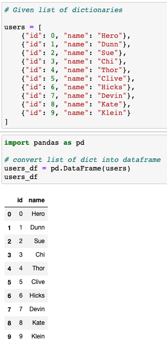
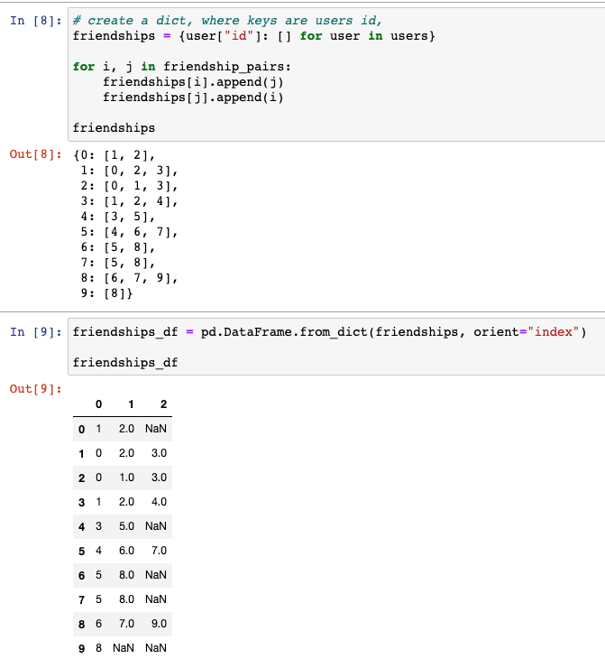
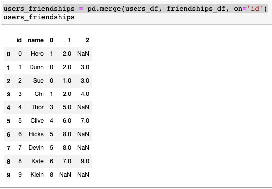
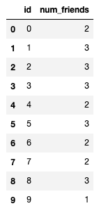
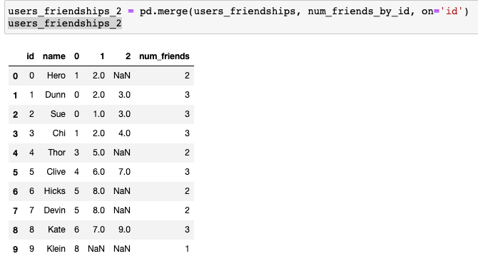
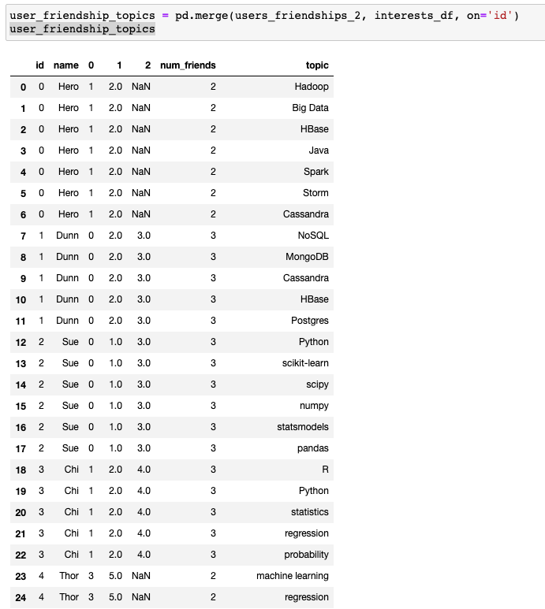
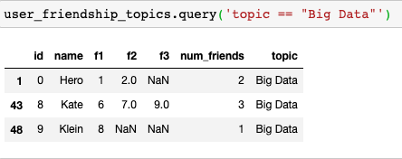
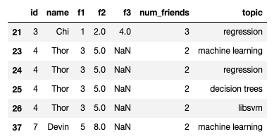
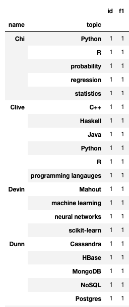

---
authors:
- admin
categories: []
date: "2020-11-07T00:00:00Z"
draft: false
featured: false
image:
  caption: ""
  focal_point: ""
lastMod: "2020-11-07T00:00:00Z"
projects: []
subtitle: Solving data problems with multiple tools
summary: Combining for-loops, list comprehensions and data frames 
tags: []
title: Supplementing lists with data frames
---


## Beyond Collections and Comprehensions

A couple days back I wrote a post summarizing how much Collections and Comprehension were used. Data was provided in the form of `lists`, either lists of `dictionaries` or `tuples`. And to answer questions *about* the data, the author often used `list comprehensions` - iterating through lists with a for-loop. I am beginning to see this as a very Python-centric way of approaching problems. 

While **not** all data is tabular, so much of it *is* so its reasonable to assume that, more often that not, you'll be dealing with spreadsheet-like tabular data (**note**: I'm open to other perspectives here, feel free to leave a comment below!).

In any case, I had this **itch** to go back to that chapter and ask:

> How would I approach the same problem using data frames? 

So that's what this post is about. You can reference these [previous post](https://paulapivat.com/post/dsfs_1/) for context; also keep in mind, this is a brief detour and deviation from Joel Grus' book (for example, I'll be using [pandas](https://pandas.pydata.org/) here and a [jupyter notebook](https://jupyter.org/) here, both of which are not covered in the book). 

For review, here's the data you are given as a newly hired data scientist at Data Scienster&trade; 

```python

# users in the network
# stored as a list of dictionaries
users = [
    {"id": 0, "name": "Hero"},
    {"id": 1, "name": "Dunn"},
    {"id": 2, "name": "Sue"},
    {"id": 3, "name": "Chi"},
    {"id": 4, "name": "Thor"},
    {"id": 5, "name": "Clive"},
    {"id": 6, "name": "Hicks"},
    {"id": 7, "name": "Devin"},
    {"id": 8, "name": "Kate"},
    {"id": 9, "name": "Klein"}
]

# friendship pairings in the network
# stored as a list of tuples
friendship_pairs = [(0,1), (0,2), (1,2), (1,3), (2,3), (3,4),
                    (4,5), (5,6), (5,7), (6,8), (7,8), (8,9)]
                    
# interests data
# stored as another list of tuples
interests = [
    (0, "Hadoop"), (0, "Big Data"), (0, "HBase"), (0, "Java"),
    (0, "Spark"), (0, "Storm"), (0, "Cassandra"),
    (1, "NoSQL"), (1, "MongoDB"), (1, "Cassandra"), (1, "HBase"),
    (1, "Postgres"), (2, "Python"), (2, "scikit-learn"), (2, "scipy"),
    (2, "numpy"), (2, "statsmodels"), (2, "pandas"), (3, "R"), (3, "Python"),
    (3, "statistics"), (3, "regression"), (3, "probability"),
    (4, "machine learning"), (4, "regression"), (4, "decision trees"),
    (4, "libsvm"), (5, "Python"), (5, "R"), (5, "Java"), (5, "C++"),
    (5, "Haskell"), (5, "programming langauges"), (6, "statistics"),
    (6, "probability"), (6, "mathematics"), (6, "theory"),
    (7, "machine learning"), (7, "scikit-learn"), (7, "Mahout"),
    (7, "neural networks"), (8, "neural networks"), (8, "deep learning"),
    (8, "Big Data"), (8, "artificial intelligence"), (9, "Hadoop"),
    (9, "Java"), (9, "MapReduce"), (9, "Big Data")
    ]
```
Given just these pieces of data, we can create **functions**, use **for-loops** and **list comprehensions** to answer some questions like:

- Who are each user friends with? 
- What are the total and average number of connections?
- Which users share the same interest?
- What are the most popular topics in this network?

However, the chapter ends with lists, functions and comprehension. What about **storing data in data frames?**

First we'll store `users` as a data frame:

```python
import pandas as pd

# convert list of dict into dataframe
users_df = pd.DataFrame(users)
users_df
```
Just visually, a `data frame` looks different from a `list of dictionaries`:



Your mileage may vary, but *I make sense of the data* very differently when I'm looking at a list vs a data frame. **Rows and columns** are ingrained in how I think about data. 

Next, we're given a `list of tuples` representing friendship pairs and we proceed to turn that into a `dictionary` by using a `dictionary comprehension`:

```python
# list of tuples
friendship_pairs = [(0,1), (0,2), (1,2), (1,3), (2,3), (3,4),
                    (4,5), (5,6), (5,7), (6,8), (7,8), (8,9)]
                    
# create a dict, where keys are users id, 
# dictionary comprehension
friendships = {user["id"]: [] for user in users}

for i, j in friendship_pairs:
    friendships[i].append(j)
    friendships[j].append(i)
```
Similar to the previous example, I find that viewing the data as a `data frame` is *different* from viewing it as a `dictionary`:



From this point, I'm doing several operations in [pandas](https://pandas.pydata.org/) to **join** the first two tables, such that I have a column with the user's id, user's name and the id of their first, second or, in some cases, third friends (at most people in this network have 3 direct connections).

If you want to know the specific [pandas](https://pandas.pydata.org/) operation, here's the code:

```python
# The users_df is fine as is with two columns: id and name (see above)

# We'll transform the friendships_df

# reset_index allows us to add an index column
friendships_df.reset_index(inplace=True)
# add index column
friendships_df = friendships_df.rename(columns = {"id":"new column name"})
# change index column to 'id'
friendships_df = friendships_df.rename(columns = {'index':'id'})
# join with users_df so we get each person's name
users_friendships = pd.merge(users_df, friendships_df, on='id')
```
Once we've joined `users_df` and `friendships_df`, we have:



Since we have `users` and `friendships` data, we could write a function to help us answer "how many friends does each user have?". In addition, we'll have to create a `list comprehension` so we loop through each `user` within `users`:

```python
# function to count how many friend each user has
def number_of_friends(user):
    """How many friends does _user_ have?"""
    user_id = user["id"]
    friend_ids = friendships[user_id]
    return len(friend_ids)

# list comprehension to apply the function for each user
num_friends_by_id = [(user["id"], number_of_friends(user)) for user in users]

# this gives us a list of tuples
num_friends_by_id

[(0, 2),
 (1, 3),
 (2, 3),
 (3, 3),
 (4, 2),
 (5, 3),
 (6, 2),
 (7, 2),
 (8, 3),
 (9, 1)]

```
Again, viewing the data as a  `list of tuples` is different from a `data frame`, so let's go ahead and turn that into a pandas data frame:

```python
# when converting to data frame, we can set the name of the columns to id and num_friends; this sets us up for another join
num_friends_by_id = pd.DataFrame(num_friends_by_id, columns = ['id', 'num_friends'])
```
Because we have an 'id' column, we can join this with our previously created `users_friendships` data frame:



Once joined with `users_friendships` using the `merge` function, we get (`users_friendships2`):



By now you're familiar with the process. We have a Python **collection**, generally a `list` of `dictionaries` or `tuples` and we want to convert them to a `data frame`. 

We'll repeat this process for the `interests` variable which is a long `list of tuples` (see above). We'll convert to data frame, then join with `users_friendships_2` to get a longer data frame with `interests` as one of the columns (*note* : picture is cut for space):



The nice thing about **pandas** is that once you have all your data **joined** together in a data frame, you can **query** the data. 

For example, I may want to see all users have an interest in "Big Data":



Previously, we would have had to create a function that returns a `list comprehension`:

```python
def data_scientists_who_like(target_interest):
    """Find the ids of all users who like the target interests."""
    return [user_id
            for user_id, user_interest in interests
            if user_interest == target_interest]
            
data_scientists_who_like("Big Data")
```
The data frame has other advantages, you could also query columns on multiple conditions, here are two ways to query multiple topics:

```python

# Option One: Use .query()
user_friendship_topics.query('topic == "machine learning" | topic == "regression" | topic == "decision trees" | topic == "libsvm"')

# Option Two: Use .isin()
user_friendship_topics[user_friendship_topics['topic'].isin(["machine learning", "regression", "decision trees", "libsvm"])]

```
Both options return this data frame:



By querying the data frame, we learned:
- all users interested in these four topics
- users that have interests in common with Thor
- (if needed) the `num_friends` that each user has

You can also find out the most popular topics within this network:

```python
# groupby topic, tally(count), then reset_index(), then sort
user_friendship_topics.groupby(['topic']).count().reset_index().sort_values('id', ascending=False)
```

You can even `groupby` two columns (name & topic) to see topic of interests listed by each user:

```python
user_friendship_topics.groupby(['name', 'topic']).count()
```



Hopefully you're convinced that **data frames** are a powerful supplement to the more familiar operations in Python like **for-loops** and/or **list comprehensions**; that both are worth knowing well to manipulate data in a variety of formats. (e.g., to access JSON data, Python dictionaries are [ideal](https://www.freecodecamp.org/news/python-read-json-file-how-to-load-json-from-a-file-and-parse-dumps/)).


