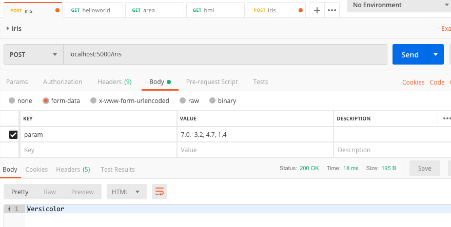

---
authors:
- admin
categories: []
date: "2020-10-10T00:00:00Z"
draft: false
featured: false
image:
  caption: ""
  focal_point: ""
lastMod: "2020-10-10T00:00:00Z"
projects: []
subtitle: Creating an API endpoint for your model
summary: Connecting models to an API
tags: []
title: Machine learning as a service
---

## Preparing API endpoints in Python with Flask

In this post, we'll create a minimal API endpoint that allows users to make request to calculate the area of a rectangle. The following code sets up an API endpoint locally. We'll import `Flask`, a lightweight web application framework and `CORS` (cross-origin resource sharing) which allows for various HTTP requests. 

We have two endpoints, one basic "hello world" and the other calculate the area (i.e., width x height).

This is saved in `App.py`. The command to run this file is `$ python3 App.py`. The last line ensures the API is running locally on `localhost:5000`. 

```
from flask import Flask, request
from flask_cors import CORS, cross_origin
import joblib
import numpy as np 

app = Flask(__name__)
CORS(app)

@app.route('/')
def helloworld():
    return 'Helloworld'

# Example request: http://localhost:5000/area?w=50&h=3
@app.route('/area', methods=['GET'])
@cross_origin()
def area():
    w = float(request.values['w'])
    h = float(request.values['h'])
    return str(w * h)

if __name__ == '__main__':
    app.run(host='0.0.0.0', port=5000, debug=True)
```

You can just run `localhost:5000` and get `Helloworld` or make a request to get the **area**, for example: `http://localhost:5000/area?w=20&h=33` (this yeilds 660)


## Training a Logistic Regression classification model

After setting up some API endpoints, it's time to create a basic machine learning model. We'll create a logistic regression model to classify flowers from the **Iris** dataset. This will be created in *one* `jupyter notebook`. 

We'll load all required libraries.
```
from sklearn.datasets import load_iris
from sklearn.linear_model import LogisticRegression
from sklearn.model_selection import train_test_split
from sklearn.metrics import accuracy_score
import joblib
import numpy as np
import pandas as pd
```

Then, we'll load the Iris dataset that comes with scikit learn, `sklearn`.

```
iris = load_iris()

# assign two variables at once
X, y = iris['data'], iris['target']
```

We'll reshape the data using `numpy`, then split the data into training and validation sets.

```
# reshape data for logistic regression
dataset = np.hstack((X, y.reshape(-1,1)))
np.random.shuffle(dataset)

# split data into training, validation sets
X_train, X_test, y_train, y_test = train_test_split(dataset[:, :4],
                                                    dataset[:, 4],
                                                    test_size=0.2)
```

We'll then fit a logistic regression model by fitting the training set to the validation set.

```
model = LogisticRegression()
model.fit(X_train, y_train)
```

Then, we'll use the model to predict on the validation data (*note*: in a real project a distinction is made between `validation` and `testing` sets, but we'll blur that distinction for this demo). You can also test the model to make a prediction on a single observation.

It's also a good idea to get the `accuracy_score()`, although it may not be ideal for classification models. 


```
# make a prediction
y_pred = model.predict(X_test)

# get accuracy score
accuracy_score(y_test, y_pred)

# make prediction on single Iris obervation
model.predict([[5.1, 3.5, 1.4, 0.2]])

```

Finally, we need to use `joblib` to save an `iris.model` to our directory, this will be used to connect to the API. 

```
joblib.dump(model, 'iris.model')
```

## Creating an API endpoint for the Logistic Regression model

Back in the `App.py` file, we'll *add* this section to create an endpoint, the `predict_species()` function that loads the `iris.model`, then sends a Post request of the four parameter values from `iris['data']`. The `predict_species()` function will then return one of three flower species.

```
@app.route('/iris', methods=['POST'])
@cross_origin()
def predict_species():
    model = joblib.load('iris.model')  #needs to be the correct path
    req = request.values['param']
    inputs = np.array(req.split(','), dtype=np.float32).reshape(1,-1)
    predict_target = model.predict(inputs)
    if predict_target == 0:
        return 'Setosa'
    elif predict_target == 1:
        return 'Versicolor'
    else:
        return 'Virginica'

```

## Testing the API endpoint on Postman

Finally, we'll use [Postman](https://www.postman.com/), a platform for API development. We will **post** four parameters (i.e., sepal length, sepal width, petal length and petal width) to the API endpoint and expect to receive a name back, either Setosa, Versicolor or Virginica. 
In Postman, we'll create a new collection and a new request:



The next step from here is to go beyond localhost and deploy the model. We'll explore that in another post. 


