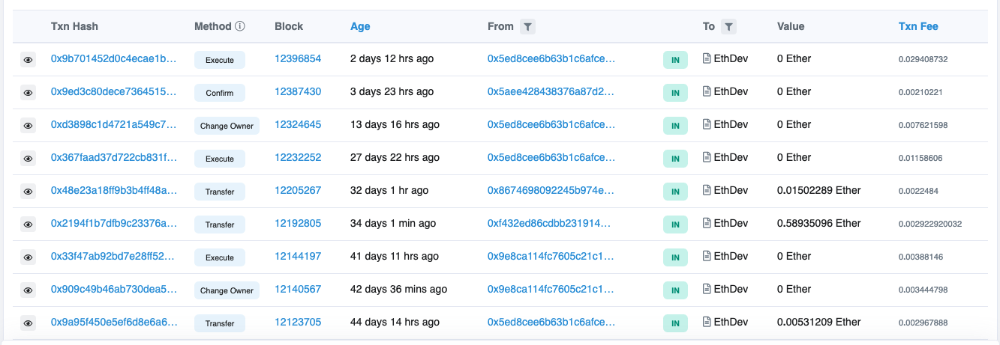
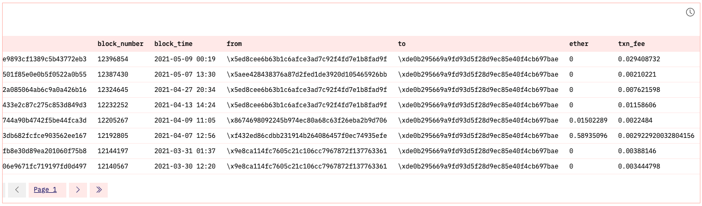
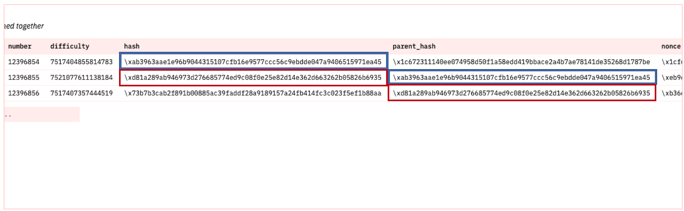

---
authors:
- admin
categories: []
date: "2021-05-11T00:00:00Z"
draft: false
featured: false
image:
  caption: ""
  focal_point: ""
lastMod: "2021-05-11T00:00:00Z"
projects: []
subtitle: Query on-chain data with Dune Analytics 
summary: A tutorial to help readers learn how Ethereum works by running SQL queries and getting a feel for on-chain data 
tags: ["Ethereum", "SQL", "Dune Analytics", "Querying", "Analytics"]
title: Learn Foundational Ethereum Topics with SQL
---

### Table of contents

- [Introduction](#introduction)
- [Transactions](#transactions)
- [Breaking Down Transactions](#breaking_down_transactions)
- [Blocks](#blocks)
- [Gas](#gas)


### Introduction

Many Ethereum tutorials target developers, but there’s a lack of educational resources for data analyst or for people who wish to see on-chain data without running a client or node. 

This tutorial helps readers understand fundamental Ethereum concepts including transactions, blocks and gas by querying on-chain data with structured query language (SQL) through an interface provided by [Dune Analytics](https://duneanalytics.com/).

On-chain data can help us understand Ethereum, the network, and as an economy for computing power and should serve as a base for understanding challenges facing Ethereum today (i.e., rising gas prices) and, more importantly, discussions around scaling solutions.


### Transactions

A user’s journey on Ethereum starts with initializing a user-controlled account or an entity with an ETH balance. There are two account types - user-controlled or a smart contract (see [ethereum.org](https://ethereum.org/en/developers/docs/accounts/)). 

Any account can be viewed on a block explorer like [Etherscan](https://etherscan.io/). Block explorers are a portal to Ethereum’s data. They display, in real-time, data on blocks, transactions, miners, accounts and other on-chain activity (see [here](https://ethereum.org/en/developers/docs/data-and-analytics/block-explorers/#top)). 

However, a user may wish to query the data directly to reconcile the information provided by external block explorers. [Dune Analytics](https://duneanalytics.com/) provides this capability to anyone with some knowledge of SQL.

For reference, the smart contract account for the Ethereum Foundation (EF) can be viewed on [Etherscan](https://etherscan.io/address/0xde0b295669a9fd93d5f28d9ec85e40f4cb697bae). 

One thing to note is that all accounts, including the EF’s, has a public address that can be used to send and receive transactions. 

The account balance on Etherscan comprises regular transactions and internal transactions. Internal transactions, despite the name, are not *actual* transactions that change the state of the chain. They are value transfers initiated by executing a contract ([source](https://ethereum.stackexchange.com/questions/3417/how-to-get-contract-internal-transactions)). Since internal transactions have no signature, they are **not** included on the blockchain and cannot be queried with Dune Analytics.

Therefore, this tutorial will focus on regular transactions. This can be queried as such:

```
WITH temp_table AS (
SELECT 
    hash,
    block_number,
    block_time,
    "from",
    "to",
    value / 1e18 AS ether,
    gas_used,
    gas_price / 1e9 AS gas_price_gwei
FROM ethereum."transactions"
WHERE "to" = '\xde0B295669a9FD93d5F28D9Ec85E40f4cb697BAe'   
ORDER BY block_time DESC
)
SELECT
    hash,
    block_number,
    block_time,
    "from",
    "to",
    ether,
    (gas_used * gas_price_gwei) / 1e9 AS txn_fee
FROM temp_table

```

This will yield the same information as provided on Etherscan's transaction page. For comparison, here are the two sources:

#### Etherscan



[EF's contract page on Etherscan.](https://etherscan.io/address/0xde0B295669a9FD93d5F28D9Ec85E40f4cb697BAe)

#### Dune Analytics



You can find dashboard [here](https://duneanalytics.com/paulapivat/Learn-Ethereum). Click on the table to see the query (also see above).


### Breaking_Down_Transactions

A submitted transaction includes several pieces of information including ([source](https://ethereum.org/en/developers/docs/transactions/)):

- **Recipient**: The receiving address (queried as "to")
- **Signature**: While a sender's private keys signs a transaction, what we can query with SQL is a sender's public address ("from").
- **Value**: This is the amount of ETH transferred (see `ether` column).
- **Data**: This is arbitrary data that's been hashed (see `data` column)
- **gasLimit**: The maximum amount of gas, or the cost of computation, that can be consumed by a transaction (see `gas_limit`). 
- **gasPrice**: The fee the sender pays to sign a transaction to the blockchain. Gas is denominated in Gwei which is 0.000000001 ETH (nine decimal places).

We can query these specific pieces of information for transactions to the Ethereum Foundation public address:

```
SELECT 
    "to",
    "from",
    value / 1e18 AS ether,
    data,
    gas_limit,
    gas_price / 1e9 AS gas_price_gwei,
    gas_used,
    ROUND(((gas_used / gas_limit) * 100),2) AS gas_used_pct
FROM ethereum."transactions"
WHERE "to" = '\xde0B295669a9FD93d5F28D9Ec85E40f4cb697BAe'   
ORDER BY block_time DESC

```


### Blocks


Each transaction will change the state of the Ethereum virtual machine ([EVM](https://ethereum.org/en/developers/docs/evm/)) ([source](https://ethereum.org/en/developers/docs/transactions/)). Transactions are broadcasted to the network to be verified and included in a block. Each transaction is associated with a block number. To see the data, we could query a specific block number:  12396854 (the most recent block among Ethereum Foundation transactions as of this writing, 11/5/21).

Moreover, when we query the next two blocks, we can see that each block contains the hash of the previous block (i.e., parent hash), illustrating how the blockchain is formed. 

Each block contains a reference to it parent block. This is shown below between the `hash` and `parent_hash` columns ([source](https://ethereum.org/en/developers/docs/blocks/)):



Here is the [query](https://duneanalytics.com/queries/44856/88292) on Dune Analytics:

```
SELECT
   time,
   number,
   difficulty,
   hash,
   parent_hash,
   nonce
FROM ethereum."blocks"
WHERE "number" = 12396854 OR "number" = 12396855 OR "number" = 12396856
LIMIT 10

```

We can  examine what’s inside a block by querying time, block number, difficulty, hash, parent hash, and nonce. 

The only thing this query does not cover is *transaction list* which requires a separate query below and *state root*. A full or archival node will store all transactions and state transitions, allowing for clients to query the state of the chain at any time. Because this requires large storage space, we can separate chain data from state data: 

- Chain data (list of blocks, transactions)
- State data (result of each transaction’s state transition)

State root falls in the latter and is *implicit* data (not stored on-chain), while chain data is explicit and stored on the chain itself ([source](https://ethereum.stackexchange.com/questions/359/where-is-the-state-data-stored)). For this tutorial, we'll be focusing on on-chain data that *can* be queried with SQL via Dune Analytics.


### Gas


For more use of data to explore web3 [find me on Twitter](https://twitter.com/paulapivat).