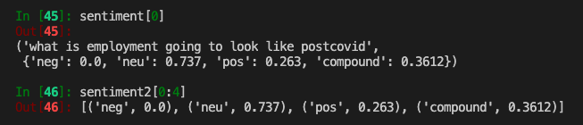
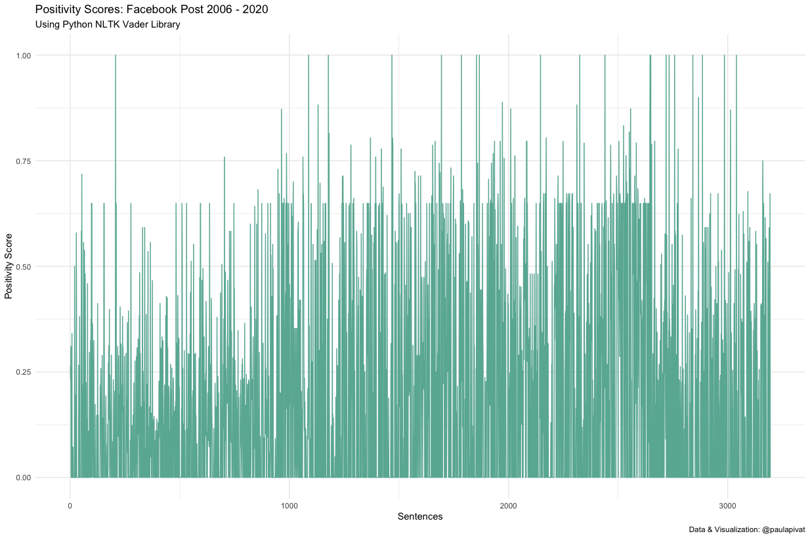
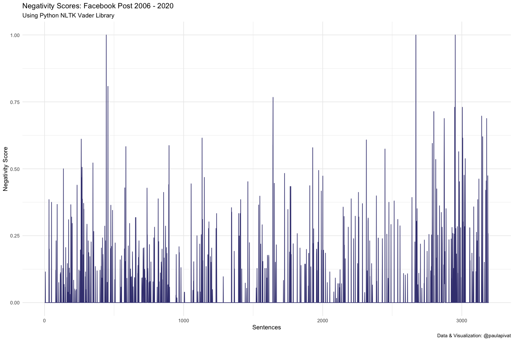
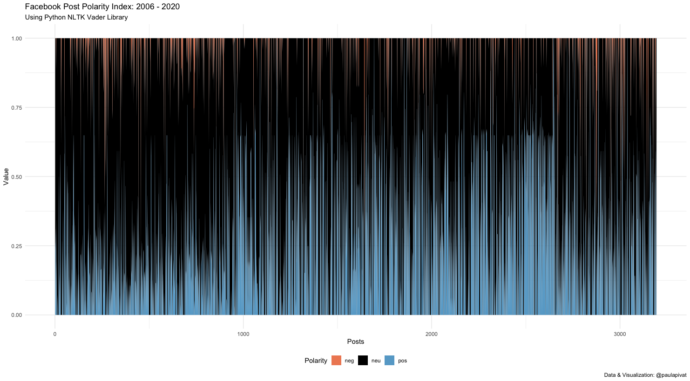
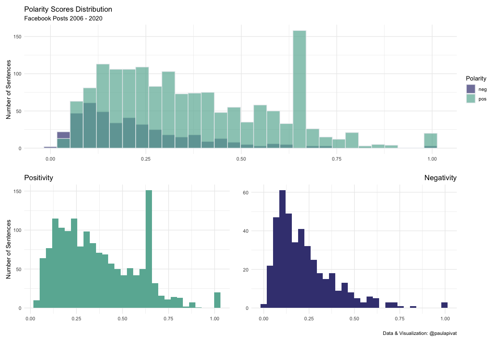

---
authors:
- admin
categories: []
date: "2021-01-26T00:00:00Z"
draft: false
featured: false
image:
  caption: ""
  focal_point: ""
lastMod: "2021-01-26T00:00:00Z"
projects: []
subtitle: Rule-based Sentiment Analysis Using Python and R
summary: Using Python and R to read, pre-process, wrangle and visualize data.
tags: ["R", "Data Science", "Facebook Data", "Python", "Sentiment Analysis", "Text Analysis"]
title: How Positive are Your Facebook Posts? 
---

### Table of contents

- [Overview](#overview)
- [Getting Data](#getting_data)
- [Tokenization](#tokenization)
- [Normalizing Sentences](#normalizing_sentences)
- [Frequency](#frequency)
- [Sentiment Analysis](#sentiment_analysis)
- [Data Transformation](#data_transformation)
- [Visualization](#visualization)
- [References](#references)


## Overview

#### Why Sentiment Analysis?

NLP is subfield of linguistic, computer science and artificial intelligence ([wiki](https://en.wikipedia.org/wiki/Natural_language_processing)), and you could spend years studying it. 

However, I wanted a quick mini-dive into this domain, to a get an intuition for how NLP works. 

What better dataset than our own social media post as we can't help but feel motivated to see insights about our *own* content. 

#### How well does Facebook know us? 

*How much is too much?*

To find out, I downloaded 14 years of posts to apply **text analysis** and **pre-processing**. I  used `Python` to read and download `json` data from Facebook. 

We'll perform tasks such as tokenization, normalization, stemming and lemmatization aided by Python's **Natural Language Toolkit**, `NLTK`. We can also get a word/sentence frequency count of all posts. Finally, we'll use the `VADER` module (Hutto & Gilbert, 2014) for rule-based (lexicon) model of **sentiment analysis**.

Finally, we'll transition our work flow to `R` and the `tidyverse` for **data manipulation** and **visualization**. 


## Getting_Data

First, you'll need to download your own Facebook data by following: Setting & Privacy > Setting > Your Facebook Information > Download Your Information > (select) Posts.

Below, I named my file `your_posts_1.json`, but you can change this. 
We'll use Python's `json` module read in data. We can get a feel for the data with `type` and `len`.

```python
import json

# load json into python, assign to 'data'
with open('your_posts_1.json') as file:
    data = json.load(file)

type(data)     # a list
type(data[0])  # first object in the list: a dictionary
len(data)      # my list contains 2166 dictionaries
```

Here are the Python libraries we use in this post:

```python
import pandas as pd
from nltk.sentiment.vader import SentimentIntensityAnalyzer
from nltk.stem import LancasterStemmer, WordNetLemmatizer      # OPTIONAL (more relevant for individual words)
from nltk.corpus import stopwords
from nltk.probability import FreqDist
import re
import unicodedata
import nltk
import json
import inflect
import matplotlib.pyplot as plt
```

[Natural Language Tookkit](https://www.nltk.org/) is a popular Python platform for work with human language data. While it has over 50 lexical resourcesm, we'll use the [Vader Sentiment Lexicon](https://github.com/cjhutto/vaderSentiment), that is *specifically* attuned to sentiments expressed in social media. Ideal for Facebook data. NLTK will also help with frequency count, stopwards, stemming and lemmatization.

[Regex](https://docs.python.org/3/library/re.html) (regular expressions) will be used to remove punctuation.

[Unicode Database](https://docs.python.org/3/library/unicodedata.html) will be used to remove non-ASCII characters.

[JSON](https://docs.python.org/3/library/json.html) module helps us to read in json from Facebook.

[Inflect](https://pypi.org/project/inflect/) helps us to convert numbers to words.

[Pandas](https://pandas.pydata.org/) is a powerful data manipulation and data analysis tool for when we save our text data into a data frame and write to csv.

After we have our data (in `json` format), we'll [dig through](https://twitter.com/paulapivat/status/1352893979897909251?s=20) to get actual **text data** (our posts). 

We'll store this text in a list.

**Note**: the `data` key occassionally returns an empty array and we want to skip over those by checking `len(v) > 0`.

```python
# create empty list
empty_lst = []

# multiple nested loops to store all post in empty list
for dct in data:
    for k, v in dct.items():
        if k == 'data':
            if len(v) > 0:
                for k_i, v_i in vee[0].items():  
                    if k_i == 'post':
                        empty_lst.append(v_i)

print("This is the empty list: ", empty_lst)
print("\nLength of list: ", len(empty_lst))
```

We now have a list of strings.

## Tokenization

We'll loop through our list of strings (empty_lst) to tokenize each *sentence* with `nltk.sent_tokenize()`. We want to split the text into either individual words or sentences. I think it'll make more sense to try to find the sentiment of each sentence, so we'll tokenize by sentence. 

This yields a list of list, we'll need to flatten it:

```python
# - list of list, len: 1762 (each list contain sentences)
nested_sent_token = [nltk.sent_tokenize(lst) for lst in empty_lst]

# flatten list, len: 3241
flat_sent_token = [item for sublist in nested_sent_token for item in sublist]
print("Flatten sentence token: ", len(flat_sent_token))
```

## Normalizing_Sentences

For context on the functions used in this section, check out this article by Matthew Mayo on [Text Data Preprocessing](https://www.kdnuggets.com/2018/03/text-data-preprocessing-walkthrough-python.html).

First, we'll remove non-ASCII characters (`remove_non_ascii(words)`) including: `#`, `-`, `'` and `?`, among many others. Then we'll lowercase (`to_lowercase(words)`), remove punctuation (`remove_punctuation(words)`), replace numbers (`replace_numbers(words)`), and remove stopwords (`remove_stopwords(words)`). 

Example stopwords are: your, yours, yourself, yourselves, he, him, his, himself etc. 

This allows us to have each sentence be on equal playing field. 

**NOTE**: It turns out the `Vader` module for sentiment analysis is fully capable of analyzing sentences with punctuation, word-shape (capitalization for emphasis), slang and even utf-8 encoded emojis, so we'll run a parallel set of analyses at the end **without normalization**. 

```python
# Remove Non-ASCII
def remove_non_ascii(words):
    """Remove non-ASCII character from List of tokenized words"""
    new_words = []
    for word in words:
        new_word = unicodedata.normalize('NFKD', word).encode(
            'ascii', 'ignore').decode('utf-8', 'ignore')
        new_words.append(new_word)
    return new_words


# To LowerCase
def to_lowercase(words):
    """Convert all characters to lowercase from List of tokenized words"""
    new_words = []
    for word in words:
        new_word = word.lower()
        new_words.append(new_word)
    return new_words


# Remove Punctuation , then Re-Plot Frequency Graph
def remove_punctuation(words):
    """Remove punctuation from list of tokenized words"""
    new_words = []
    for word in words:
        new_word = re.sub(r'[^\w\s]', '', word)
        if new_word != '':
            new_words.append(new_word)
    return new_words


# Replace Numbers with Textual Representations
def replace_numbers(words):
    """Replace all interger occurrences in list of tokenized words with textual representation"""
    p = inflect.engine()
    new_words = []
    for word in words:
        if word.isdigit():
            new_word = p.number_to_words(word)
            new_words.append(new_word)
        else:
            new_words.append(word)
    return new_words

# Remove Stopwords
def remove_stopwords(words):
    """Remove stop words from list of tokenized words"""
    new_words = []
    for word in words:
        if word not in stopwords.words('english'):
            new_words.append(word)
    return new_words
    
# Combine all functions into Normalize() function
def normalize(words):
    words = remove_non_ascii(words)
    words = to_lowercase(words)
    words = remove_punctuation(words)
    words = replace_numbers(words)
    words = remove_stopwords(words)
    return words
```
Here, we're normalizing *sentences*, rather than *words*. 

```python
sents = normalize(flat_sent_token)
print("Length of sentences list: ", len(sents))   # 3194
```

**NOTE**: The process of stemming and lemmatization makes more sense for individuals words (over sentences), so we won't use them here.

## Frequency

You can use the `FreqDist()` function to get the most common sentences. Then, you could plot a line chart for a visual comparison of the most frequent sentences. 

Although simple, counting frequencies can yield some [insights](https://twitter.com/paulapivat/status/1353704114467729408?s=20). 

```python
from nltk.probability import FreqDist

# Find frequency of sentence
fdist_sent = FreqDist(sents)
fdist_sent.most_common(10)   

# Plot
fdist_sent.plot(10)
```

## Sentiment_Analysis

We'll use the `Vader` module from `NLTK`. Vader stands for:

> Valence, Aware, Dictionary and sEntiment Reasoner. 

We are taking a **Rule-based/Lexicon** approach to sentiment analysis because we have a fairly large dataset, but lack labeled data to build a robust training set. Thus, Machine Learning would **not** be ideal for this task.

To get an intuition for how the `Vader` module works, we can visit the github repo to view `vader_lexicon.txt` [source](https://github.com/cjhutto/vaderSentiment/blob/master/vaderSentiment/vader_lexicon.txt). This is a **dictionary** that has been empirically validated by multiple independent human judges. Sentiment ratings are provided by 10 independent human raters (pre-screened, trained and checked for inter-rater reliability).

Scores range from (-4) Extremely Negative to (4) Extremely Positive, with (0) as Neutral. For example, "die" is rated -2.9, while "dignified" has a 2.2 rating. For more details visit their [repo](https://github.com/cjhutto/vaderSentiment).

We'll create two empty lists to store the sentences and the polarity scores, separately. 

`sentiment` captures each sentence and `sent_scores`, which initializes the `nltk.sentiment.vader.SentimentIntensityAnalyzer`, calculates the **polarity_score** of each sentence (i.e., negative, neutral, positive). 

`sentiment2` captures each polarity and value in a list of tuples. 

The below screen-cap should give you a sense of what we have:





After we have appended each sentence (`sentiment`) and their polarity scores (`sentiment2`, negative, neutral, positive), we'll **create data frames** to store these values. 

Then, we'll write the data frames to **CSV** to transition to `R`. Note that we set index to false when saving for CSV. Python starts counting at 0, while `R` starts at 1, so we're better off re-creating the index as a separate column in `R`. 

**NOTE**: There are more efficient ways for what I'm doing here. My solution is to save two CSV files and move the work flow over to `R` for further data manipulation and visualization. This is primarily a personal preference for handling data frames and visualizations in `R`, but I should point out this *can* be done with `pandas` and `matplotlib`. 

```python
# nltk.download('vader_lexicon')

sid = SentimentIntensityAnalyzer()

sentiment = []
sentiment2 = []

for sent in sents:
    sent1 = sent
    sent_scores = sid.polarity_scores(sent1)
    for x, y in sent_scores.items():
        sentiment2.append((x, y))
    sentiment.append((sent1, sent_scores))
    # print(sentiment)

# sentiment
cols = ['sentence', 'numbers']
result = pd.DataFrame(sentiment, columns=cols)
print("First five rows of results: ", result.head())

# sentiment2
cols2 = ['label', 'values']
result2 = pd.DataFrame(sentiment2, columns=cols2)
print("First five rows of results2: ", result2.head())

# save to CSV
result.to_csv('sent_sentiment.csv', index=False)
result2.to_csv('sent_sentiment_2.csv', index=False)
```

## Data_Transformation

From this point forward, we'll be using `R` and the `tidyverse` for data manipulation and visualization. `RStudio` is the IDE of choice here. We'll create an `R Script` to store all our data transformation and visualization process. We should be in the same directory in which the above CSV files were created with `pandas`. 

We'll load the two CSV files we saved and the `tidyverse` library:

```r
library(tidyverse)

# load data
df <- read_csv("sent_sentiment.csv")       
df2 <- read_csv('sent_sentiment_2.csv')    
```

We'll create another column that matches the index for the first data frame (sent_sentiment.csv). I save it as `df1`, but you could overwrite the original `df` if you wanted. 

```r
# create a unique identifier for each sentence
df1 <- df %>%
    mutate(row = row_number())
```

Then, for the second data frame (sent_sentiment_2.csv), we'll create another column matching the index, but also use `pivot_wider` from the `tidyr` package. **NOTE**: You'll want to `group_by` label first, then use `mutate` to create a unique identifier. 

We'll then use `pivot_wider` to ensure that all polarity values (negative, neutral, positive) have their own columns. 

By creating a unique identifier using `mutate` and `row_number()`, we'll be able to join (`left_join`) by row.

Finally, I save the operation to `df3` which allows me to work off a fresh new data frame for visualization.

```r
# long-to-wide for df2
# note: first, group by label; then, create a unique identifier for each label then use pivot_wider

df3 <- df2 %>%
    group_by(label) %>%
    mutate(row = row_number()) %>%
    pivot_wider(names_from = label, values_from = values) %>%
    left_join(df1, by = 'row') %>%
    select(row, sentence, neg:compound, numbers) 
```

## Visualization

First, we'll visualize the positive and negative polarity scores separately, across all 3194 sentences (your numbers will vary). 

Here are positivity scores:



Here are negativity scores:



When I sum positivity and negativity scores to get a ratio, it's approximately 568:97 or  5.8x more positive than negative according to the `Vader` (Valance Aware Dictionary and Sentiment Reasoner). 

The `Vader` module will take in every sentence and assign a valence score from -1 (most negative) to 1 (most positive). We can classify sentences as `pos` (positive), `neu` (neutral) and `neg`(negative) or as a composite (`compound`) score (i.e., normalized, weighted composite score). For more details, see [vader-sentiment documentation](https://pypi.org/project/vader-sentiment/).

To see both positive and negative scores together (positive = blue, negative = red, neutral = black).



Finally, we can also use `histograms` to see the distribution of negative and positive sentiment among the sentences:



#### Summary

I downloaded 14 years worth of Facebook posts to run a rule-based sentiment analysis and visualize the results, using a combination of `Python` and `R`. 

I enjoyed using both for this project and sought to play to their strengths. I found parsing JSON straight-forward with Python, but once we transition to data frames, I was itching to get back to R. 

Because we lacked labeled data, using a rule-based/lexicon-approach to sentiment analysis made sense. Now that we have a label for valence scores, it may be possible to take a machine learning approach to predict the valence of future posts. 


## References

1. Hutto, C.J. & Gilbert, E.E. (2014). VADER: A Parsimonious Rule-based Model for Sentiment Analysis of Social Media Text. Eighth International Conference on Weblogs and Social Media (ICWSM-14). Ann Arbor, MI, June 2014.


For more content on data science, machine learning, R, Python, SQL and more, [find me on Twitter](https://twitter.com/paulapivat).