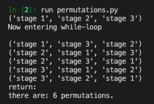

---
authors:
- admin
categories: []
date: "2020-12-09T00:00:00Z"
draft: false
featured: false
image:
  caption: ""
  focal_point: ""
lastMod: "2020-12-09T00:00:00Z"
projects: []
subtitle: Exploring Statistics & Probability Concepts Using Code
summary: Learning Statistics and Probability Concepts through Code Snippets
tags: ["Python", "Data Science", "Probability", "Statistics"]
title: Statistics & Probability in Code
---

### Table of contents

- [Permutations](#permutations)

## Overview

`Itertools` are a core set of fast, memory efficient tools for creating iterators for efficient looping (read the [documentation](https://docs.python.org/3/library/itertools.html) here). 

## Itertools Permutations

One (of many) uses for `itertools` is to create a `permutations()` function that will return all possible combinations of items in a list. 

I was working on a project that involved user funnels with different stages and we were wondering how many different "paths" a user *could* take, so this was naturally a good fit for using **permutations**. 


*Sample Funnel*

In our hypothetical example, we're looking at a funnel with three stages for a total of 6 permutations. Here's the formula:


If you're using a sales/marketing funnel, you'll have in mind what your funnel would look like so you may **not** want all possible paths, but if you're interested in exploring potentially *overlooked* paths, read on.

Here's the python [documentation](https://docs.python.org/3.6/library/itertools.html#itertools.permutations) for `itertools`, and `permutations` specifically. We'll break down the code to better understand what's going on in this function.

**note:** I found a clearer alternative after the fact. Feel free to skip to the final section below, although there is value in comparing the two versions. 

We'll start off with the `iterable` which is a `list` with three strings. The `permutations` function takes in two parameters, the `iterable` and `r` which is the number of items from the list that we're interested in finding the combination of. If we have three items in the list, we generally want to find *all possible* combinations of those three items.

Here is the code, and subsequent breakdown:

```python
# list of length 3
list1 = ['stage 1', 'stage 2', 'stage 3']

# iterable is the list
# r = number of items from the list to find combinations of


def permutations(iterable, r=None):
    """Find all possible order of a list of elements"""
    # permutations('ABCD',2)--> AB AC AD BA BC BD CA CB CD DA DB DC
    # permutations(range(3))--> 012 021 102 120 201 210
    # permutations(list1, 6)--> ...720 permutations
    pool = tuple(iterable)
    n = len(pool)
    r = n if r is None else r
    if r > n:
        return
    indices = list(range(n))                     # [0, 1, 2]
    cycles = list(range(n, n-r, -1))             # [3, 2, 1]
    yield tuple(pool[i] for i in indices[:r])
    print("Now entering while-loop \n")
    while n:
        for i in reversed(range(r)):
            cycles[i] -= 1
            if cycles[i] == 0:
                indices[i:] = indices[i+1:] + indices[i:i+1]
                cycles[i] = n - i
            else:
                j = cycles[i]
                indices[i], indices[-j] = indices[-j], indices[i]
                yield tuple(pool[i] for i in indices[:r])
                print("indices[:r]", indices[:r])
                print("pool[i]:", tuple(pool[i] for i in indices[:r]))
                print("n:", n)
                break
        else:
            print("return:")
            return


#permutations(list1, 6)

perm = permutations(list1, 3)
count = 0

for p in perm:
    count += 1
    print(p)
print("there are:", count, "permutations.")

```

The first thing we do is take the `iterable` input parameter is turn it from a `list` into a `tuple`. 

```python
pool = tuple(iterable)
```

There are several reasons to do this. First, `tuples` are *faster* than `lists`; the `permutations()` function will do several operations to the input so changing it to a `tuple` allows faster operations and because `tuples` are *immutable*, we can do a bunch of different operations without fear that we might *inadvertently* change the list. 

We then create `n` from the length of `pool` (in our case it's 3) and the additional `r` parameter, which defaults to `None` is also 3 as we're interested in seeing **all combinations** of a list of three elements. 

We also have a line that ensures that `r` can never be greater than the number of elements in the `iterable` (list).

```python
if r > n:
    return
```

Next, we create `indices` and `cycles`. Indices are basically the index of each item, starting with 0 to 2, for three items. Cycles uses `range(n, n-r, -1)`, which in our case is `range(3, 3-3, -1)`; this means **start** at three and **end** at zero, in -1 **steps**.

The next chunk of code is a `while-loop` that will continue for the length of the list, `n` (note the `break` at the bottom to exit out of this loop).

After each `if-else` cycle, a new set of `indices` are created, which then gets looped through with `pool`, the interable parameter input, which changes the order of the elements in the list. 

You'll note in the commented code above, `cycles` start off at [3,2,1] and `indices` start off at [0,1,2]. Each loop through the code changes the `indices` where `indices[i:]` successively gets longer [2], then [1,2], then [1,2,3]. While `cycles` changes as it trends toward [1,1,1], which point the code breaks out of the loop. 

```python
while n:
        for i in reversed(range(r)):
            cycles[i] -= 1
            if cycles[i] == 0:
                indices[i:] = indices[i+1:] + indices[i:i+1]
                cycles[i] = n - i
            else:
                j = cycles[i]
                indices[i], indices[-j] = indices[-j], indices[i]
                yield tuple(pool[i] for i in indices[:r])
                print("indices[:r]", indices[:r])
                print("pool[i]:", tuple(pool[i] for i in indices[:r]))
                print("n:", n)
                break
        else:
            print("return:")
```
The `permutations(iterable, r)` function actually creates a `generator` so we need to loop through it again to print out all the permutations of the list.

```python
<generator object permutations at 0x7fe19400fdd0>
```

We add another for-loop at the bottom to print out all the permutations:

```python
perm = permutations(list1, 3)
count = 0

for p in perm:
    count += 1
    print(p)
print("there are:", count, "permutations.")
```

Here is our result:



### A Clearer Alternative: Permutation Using Recursion

As is often the case, there is a better way I found in retrospect from [this stack overflow](https://stackoverflow.com/questions/104420/how-to-generate-all-permutations-of-a-list) (h/t to [Eric O Lebigot](https://twitter.com/lebigot)):

```python
def all_perms(elements):
    if len(elements) <= 1:
        yield elements  # Only permutation possible = no permutation
    else:
        # Iteration over the first element in the result permutation:
        for (index, first_elmt) in enumerate(elements):
            other_elmts = elements[:index] + elements[index+1:]
            for permutation in all_perms(other_elmts):
                yield [first_elmt] + permutation
```

The `enumerate` built-in function obviates the need to separately create `cycles` and `indices`. The local variable `other_elmts` separates the other elements in the list from the `first_elmt`, then the second for-loop recursively finds the permutation of the other elements before adding with the `first_elmt` on the final line, yielding all possible permutations of a list. As with the previous case, the result of this function is a `generator` which requires looping through and printing the permutations.

I found this much easier to digest than the documentation version. 

Permutations can be useful when you have varied user journeys through your product and you want to figure out all the possible paths. With this short python script, you can easily print out all options for consideration.

### Take Aways

From the perspective of a user funnel, **permutations** allow us to explore all possible *paths* a user might take. For our hypothetical example, a three-step funnel yields six possible paths a user could navigate from start to finish. 

Knowing permutations should also **give us pause** when deciding whether to add another "step" to a funnel. Going from a three-step funnel to a four-step funnel increases the number of possible paths from six to 24 - a quadruple increase. 

Not only does this increase **friction** between your user and the 'end goal' (conversion), whatever that may be for your product, but it also increases complexity (and potentially confusion) in the user experience. 


For more content on data science, machine learning, R, Python, SQL and more, [find me on Twitter](https://twitter.com/paulapivat).