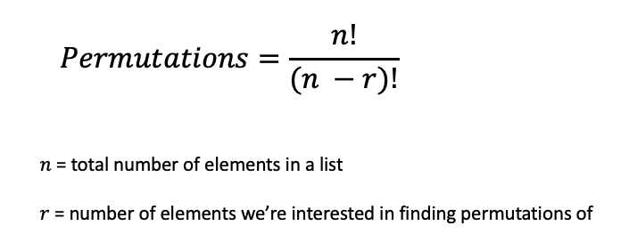

---
authors:
- admin
categories: []
date: "2020-12-09T00:00:00Z"
draft: false
featured: false
image:
  caption: ""
  focal_point: ""
lastMod: "2020-12-09T00:00:00Z"
projects: []
subtitle: Exploring Statistics & Probability Concepts Using Code
summary: Learning Statistics and Probability Concepts through Code Snippets
tags: ["Python", "Data Science", "Probability", "Statistics", "R"]
title: Statistics & Probability in Code
---

### Table of contents

- [Permutations](#permutations)

## Overview

`Itertools` are a core set of fast, memory efficient tools for creating iterators for efficient looping (read the [documentation](https://docs.python.org/3/library/itertools.html) here). 

## Permutations

One (of many) uses for `itertools` is to create a `permutations()` function that will return all possible combinations of items in a list. 

I was working on a project that involved user funnels with different stages and we were wondering how many different "paths" a user *could* take, so this was naturally a good fit for using **permutations**. 

In our hypothetical example, we're looking at a funnel with three stages for a total of 6 permutations. Here's the formula:




Now it's likely that if you're using a sales/marketing funnel of some sort, you'll have in mind what your funnel would look like so you may not want all possible paths, but if you do, read on.

Here's the [documentation](https://docs.python.org/3.6/library/itertools.html#itertools.permutations). We'll break down the code to better understand what's going on in this function.

We'll start off with the `iterable` which is a `list` with three strings. The `permutations` function takes in two parameters, the `iterable` and `r` which is the number of items from the list that we're interested in finding the combination of. If we have three items in the list, we generally want to find *all possible* combinations of those three items.

Here is the code, and subsequent breakdown:

```python
# list of length 3
list1 = ['stage 1', 'stage 2', 'stage 3']

# iterable is the list
# r = number of items from the list to find combinations of


def permutations(iterable, r=None):
    """Find all possible order of a list of elements"""
    # permutations('ABCD',2)--> AB AC AD BA BC BD CA CB CD DA DB DC
    # permutations(range(3))--> 012 021 102 120 201 210
    # permutations(list1, 3)--> ...6 permutations
    pool = tuple(iterable)
    n = len(pool)
    r = n if r is None else r
    if r > n:
        return
    indices = list(range(n))                     # [0, 1, 2]
    cycles = list(range(n, n-r, -1))             # [3, 2, 1]
    yield tuple(pool[i] for i in indices[:r])
    while n:
        for i in reversed(range(r)):
            cycles[i] -= 1
            if cycles[i] == 0:
                indices[i:] = indices[i+1:] + indices[i:i+1]
                cycles[i] = n - i
            else:
                j = cycles[i]
                indices[i], indices[-j] = indices[-j], indices[i]
                yield tuple(pool[i] for i in indices[:r])
                break
        else:
            return


#permutations(list1, 3)
perm = permutations(list1, 3)
count = 0

for p in perm:
    count += 1
    print(p)
print("there are:", count, "permutations.")

```

The first thing we do is take the `iterable` input parameter is turn it from a `list` into a `tuple`. 

```python
pool = tuple(iterable)
```

There are several reasons to do this. First, `tuples` are *faster* than `lists`; the `permutations()` function will do several operations to the input so changing it to a `tuple` allows faster operations and because `tuples` are *immutatble*, we can do a bunch of different operations without fear that we might *inadvertently* change the list. 

We then create `n` from the length of `pool` (in our case it's 3) and the additional `r` parameter, which defaults to `None` is also 3 as we're interested in seeing **all combinations** of a list of four elements. 

We also have a line that ensures that `r` can never be greater than the number of elements in it `iterable`.

```python
if r > n:
    return
```

Next, we create `indices` and `cycles`. Indices are basically the index of each item, starting with 0 to 2, for three items. Cycles uses `range(n, n-r, -1)`, which in our case is `range(3, 3-3, -1)`; this means **start** at three and **end** at zero, in -1 **steps**.

The next chunk of code is a `while-loop` that will continue for the length of the list, `n` (note the `break` at the bottom to exit out of this loop).

The `for i in reversed(range(r))` will do a reverse loop through the indices, for example

```python
for i in reversed(range(3)):
     print(i)

2
1
0
```


For more content on data science, machine learning, R, Python, SQL and more, [find me on Twitter](https://twitter.com/paulapivat).