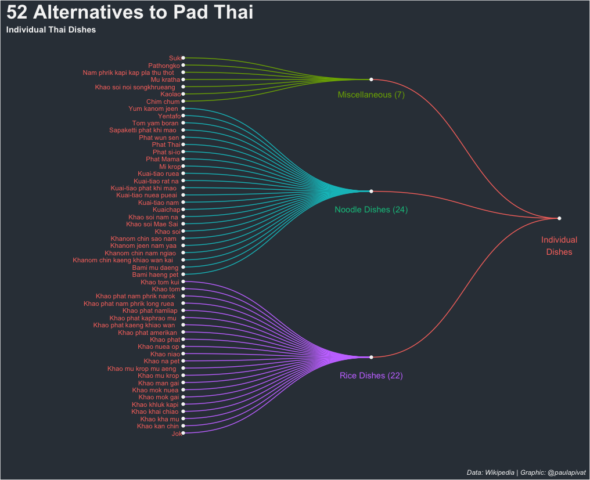
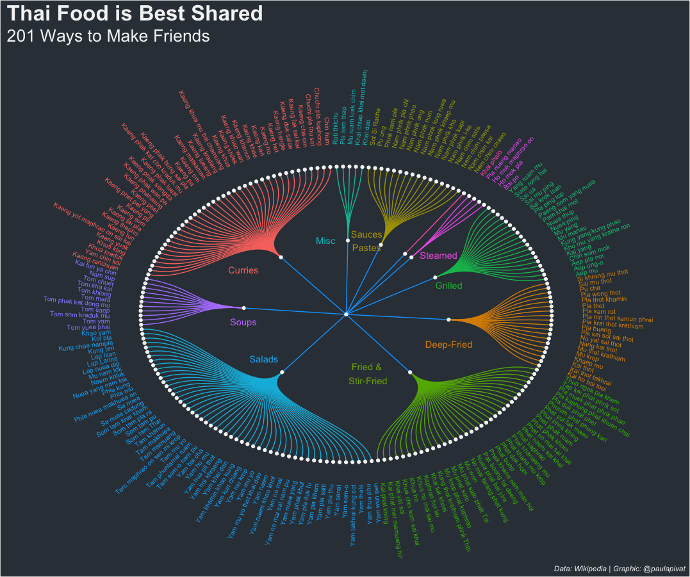
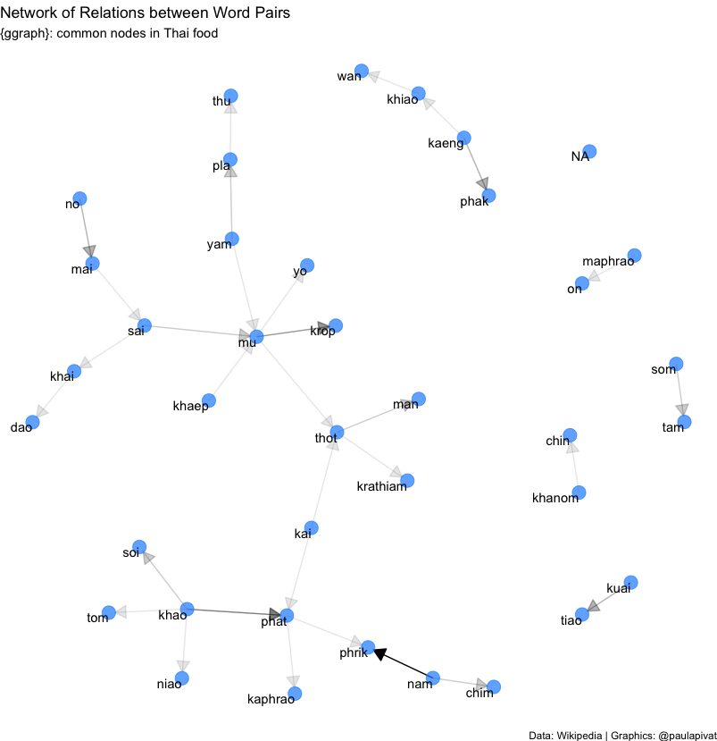

---
authors:
- admin
categories: []
date: "2021-03-18T00:00:00Z"
draft: false
featured: false
image:
  caption: ""
  focal_point: ""
lastMod: "2021-03-18T00:00:00Z"
projects: []
subtitle: Using visualization and text mining to learn about Thai dishes
summary: Using R and Python to scrape, pre-process, wrangle and visualize data.
tags: ["Web Scraping", Data Viz", "Text Mining", "RStats", "ggplot2", "Python"]
title: Pad Thai is a Terrible Choice
---

### Table of contents

- [Overview](#overview)
- [Web Scraping](#web_scraping)
- [Data Cleaning](#data_cleaning)
- [Data Visualization](#data_visualization)
- [Text Mining](#text_mining)
- [Exploratory Questions](#exploratory_questions)

### Overview

People need to know they have other choices aside from Pad Thai. In fact Pad Thai is one of 53 individual dishes and there are at least 201 shared dishes in Thai cuisine (source: [wikipedia](https://en.wikipedia.org/wiki/List_of_Thai_dishes)).

This project is an opportunity to build a dataset of Thai dishes by scrapping tables off Wikipedia. We will use Python for web scrapping and R for visualization. Web scrapping is done in `Beautiful Soup` (Python) and pre-processed further with `dplyr` and visualized with `ggplot2`.

Aside from furthering our data skills, we also make an open source [contribution](https://github.com/holtzy/R-graph-gallery/pull/34).

The project repo is [here](https://github.com/PaulApivat/thai_dishes).

### Web_Scraping

#### First Round

We scraped over [300 Thai dishes](https://en.wikipedia.org/wiki/List_of_Thai_dishes). For each dish, we got:

- Thai name
- Thai script
- English name
- Region
- Description

First, we'll use the following libraries/modules:

```python
import requests
from bs4 import BeautifulSoup
import urllib.request
import urllib.parse
import urllib.error
import ssl
import pandas as pd
```

We'll use `requests` to send an HTTP requests to the wikipedia url we need. We'll access network sockets using 'secure sockets layer' (SSL). Then we'll read in the html data to parse it with **Beautiful Soup**.

To being using **Beautiful Soup**, we want to understand the structure of the page (and tables) we want to scrape. We can see that we want the `table` tag, along with class of `wikitable sortable`.


The main function we'll use from **Beautiful Soup** is `findAll()` and the main three parameters are `th` (Header Cell in HTML table), `tr` (Row in HTML table) and `td` (Standard Data Cell). 

First, we'll save the table headers in a list, which we'll use when creating an empty `dictionary` to store the data we need. 

```python
header = [item.text.rstrip() for item in all_tables[0].findAll('th')]

table = dict([(x, 0) for x in header])
```

Initially, we want to successfully scrape one table, knowing that we'll need to repeat the process for all 16 tables. Therefore we'll use a *nested loop*. Because all tables have 6 columns, we'll want to create 6 empty lists.

We'll scrape through all table rows `tr` and check for 6 cells (which we should have for 6 columns), then we'll *append* the data to each empty list we create.

```python
# loop through all 16 tables
a = [0, 1, 2, 3, 4, 5, 6, 7, 8, 9, 10, 11, 12, 13, 14, 15]

# empty list to store data
a1 = []
a2 = []
a3 = []
a4 = []
a5 = []
a6 = []

# nested loop for looping through all 16 tables, then all tables individually
for i in a:
    for row in all_tables[i].findAll('tr'):
        cells = row.findAll('td')
        if len(cells) == 6:
            a1.append([string for string in cells[0].strings])
            a2.append(cells[1].find(text=True))
            a3.append(cells[2].find(text=True))
            a4.append(cells[3].find(text=True))
            a5.append(cells[4].find(text=True))
            a6.append([string for string in cells[5].strings])
```

You'll note the code for `a1` and `a6` are slightly different. In retrospect, I found that `cells[0].find(text=True)` did **not** yield certain texts, particularly if they were links, therefore a slight adjustment is made. 

The strings tag returns a `NavigableString` type object while text returns a `unicode` object (see [stack overflow](https://stackoverflow.com/questions/25327693/difference-between-string-and-text-beautifulsoup) explanation).

After we've scrapped the data, we'll need to store the data in a `dictionary` before converting to `data frame`:

```python
# create dictionary
table = dict([(x, 0) for x in header])

# append dictionary with corresponding data list
table['Thai name'] = a1
table['Thai script'] = a2
table['English name'] = a3
table['Image'] = a4
table['Region'] = a5
table['Description'] = a6

# turn dict into dataframe
df_table = pd.DataFrame(table)
```

For `a1` and `a6`, we need to do an extra step of joining the strings together, so I've created two additional corresponding columns, `Thai name 2` and `Description2`:

```python
# Need to Flatten Two Columns: 'Thai name' and 'Description'
# Create two new columns
df_table['Thai name 2'] = ""
df_table['Description2'] = ""

# join all words in the list for each of 328 rows and set to thai_dishes['Description2'] column
# automatically flatten the list
df_table['Description2'] = [
    ' '.join(cell) for cell in df_table['Description']]

df_table['Thai name 2'] = [
    ' '.join(cell) for cell in df_table['Thai name']]
```

After we've scrapped all the data and converted from `dictionary` to `data frame`, we'll write to CSV to prepare for data cleaning in R (note: I saved the csv as thai_dishes.csv, but you can choose a different name).

### Data_Cleaning

Data cleaning is typically non-linear. I'll manipulate the data to explore, then learn *about* the data and see that certain aspects need cleaning or, in some cases, re-scraping back in Python altogether. The difference in how columns `a1` and `a6` were created above stems from **missing data** found during exploration and cleaning.

Certain words were hyperlink and simply using `.find(text=True)` wasn't working how I needed, so a slight adjustment was made. 

`R` is my tool of choice for cleaning the data. 

Here are other more *minor* cleaning tasks:

- Changing column names (snake case)

```python
# read data
df <- read_csv("thai_dishes.csv")

# change column name
df <- df %>%
    rename(
        Thai_name = `Thai name`,
        Thai_name_2 = `Thai name 2`,
        Thai_script = `Thai script`,
        English_name = `English name`
    )

```

- Remove newline escape sequence (\n)

```python
# remove  \n from all columns ----
df$Thai_name <- gsub("[\n]", "", df$Thai_name)
df$Thai_name_2 <- gsub("[\n]", "", df$Thai_name_2)
df$Thai_script <- gsub("[\n]", "", df$Thai_script)
df$English_name <- gsub("[\n]", "", df$English_name)
df$Image <- gsub("[\n]", "", df$Image)
df$Region <- gsub("[\n]", "", df$Region)
df$Description <- gsub("[\n]", "", df$Description)
df$Description2 <- gsub("[\n]", "", df$Description2)
```

- Add/Mutate new columns (major_groupings, minor_groupings):

```python
# Add Major AND Minor Groupings ----
df <- df %>%
    mutate(
        major_grouping = as.character(NA),
        minor_grouping = as.character(NA)
        )
```


- Edit rows for missing data in Thai_name column: 26, 110, 157, 234-238, 240, 241, 246

**Note**: This was only necessary the first time round, after the changes are made to how I scraped `a1` and `a6`, this step is **no longer necessary**:

```python
# If necessary; may not need to do this after scraping a1 and a6 - see above
# Edit Rows for missing Thai_name
df[26,]$Thai_name <- "Khanom chin nam ngiao"
df[110,]$Thai_name <- "Lap Lanna"
df[157,]$Thai_name <- "Kai phat khing"
df[234,]$Thai_name <- "Nam chim chaeo"
df[235,]$Thai_name <- "Nam chim kai"
df[236,]$Thai_name <- "Nam chim paesa"
df[237,]$Thai_name <- "Nam chim sate"
df[238,]$Thai_name <- "Nam phrik i-ke"
df[240,]$Thai_name <- "Nam phrik kha"
df[241,]$Thai_name <- "Nam phrik khaep mu"
df[246,]$Thai_name <- "Nam phrik pla chi"
```

- save to "edit_thai_dishes.csv"

```python
# Write new csv to save edits made to data frame
write_csv(df, "edit_thai_dishes.csv")
```


### Data_Visualization

There are several ways to visualize the data. Because we want to communicate the diversity of Thai dishes, *aside* from Pad Thai, we want a visualization that captures the many, many options.

I opted for a **dendrogram**. This graph assumes hierarchy within the data, which fits our project because we can organize the dishes in grouping and sub-grouping. 

We first make a distinction between **individual** and **shared** dishes, showing that Pad Thai, while not even close to being the best *individual* dish is nonetheless an dish to be consumed individually. While, in fact, more dishes fall under the **shared** grouping. 

To avoid cramming too much data into one visual, we'll create two separate visualizations for individual vs. shared dishes. 

- Dendrogram 1: 52 Alternatives to Pad Thai (individual dishes)



Creating a dendrogram requires using the `ggraph` and `igraph` libraries. First, we'll load the libraries and sub-set our data frame by filtering for Individual Dishes:

```python
df <- read_csv("edit_thai_dishes.csv")

library(ggraph)
library(igraph)

df %>%
    select(major_grouping, minor_grouping, Thai_name, Thai_script) %>%
    filter(major_grouping == 'Individual dishes') %>%
    group_by(minor_grouping) %>%
    count() 

```

We create edges and nodes (i.e., from and to) to create the sub-groupings within Individual Dishes (i.e., Rice, Noodles and Misc):

```python
# Individual Dishes ----

# data: edge list
d1 <- data.frame(from="Individual dishes", to=c("Misc Indiv", "Noodle dishes", "Rice dishes"))

d2 <- df %>%
    select(minor_grouping, Thai_name) %>%
    slice(1:53) %>%
    rename(
        from = minor_grouping,
        to = Thai_name
    ) 

edges <- rbind(d1, d2)

# plot dendrogram (idividual dishes)
indiv_dishes_graph <- graph_from_data_frame(edges)

ggraph(indiv_dishes_graph, layout = "dendrogram", circular = FALSE) +
    geom_edge_diagonal(aes(edge_colour = edges$from), label_dodge = NULL) +
    geom_node_text(aes(label = name, filter = leaf, color = 'red'), hjust = 1.1, size = 3) +
    geom_node_point(color = "whitesmoke") +
    theme(
        plot.background = element_rect(fill = '#343d46'),
        panel.background = element_rect(fill = '#343d46'),
        legend.position = 'none',
        plot.title = element_text(colour = 'whitesmoke', face = 'bold', size = 25),
        plot.subtitle = element_text(colour = 'whitesmoke', face = 'bold'),
        plot.caption = element_text(color = 'whitesmoke', face = 'italic')
    ) +
    labs(
        title = '52 Alternatives to Pad Thai',
        subtitle = 'Individual Thai Dishes',
        caption = 'Data: Wikipedia | Graphic: @paulapivat'
    ) +
    expand_limits(x = c(-1.5, 1.5), y = c(-0.8, 0.8)) +
    coord_flip() +
    annotate("text", x = 47, y = 1, label = "Miscellaneous (7)", color = "#7CAE00")+
    annotate("text", x = 31, y = 1, label = "Noodle Dishes (24)", color = "#00C08B") +
    annotate("text", x = 8, y = 1, label = "Rice Dishes (22)", color = "#C77CFF") +
    annotate("text", x = 26, y = 2, label = "Individual\nDishes", color = "#F8766D")
```


- Dendrogram 2: Thai Food is Best Shared (201 Shared Dishes)



```python
# Shared Dishes ----
df %>%
    select(major_grouping, minor_grouping, Thai_name, Thai_script) %>%
    filter(major_grouping == 'Shared dishes') %>%
    group_by(minor_grouping) %>%
    count() %>%
    arrange(desc(n))

d3 <- data.frame(from="Shared dishes", to=c("Curries", "Soups", "Salads",
                                            "Fried and stir-fried dishes", "Deep-fried dishes", "Grilled dishes",
                                            "Steamed or blanched dishes", "Stewed dishes", "Dipping sauces and pastes", "Misc Shared"))


d4 <- df %>%
    select(minor_grouping, Thai_name) %>%
    slice(54:254) %>%
    rename(
        from = minor_grouping,
        to = Thai_name
    )

edges2 <- rbind(d3, d4)

# create a vertices data.frame. One line per object of hierarchy
vertices = data.frame(
    name = unique(c(as.character(edges2$from), as.character(edges2$to)))
)

# add column with group of each name. Useful to later color points
vertices$group = edges2$from[ match(vertices$name, edges2$to)]

# Add information concerning the label we are going to add: angle, horizontal adjustment and potential flip
# calculate the ANGLE of the labels
vertices$id=NA
myleaves=which(is.na(match(vertices$name, edges2$from)))
nleaves=length(myleaves)
vertices$id[myleaves] = seq(1:nleaves)
vertices$angle = 360 / nleaves * vertices$id + 90    


# calculate the alignment of labels: right or left
vertices$hjust<-ifelse( vertices$angle < 275, 1, 0)


# flip angle BY to make them readable
vertices$angle<-ifelse(vertices$angle < 275, vertices$angle+180, vertices$angle)

# plot dendrogram (shared dishes)
shared_dishes_graph <- graph_from_data_frame(edges2)

ggraph(shared_dishes_graph, layout = "dendrogram", circular = TRUE) +
    geom_edge_diagonal(aes(edge_colour = edges2$from), label_dodge = NULL) +
    geom_node_text(aes(x = x*1.15, y=y*1.15, filter = leaf, label=name, angle = vertices$angle, hjust= vertices$hjust, colour= vertices$group), size=2.7, alpha=1) +
    geom_node_point(color = "whitesmoke") +
    theme(
        plot.background = element_rect(fill = '#343d46'),
        panel.background = element_rect(fill = '#343d46'),
        legend.position = 'none',
        plot.title = element_text(colour = 'whitesmoke', face = 'bold', size = 25),
        plot.subtitle = element_text(colour = 'whitesmoke', margin = margin(0,0,30,0), size = 20),
        plot.caption = element_text(color = 'whitesmoke', face = 'italic')
    ) +
    labs(
        title = 'Thai Food is Best Shared',
        subtitle = '201 Ways to Make Friends',
        caption = 'Data: Wikipedia | Graphic: @paulapivat'
    ) +
    #expand_limits(x = c(-1.5, 1.5), y = c(-0.8, 0.8)) +
    expand_limits(x = c(-1.5, 1.5), y = c(-1.5, 1.5)) +
    coord_flip() +
    annotate("text", x = 0.4, y = 0.45, label = "Steamed", color = "#F564E3") +
    annotate("text", x = 0.2, y = 0.5, label = "Grilled", color = "#00BA38") +
    annotate("text", x = -0.2, y = 0.5, label = "Deep-Fried", color = "#DE8C00") +
    annotate("text", x = -0.4, y = 0.1, label = "Fried &\n Stir-Fried", color = "#7CAE00") +
    annotate("text", x = -0.3, y = -0.4, label = "Salads", color = "#00B4F0") +
    annotate("text", x = -0.05, y = -0.5, label = "Soups", color = "#C77CFF") +
    annotate("text", x = 0.3, y = -0.5, label = "Curries", color = "#F8766D") +
    annotate("text", x = 0.5, y = -0.1, label = "Misc", color = "#00BFC4") +
    annotate("text", x = 0.5, y = 0.1, label = "Sauces\nPastes", color = "#B79F00")
    
```


### Text_Mining

- Word Frequency

Frequency of Words across all Thai Dishes


Frequent words that are shared by Individual and Shared Dishes


- Term Document Inverse Document Frequency


- Network of Relationships



- Relationship between Words


### Exploratory_Questions

Here are some exploratory questions generated during this project:

1. How might we organized Thai dishes?
2. What is the best way to organized the different dishes?
3. Which raw material(s) are most popular?
4. Which raw materials are most important?
5. Could you learn about Thai food just from the names of the dishes?


For more content on data science, machine learning, R, Python, SQL and more, [find me on Twitter](https://twitter.com/paulapivat).