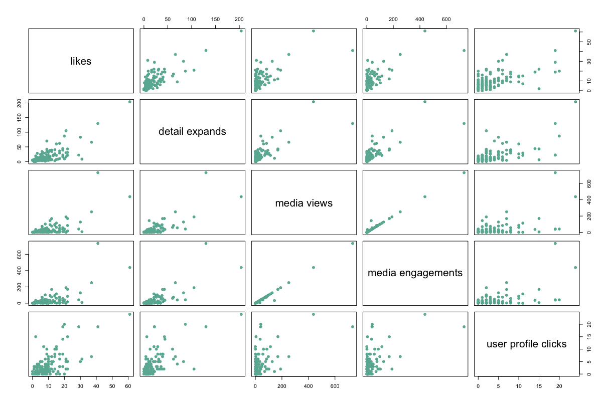
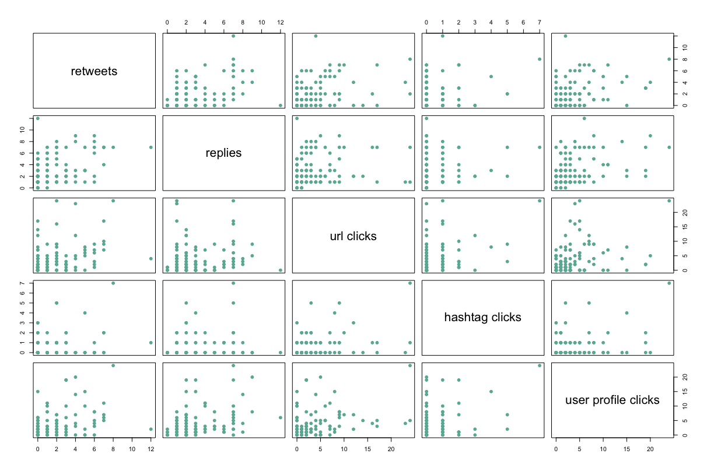
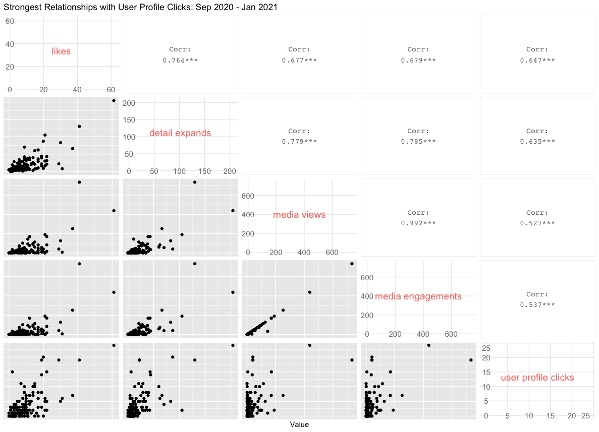
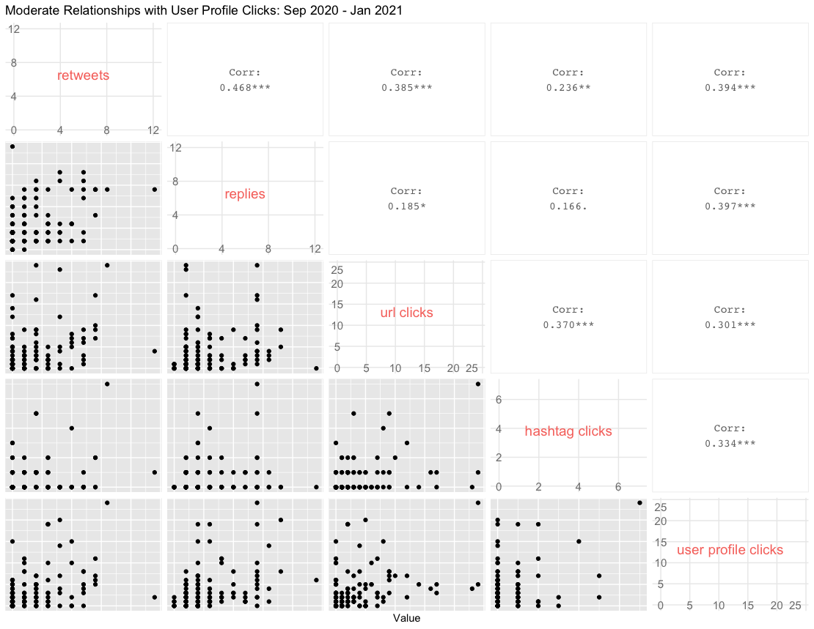

---
authors:
- admin
categories: []
date: "2021-01-15T00:00:00Z"
draft: false
featured: false
image:
  caption: ""
  focal_point: ""
lastMod: "2021-01-15T00:00:00Z"
projects: []
subtitle: Understanding Twitter Analytics with Your Data
summary: Using R to Explore Twitter Data
tags: ["R", "Data Science", "Twitter Analytics", "Analytics"]
title: Analyzing Your Twitter Data
---

### Table of contents

- [Overview](#overview)
- [Exploring Relationships](#exploring_relationships)


## Overview & Setup

This post uses various R libraries and functions to help you explore your Twitter Analytics Data. The first thing to do is download data from [analytics.twitter.com](https://analytics.twitter.com/). The assumption here is that you're already a Twitter user and have been using for at least 6 months. 

Once there, you'll click on the `Tweets` tab, which should bring you to your Tweet activity with the option to **Export data**:


Once you click on **Export data**, you'll choose "By day", which provides your impressions and engagements metrics for everyday (you'll also select the time period, in the drop down menu right next to Export data - the default is "Last 28 Days").

**Note**: The other option is to choose "By Tweet" and that will download the text of each Tweet along with associated metrics. We could potentially do fun text analysis with this, but we'll save that for another post. 

For this post, I downloaded all *available* data, which goes five months back. 

After downloading, you'll want to **read** in the data and, in our case, **combine** all five months into one data frame, we'll use the `readr` package and `read_csv()` function contained in `tidyverse`. Then we'll use `rbind()` to combine five data frames by rows:

```
library(tidyverse)

# load data from September to mid-January
df1 <- read_csv("./daily_tweet_activity/daily_tweet_activity_metrics_paulapivat_20200901_20201001_en.csv")
df2 <- read_csv("./daily_tweet_activity/daily_tweet_activity_metrics_paulapivat_20201001_20201101_en.csv")
df3 <- read_csv("./daily_tweet_activity/daily_tweet_activity_metrics_paulapivat_20201101_20201201_en.csv")
df4 <- read_csv("./daily_tweet_activity/daily_tweet_activity_metrics_paulapivat_20201201_20210101_en.csv")
df5 <- read_csv("./daily_tweet_activity/daily_tweet_activity_metrics_paulapivat_20210101_20210112_en.csv")

# combining ALL five dataframes into ONE, by rows
df <- rbind(df1, df2, df3, df4, df5)
```

## Exploring_Relationships

Twitter analytics tracks several metric that are broadly grouped under Engagements, including: retweets, replies, likes, user profile clicks, url clicks, hashtag clicks, detail expands, media views and media engagements.

There are other metrics like "app opens" and "promoted engagements", which are services I have not used and so do not have any data available. 

#### A Guiding Question

It's useful to have a guiding question as it helps focus your exploration. Let's say, I was interested in whether one of my tweets prompted a reader to click on my profile. The metric for this is `user profile clicks`.

My initial guiding question for this post is: 

> Which metrics are most strongly correlated with User Profile Clicks?

You could simply use the `cor.test()` function, which comes with base R, to go one by one between *each* metric and `User Profile Click`. For example, below we calculate the correlation between three pairs of variables, `User Profile Clicks` and `retweets`, `replies` and `likes`, separately. After awhile, this can get tedious.

```
cor.test(x = df$`user profile clicks`, y = df$retweets)
cor.test(x = df$`user profile clicks`, y = df$replies)
cor.test(x = df$`user profile clicks`, y = df$likes)
```

A quicker way to explore the relationship between pairs of metrics throughout a dataset is to use a **correlelogram**. 

We'll start with base R. You'll want to limit the number of variables you visualize so the correlelogram doesn't become too cluttered. Here are four variables that correlate the highest with `User Profile Clicks`:

```
# four columns are selected along with user profile clicks to plot
df %>%
    select(8, 12, 19:20, `user profile clicks`) %>%
    plot(pch = 20, cex = 1.5, col="#69b3a2")
```

Here's a visual:



Here are another four metrics with *moderate* relationships:

```
df %>%
    select(6:7, 10:11, `user profile clicks`) %>%
    plot(pch = 20, cex = 1.5, col="#69b3a2")
```



Visually, you can see the moderate relationship scatter plots are more dispersed, with a less identifiable direction. 

While base R is dependable, we can get more informative plots with the `GGally` package. Here are the four highly correlated variables with `User Profile Clicks`:

```
library(GGally)

# GGally, Strongest Related
df %>%
    select(8, 12, 19:20, `user profile clicks`) %>%
    ggpairs(
        diag = NULL,
        title = "Strongest Relationships with User Profile Clicks: Sep 2020 - Jan 2021",
        axisLabels = c("internal"),
        xlab = "Value"
    )

```

Here's the correlelogram between the four most highly correlated variables with `user profile clicks`:



Here are the moderately correlated variables with `User Profile Clicks`:



As you can see, not only do these provide scatter plots, but they also show the numerical values of the correlation between each pair of variables, which is much more informative than base R. 

Now, its entirely possible that the pattern of correlation in your data is different as the initial patterns we're seeing here are not meant to generalize to a different dataset. 


For more content on data science, machine learning, R, Python, SQL and more, [find me on Twitter](https://twitter.com/paulapivat).