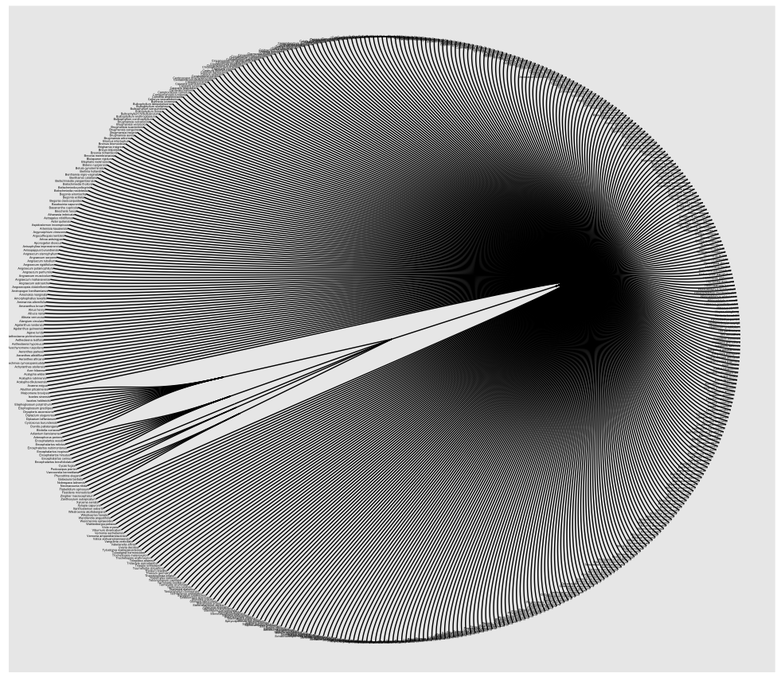

## Nested and Hierarchical Data

When you have data with multiple subgroups, one option is to treat them as nested and/or hierarchical data. 

In this technical note, I'll outline how to create a dendrogram.

The data used is from the [Extinct Plants](https://github.com/rfordatascience/tidytuesday/blob/master/data/2020/2020-08-18/readme.md) data set from [TidyTuesday](https://github.com/rfordatascience/tidytuesday). 

Here's the breakdown:

1. Load Packages and Libraries
```
install.packages("ggraph")
install.packages("igraph")
library(ggraph)
library(igraph)
```

2. Create a data frame with three levels

Taking the `plants` data frame, I do some wrangling to get the desired columns.

```
plants_data <- plants %>%
    select(group, binomial_name) %>%
    group_by(group) %>%
    arrange(group) %>% 
    mutate(
        level1 = 'center',
        level2 = group,
        level3 = binomial_name
    ) %>%
    # important to ungroup here
    ungroup() %>%
    select(level1:level3) 

```

3. Create an edge list

```
# transform it to an edge list
plants_edges_level1_2 <- plants_data %>% 
    select(level1, level2) %>% 
    unique %>% 
    rename(from=level1, to=level2)

plants_edges_level2_3 <- plants_data %>% 
    select(level2, level3) %>% 
    unique %>% 
    rename(from=level2, to=level3)

plants_edge_list=rbind(plants_edges_level1_2, plants_edges_level2_3)
```

4. Plot a basic chart

Because I have many observations, I'm optiing to use a "circular" dendrogram.
```
# plot plant dendogram
plantgraph <- graph_from_data_frame(plants_edge_list)

ggraph(plantgraph, layout = "dendrogram", circular = TRUE) +
    geom_edge_diagonal() +
    geom_node_point() +
    theme_void()
```

5. Add text to the end of the edges

```
# add text & color(leaf)
ggraph(plantgraph, layout = "dendrogram", circular = TRUE) +
    geom_edge_diagonal() +
    geom_node_text(aes(label = name, filter=leaf), hjust = 1, size = 1) +
    geom_node_point()
```

NOTE: The breakdown of plant groupings are listed below. We can see the Flowering Plants *disproportionately* out number other groups like Ferns & Allies, Cycad, Mosses, Algae and Conifer. 

When visualizing, we're better off separating Flowering Plants from the other groups. 

```
plants %>%
    group_by(group) %>%
    tally(sort = TRUE)

# A tibble: 6 x 2
  group                n
  <chr>            <int>
1 Flowering Plant    471
2 Ferns and Allies    13
3 Cycad                8
4 Mosses               4
5 Algae                3
6 Conifer              1

```

Here's a sample picture of the plants 