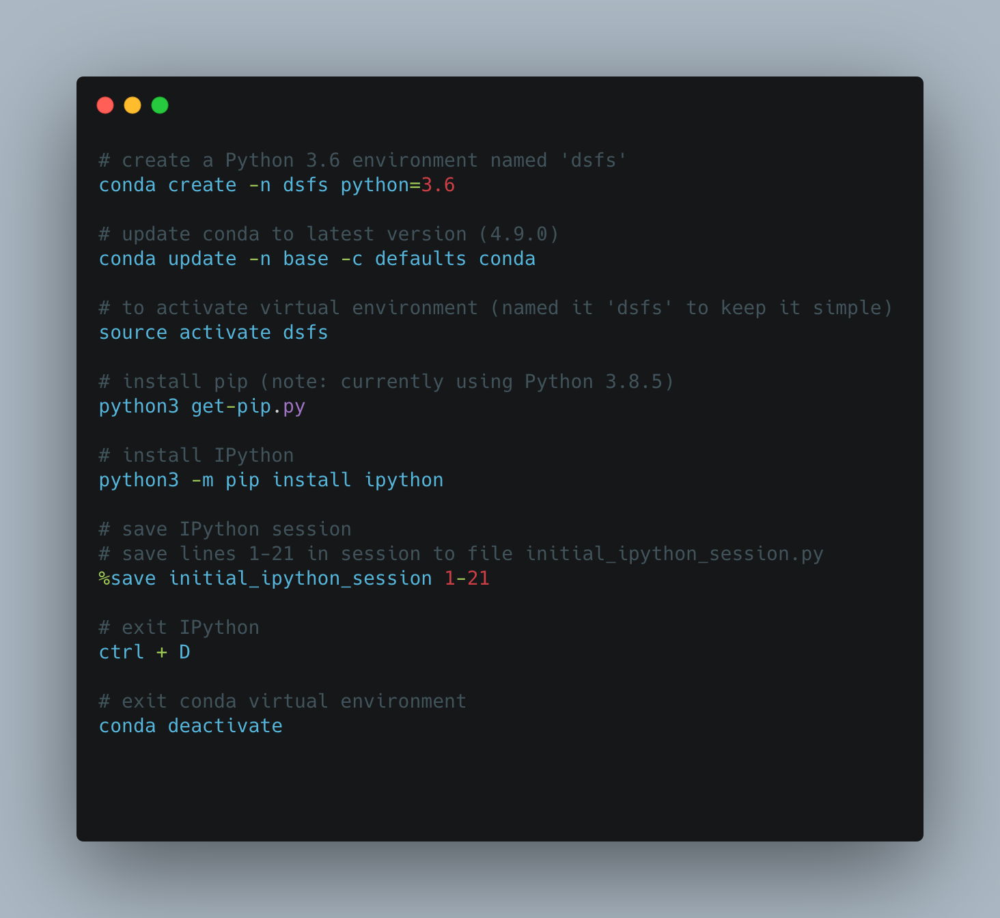

## Virtual Environment Best Practices

NOTE: This is from chapter 2 of Joel Grus' 'Data Science from Scratch'.

Joel's a known [opponent of notebooks](https://www.youtube.com/watch?v=7jiPeIFXb6U) and recommends operating in IPython instead.

I was pleasantly surprised that the process of setting up a virtual environment and IPython was relatively painless. Here's my process, taken from the book with some tweaks:

```
# create a Python 3.6 environment named 'dsfs'
conda create -n dsfs python=3.6

# update conda to latest version (4.9.0)
conda update -n base -c defaults conda

# to activate virtual environment (named it 'dsfs' to keep it simple)
source activate dsfs

# install pip (note: currently using Python 3.8.5)
python3 get-pip.py

# install IPython 
python3 -m pip install ipython

# save IPython session
# save lines 1-21 in session to file initial_ipython_session.py
%save initial_ipython_session 1-21

# exit IPython
ctrl + D

# exit conda virtual environment
conda deactivate

```

Here's a png of the above code:


